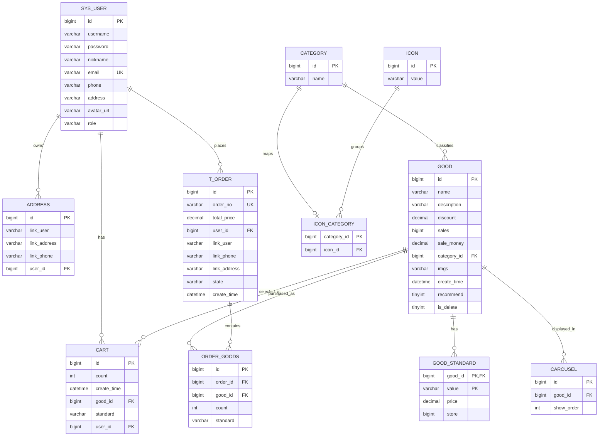

# Database Design

Date: 2026-06-15

## Overview

Project FYP Mall uses a MySQL database named `electronic_mall` for a small cloud-based e-commerce platform. The database supports customer browsing, account login, cart management, order placement, simulated payment, order history, product administration, category navigation, carousel display, and uploaded image/avatar storage.

The current schema is defined in:

- `database/electronic_mall.sql`

The backend uses Spring Boot, MyBatis, and MyBatis-Plus. Important mapped entities include `User`, `Good`, `Standard`, `Cart`, `Order`, `OrderGoods`, `Address`, `Category`, `Icon`, `Carousel`, `MyFile`, and `Avatar`.

## Table Summary

| Table | Purpose | Main Notes |
| --- | --- | --- |
| `sys_user` | Stores customer/admin accounts | Has primary key and unique email index. Passwords are currently MD5 hashes from the frontend. |
| `address` | Stores delivery addresses | Belongs to a user through `user_id`. |
| `category` | Stores product categories | Used by product list filters and icon grouping. |
| `icon` | Stores icon font codes | Used for category navigation groups. |
| `icon_category` | Links categories to icons | Current primary key is `category_id`, meaning one icon per category. |
| `good` | Stores product master data | Includes category, image path, discount, sales, sale amount, recommendation flag, and soft-delete flag. |
| `good_standard` | Stores product variants | Active variant table used for price and stock. Uses composite primary key `(good_id, value)`. |
| `cart` | Stores shopping-cart items | Links users, products, selected variant, quantity, and created time. |
| `t_order` | Stores order headers | Stores order number, total price, user, delivery snapshot, state, and created time. |
| `order_goods` | Stores order line items | Links order headers to purchased products and selected variants. |
| `carousel` | Stores homepage carousel product links | Uses product ID and display order. |
| `sys_file` | Stores uploaded product file metadata | Tracks file path, type, size, delete flag, enable flag, and MD5. |
| `avatar` | Stores uploaded avatar metadata | Tracks avatar file path, type, size, and MD5. |
| `standard` | Removed legacy variant table | Removed from the current SQL seed after confirming the backend maps variants to `good_standard`. |

## ERD

The ERD shows the intended logical relationships. The SQL file now declares the main foreign-key constraints after seed data insertion, so the design is reportable as an enforced relational model once imported into MySQL.

## Core Data Flow

1. The homepage reads recommended products from `good`, variant prices from `good_standard`, category groups from `category`, `icon`, and `icon_category`, and carousel items from `carousel`.
2. The product list filters `good` by category and search text, with active products controlled by `is_delete`.
3. The product detail page reads one `good` row and its variants from `good_standard`.
4. Login reads `sys_user` by username or email and compares the submitted hash with `sys_user.password`.
5. Add-to-cart inserts a `cart` row for the current `sys_user`, selected `good`, selected variant, and quantity.
6. Place-order creates one `t_order` row and one or more `order_goods` rows, then removes the selected cart row.
7. Simulated payment updates `t_order.state` to `Paid`, deducts stock in `good_standard`, and updates sales totals in `good`.
8. Order history joins `t_order`, `order_goods`, and `good` for the logged-in user.

## Current Design Status and Remaining Risks

| Risk | Impact | Planned Treatment |
| --- | --- | --- |
| Real MySQL import not verified locally | Syntax/import issues may only appear when MySQL executes the script | Run import after local MySQL is available or on a disposable VM database |
| Cloud database may still use older data | Live demo and repository seed can drift | Back up and update the VM database before final presentation |
| Passwords use frontend MD5 | Weak password protection | Kept for FYP demo scope; document as limitation and avoid real passwords |
| Advanced migration tooling is absent | Manual SQL imports require discipline | Future work: add Flyway or Liquibase after FYP |

## Report Explanation

This database is intentionally small and direct. It uses separate tables for users, products, variants, carts, orders, categories, and uploaded resources. The design is suitable for demonstrating a cloud-hosted e-commerce workflow on a single VM with Nginx, Spring Boot, MySQL, and Redis. The next database improvement phase should strengthen integrity and indexing without expanding the system into enterprise architecture.
