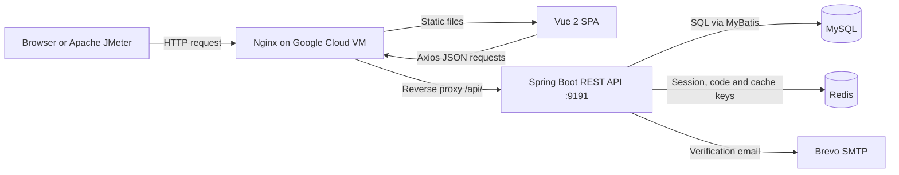
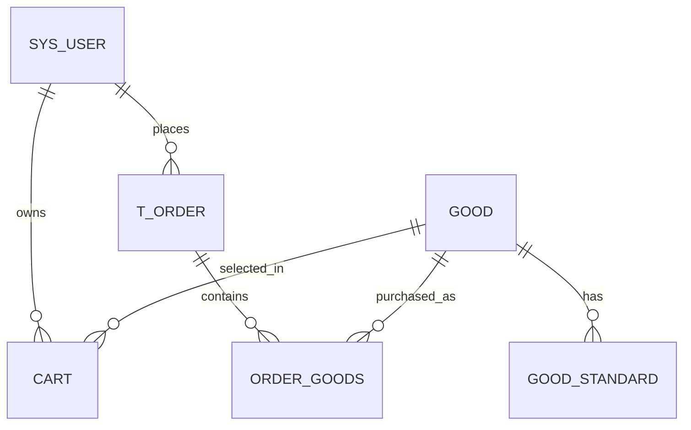

# CHAPTER 4: SYSTEM DEVELOPMENT AND TESTING

## Development and Network Performance Evaluation of a Cloud-Based Small E-Commerce Platform

**Project Name:** R Mall  
**Programme:** TK/TM/TU/TH4086 Final Year Project  
**Track:** Network Technology  
**Chapter Version:** 1  
**Date:** 7 July 2026  

---

## LIST OF TABLES

| Table | Title |
|---|---|
| Table 4.1 | Chapter 4 Mapping to D6, D7 and D8 Requirements |
| Table 4.2 | Implemented Technology Stack |
| Table 4.3 | Implementation Component Structure |
| Table 4.4 | Representative REST Interfaces |
| Table 4.5 | Implemented Database Tables |
| Table 4.6 | Testing Objectives |
| Table 4.7 | Testing Types and Rationale |
| Table 4.8 | Test Environment |
| Table 4.9 | Test Completion Criteria |
| Table 4.10 | Functional and Regression Test Cases |
| Table 4.11 | Deployment and Connectivity Test Cases |
| Table 4.12 | Basic Security Test Cases |
| Table 4.13 | JMeter Performance Test Cases |
| Table 4.14 | Testing Execution Record |
| Table 4.15 | Local Verification Result Summary |
| Table 4.16 | JMeter Smoke Test Results |
| Table 4.17 | Overall JMeter Result Summary |
| Table 4.18 | Highest-Concurrency Performance Summary |
| Table 4.19 | Mutation Test Database Impact |
| Table 4.20 | Unexpected Problems and Resolutions |

## LIST OF FIGURES

| Figure | Title |
|---|---|
| Figure 4.1 | Implemented Cloud Request Architecture |
| Figure 4.2 | Core Order Entity Relationship |

## LIST OF CODE LISTINGS

| Listing | Title |
|---|---|
| Code Listing 4.1 | Selected Axios Request and Response Interceptors |
| Code Listing 4.2 | Selected Email-Verified Registration Logic |
| Code Listing 4.3 | Selected Redis-Backed Login Session Creation |
| Code Listing 4.4 | Selected JWT and Redis Session Validation |
| Code Listing 4.5 | Selected Email Verification Code Lifecycle |
| Code Listing 4.6 | Selected Transactional Order and Simulated Payment Logic |
| Code Listing 4.7 | Selected Nginx Reverse-Proxy Configuration |

---

## 4.1 Introduction

This chapter presents the development and testing of R Mall, a cloud-based small e-commerce platform implemented for the Network Technology final year project. The chapter combines the implementation scope of D6 and the testing scope of D7 into the Chapter 4 structure required by D8. It explains how the system was built, which source-code segments are critical, how the cloud deployment was configured, how testing was planned and executed, and what the measured results show.

The chapter is written around one central claim: R Mall was implemented as a bounded but operational cloud e-commerce prototype, and it was tested through functional, integration, deployment, basic security and Apache JMeter performance tests. The evidence supports academic prototype readiness and network-performance analysis on a single Google Cloud virtual machine (VM). It does not support claims about commercial-scale capacity, real payment settlement, horizontal scaling, or an HTTP-versus-HTTPS comparison.

**Table 4.1: Chapter 4 Mapping to D6, D7 and D8 Requirements**

| Required source | Chapter 4 coverage |
|---|---|
| D6 implementation process | Sections 4.2 to 4.7 explain development process, selected technologies, modules, database, deployment, and implementation problems. |
| D6 selected code explanation | Sections 4.4 to 4.6 include critical frontend, backend and deployment code listings. |
| D7 testing plan | Section 4.8 defines testing objectives, test basis, techniques, environment, data, and completion criteria. |
| D7 test case design | Section 4.9 defines functional, deployment, security and JMeter performance test cases. |
| D7 testing execution | Section 4.10 explains how tests were executed. |
| D7 testing results | Section 4.11 reports functional, smoke, JMeter, highest-load, mutation and interpretation results. |
| D7 summary | Section 4.12 records unexpected testing problems and summarises the testing conducted. |
| D8 Chapter 4 integration | The whole chapter combines reviewed D6 and D7 content into "System Development and Testing". |

Important terms are used consistently in this chapter. R Mall refers to the project system. Vue 2 single-page application (SPA) refers to the browser frontend. Spring Boot REST API refers to the backend service. Nginx reverse proxy refers to the public web entry point that serves the frontend and forwards API requests. MySQL stores durable business data. Redis stores temporary session, email verification, cooldown and cache data. Apache JMeter is the performance-testing tool used to generate HTTP workload against the public endpoint.

---

## 4.2 Development Process

### 4.2.1 Development Approach

The system was developed as a modular monorepo so that source code, database scripts, deployment files, verification scripts, JMeter plans and documentation remained traceable in one workspace. Development proceeded from core user workflow stabilisation to authentication improvement, cloud deployment, route verification and network-performance testing. This order matched the project goal: the system first had to work as an e-commerce platform before its network behaviour could be measured.

The implementation scope was deliberately bounded. The system includes account access, email verification, product browsing, cart management, order placement, simulated payment, order history, administrator functions, cloud deployment and performance-test artefacts. It excludes real payment gateways, logistics integration, microservice deployment, container orchestration, horizontal load balancing and multi-region redundancy.

### 4.2.2 Implemented Technology Stack

The selected technology stack supports a measurable browser-server-database architecture. Vue implements the browser-facing SPA; Spring Boot implements the REST API; MySQL stores persistent business records; Redis manages short-lived state; Nginx provides public routing; and JMeter generates controlled HTTP workload.

**Table 4.2: Implemented Technology Stack**

| Layer | Technology | Main role | Network Technology relevance |
|---|---|---|---|
| Frontend | Vue 2.6.14, Vue Router 3.5.1, Vuex 3.6.2 | Customer and administrator SPA views. | Provides the browser workload that initiates HTTP requests. |
| HTTP client | Axios 0.26.1 | Centralised API calls, token header injection and response handling. | Standardises browser-to-server communication through the public API path. |
| UI components | Element UI 2.15.6 | Forms, tables and management interface widgets. | Supports consistent interaction for functional testing workflows. |
| Backend | Spring Boot 2.5.6, Java 8 | REST controllers, services, validation and executable packaging. | Processes HTTP requests and coordinates application logic. |
| Persistence | MyBatis, MyBatis-Plus, MySQL | SQL mapping and durable data storage. | Represents the persistent data-service layer in the deployed request path. |
| Temporary state | Redis | Login sessions, email codes, cooldown keys and selected cache state. | Provides short-lived state that affects authentication and request handling. |
| Email delivery | Spring Mail, Brevo SMTP | Verification-code delivery for registration and reset. | Adds an external service dependency to selected user workflows. |
| Deployment | Nginx, systemd, Google Cloud VM | Static frontend serving, reverse proxy and backend process management. | Defines the public cloud entry point evaluated by JMeter. |
| Performance testing | Apache JMeter 5.6.3 | Smoke, load, authenticated and mutation testing. | Generates controlled HTTP traffic for response-time, throughput and error-rate measurement. |

### 4.2.3 Implemented Cloud Request Architecture

The implemented request path is browser or JMeter client to public Nginx, Nginx to Spring Boot, and Spring Boot to MySQL or Redis. This path is central to the Network Technology contribution because testing is performed through the same public endpoint used by users. The measured response time therefore includes public HTTP access, reverse-proxy routing, application processing and data-service interaction where relevant.



**Figure 4.1: Implemented Cloud Request Architecture**

The public deployment uses HTTP on port 80. HTTPS is not reported as implemented or compared in this chapter. This boundary matters because the performance results evaluate the implemented public path, not a TLS-enabled alternative.

### 4.2.4 Implementation Component Structure

The implementation is organised into functional components rather than a single monolithic program. This structure is important for the thesis because each component contributes a different part of the deployed request path and testing evidence.

**Table 4.3: Implementation Component Structure**

| Component group | Implemented content | Role in the thesis evidence |
|---|---|---|
| Frontend application | Customer pages, administrator pages, routing, state management, API communication and production build settings. | Demonstrates the user-facing workload used for functional and performance testing. |
| Backend application | REST controllers, services, DTOs, interceptors, entities, data mappers, configuration and tests. | Demonstrates the application logic that receives and processes public API requests. |
| Database layer | MySQL schema, product data, user data, cart records, order records and uploaded-resource metadata. | Demonstrates persistent state for e-commerce transactions and result verification. |
| Reverse-proxy deployment | Nginx routing, SPA fallback, API forwarding and static-resource delivery. | Demonstrates the public cloud request path tested in the NT evaluation. |
| Runtime management | Backend process management and environment configuration without exposing secrets. | Demonstrates that the deployed service can run as a managed VM process. |
| Verification workflow | Functional checks, deployment checks, schema checks, route checks and authentication checks. | Demonstrates readiness before performance results are interpreted. |
| Performance evaluation | JMeter test plans, execution records, result summaries and generated metric artefacts. | Demonstrates controlled measurement of response time, throughput and error rate. |

---

## 4.3 Frontend Implementation

### 4.3.1 Customer and Administrator Interfaces

The frontend was implemented as a Vue 2 SPA with separate customer and administrator workflows. Customer pages cover registration, login, homepage, product list, product detail, cart, checkout, simulated payment, order history and profile management. Administrator pages cover user, product, category, carousel, order, file and income management.

The implemented customer flow is:

```text
Register or login -> Browse products -> View product details -> Add to cart
-> Place order -> Complete simulated payment -> View order history
```

The interface was localised for the demonstration context. Display text is in English, prices use RM, sample addresses follow a Malaysia context, and the payment page clearly indicates simulated payment. These implementation choices keep the user interface aligned with the academic scope of the project. The interface screenshots are not repeated in this chapter because Chapter 3 already presents the interface design evidence; Chapter 4 instead explains the implemented workflow and the code mechanisms behind it.

### 4.3.2 Centralised HTTP Communication

The frontend uses one Axios utility to centralise browser-to-backend communication. This module sets the API base URL, applies a five-second timeout, adds JSON headers, injects the session token when available, and handles expired sessions by clearing local state and returning the user to the login page.

**Code Listing 4.1: Selected Axios Request and Response Interceptors**

```javascript
const request = axios.create({
    baseURL: process.env.VUE_APP_API_BASE_URL || '/api',
    timeout: 5000
})

request.interceptors.request.use(config => {
    config.headers['Content-Type'] = 'application/json;charset=utf-8';
    let user = JSON.parse(localStorage.getItem("user"))
    if (user) {
         config.headers['token'] = user.token;
    }
    return config
})

request.interceptors.response.use(response => {
    let res = response.data;
    if (res.code === '401' || res.code === '402') {
        localStorage.removeItem("user");
        ElementUI.MessageBox({
            title: 'Error',
            message: res.msg
        }).then(() => {
            if (router.currentRoute.path !== '/login') {
                router.push('/login')
            }
        })
    }
    return res;
})
```

This code is included because it is the common network entry point for frontend requests. It also explains why the cloud deployment can use `/api` as the production base URL instead of exposing the backend port directly to the browser.

### 4.3.3 Email-Verified Registration Interface

The registration page implements email-code registration rather than direct account creation. The page checks required fields and email format, requests a verification code, starts a 60-second countdown, submits the registration form and stores the returned session DTO after success.

**Code Listing 4.2: Selected Email-Verified Registration Logic**

```javascript
sendCode() {
  if (!this.user.email || !this.isValidEmail(this.user.email)) {
    this.$message.error("Email format is invalid");
    return false;
  }
  this.request.post("/api/auth/send-email-code", {
    email: this.user.email,
    purpose: "register",
  }).then((res) => {
    if (res.code === "200") {
      this.$message.success("Verification code sent");
      this.startCountdown();
    } else {
      this.$message.error(res.msg);
    }
  });
}

onSubmit() {
  const form = {
    username: this.user.username,
    email: this.user.email,
    code: this.user.code,
    password: md5(this.user.password),
  };
  this.request.post("/api/auth/register-by-email", form).then((res) => {
    if (res.code === "200") {
      localStorage.setItem("user", JSON.stringify(res.data));
      this.$router.push("/");
    } else {
      this.$message.error(res.msg);
    }
  });
}
```

Frontend validation improves user experience, but the authoritative verification remains in the backend. The backend normalises email, checks uniqueness, verifies the Redis-stored code and creates the login session.

---

## 4.4 Backend Implementation

### 4.4.1 Layered REST API Structure

The backend uses a controller-service-mapper-entity structure. Controllers expose REST endpoints and return a common response object. Services implement business rules, transactions, validation and Redis integration. Mapper interfaces and XML files implement SQL access through MyBatis. Entities represent database tables, while DTOs return controlled fields to the frontend.

**Table 4.4: Representative REST Interfaces**

| Endpoint | Method | Access | Purpose |
|---|---|---|---|
| `/login` | POST | Public | Log in by username or email and return a session DTO. |
| `/api/auth/send-email-code` | POST | Public | Send a registration or password-reset verification code. |
| `/api/auth/register-by-email` | POST | Public | Register after successful email-code verification. |
| `/api/auth/reset-password-by-email` | POST | Public | Reset password after successful email-code verification. |
| `/api/good` | GET | Public | Retrieve product data for storefront browsing. |
| `/api/cart` | POST / PUT / DELETE | Authenticated | Add, update or remove cart items. |
| `/api/order` | POST | Authenticated | Create an order from checkout data. |
| `/api/order/paid/{orderNo}` | GET | Authenticated | Complete the simulated-payment state transition. |
| `/api/order/userid/{userId}` | GET | Authenticated | Retrieve order history for the user. |
| `/api/order/delivery/{orderNo}` | GET | Administrator | Mark an order as shipped. |

### 4.4.2 Redis-Backed Login Session Creation

After a successful login, email registration or password reset, the backend creates a JSON Web Token (JWT) and stores the corresponding user object in Redis. Redis controls the session expiry through a time-to-live (TTL) value of 180 minutes.

**Code Listing 4.3: Selected Redis-Backed Login Session Creation**

```java
private UserDTO createLoginSession(User user) {
    String token = TokenUtils.genToken(
            user.getId().toString(),
            user.getUsername()
    );
    redisTemplate.opsForValue().set(
            RedisConstants.USER_TOKEN_KEY + token,
            user
    );
    redisTemplate.expire(
            RedisConstants.USER_TOKEN_KEY + token,
            RedisConstants.USER_TOKEN_TTL,
            TimeUnit.MINUTES
    );
    UserDTO userDTO = BeanUtil.copyProperties(user, UserDTO.class);
    userDTO.setToken(token);
    return userDTO;
}
```

This implementation is critical because it combines token-based request identity with server-side session control. JWT verifies token integrity, while Redis allows the server to expire or remove session state.

### 4.4.3 Request Authentication and Access Control

Protected requests pass through `JwtInterceptor`. The interceptor reads the token header, loads the user from Redis, refreshes the Redis expiry, verifies the JWT signature and stores the current user in `UserHolder` for downstream service logic.

**Code Listing 4.4: Selected JWT and Redis Session Validation**

```java
String token = request.getHeader("token");
if (!StringUtils.hasLength(token)) {
    throw new ServiceException(Constants.TOKEN_ERROR,
        "Session expired. Please log in again");
}

User user = redisTemplate.opsForValue()
    .get(RedisConstants.USER_TOKEN_KEY + token);
if (user == null) {
    throw new ServiceException(Constants.TOKEN_ERROR,
        "Session expired. Please log in again");
}

UserHolder.saveUser(user);
redisTemplate.expire(
    RedisConstants.USER_TOKEN_KEY + token,
    RedisConstants.USER_TOKEN_TTL,
    TimeUnit.MINUTES
);

JWTVerifier jwtVerifier = JWT
    .require(Algorithm.HMAC256(user.getUsername()))
    .build();
jwtVerifier.verify(token);
```

This code is included because most protected business functions depend on correct current-user resolution. It supports the cart, order, profile and administrator workflows and provides the basis for session-related tests in Section 4.9.

### 4.4.4 Email Verification Lifecycle

The email verification service strengthens registration and password reset. It stores a six-digit code in Redis for five minutes, sets a cooldown key for 60 seconds and sends the code through Brevo SMTP. If SMTP delivery fails, the service deletes both the verification-code key and the cooldown key.

**Code Listing 4.5: Selected Email Verification Code Lifecycle**

```java
String code = generateCode();
redisTemplate.opsForValue().set(
        buildCodeKey(normalizedEmail, normalizedPurpose),
        code,
        RedisConstants.EMAIL_CODE_TTL,
        TimeUnit.MINUTES
);
redisTemplate.opsForValue().set(
        cooldownKey,
        "1",
        RedisConstants.EMAIL_COOLDOWN_TTL,
        TimeUnit.SECONDS
);

try {
    mailSender.send(message);
} catch (RuntimeException e) {
    redisTemplate.delete(buildCodeKey(normalizedEmail, normalizedPurpose));
    redisTemplate.delete(cooldownKey);
    throw new ServiceException(Constants.CODE_500,
        "Failed to send verification email");
}
```

The cleanup branch is important because it prevents the system from keeping a valid code when the user did not receive the email. This implementation supports the testing of code TTL, cooldown, wrong-code rejection and SMTP failure handling.

### 4.4.5 Order Creation and Simulated Payment

Order processing is the main business transaction in the system. It connects current-user identity, cart data, order persistence, order line items, product variants, stock and simulated payment. The implementation uses Spring transactions so that partial database updates are rolled back if a critical operation fails.

**Code Listing 4.6: Selected Transactional Order and Simulated Payment Logic**

```java
@Transactional
public String saveOrder(Order order) {
    order.setUserId(TokenUtils.getCurrentUser().getId());
    String orderNo = DateUtil.format(new Date(), "yyyyMMddHHmmss")
            + RandomUtil.randomNumbers(6);
    order.setOrderNo(orderNo);
    order.setCreateTime(DateUtil.now());
    orderMapper.insert(order);

    OrderGoods orderGoods = new OrderGoods();
    orderGoods.setOrderId(order.getId());
    List<OrderItem> orderItems =
            JSON.parseArray(order.getGoods(), OrderItem.class);
    for (OrderItem orderItem : orderItems) {
        orderGoods.setGoodId(orderItem.getId());
        orderGoods.setCount(orderItem.getNum());
        orderGoods.setStandard(orderItem.getStandard());
        orderGoodsMapper.insert(orderGoods);
    }
    cartService.removeById(order.getCartId());
    return orderNo;
}

@Transactional
public void payOrder(String orderNo) {
    orderMapper.payOrder(orderNo);
    Map<String, Object> orderMap = orderMapper.selectByOrderNo(orderNo);
    int count = (int) orderMap.get("count");
    Long goodId = Long.parseLong(orderMap.get("goodId").toString());
    String standard = (String) orderMap.get("standard");
    int store = standardMapper.getStore(goodId, standard);
    if (store < count) {
        throw new ServiceException(Constants.CODE_500, "Insufficient stock");
    }
    standardMapper.deductStore(goodId, standard, store - count);
    BigDecimal totalPrice = getOne(
            new LambdaQueryWrapper<Order>().eq(Order::getOrderNo, orderNo)
    ).getTotalPrice();
    goodMapper.saleGood(goodId, count, totalPrice);
}
```

This code is shortened to show the critical control flow. The payment operation is explicitly simulated and does not connect to Alipay, WeChat Pay, card processing or online banking. This boundary is necessary because the project evaluates the e-commerce workflow and network performance, not real financial settlement.

---

## 4.5 Database Implementation

The MySQL database is named `electronic_mall` and is initialised from the project database schema. It stores users, products, variants, carts, order headers, order line items, categories, carousel records and uploaded-resource metadata.

**Table 4.5: Implemented Database Tables**

| Table | Implementation role |
|---|---|
| `sys_user` | Stores customer and administrator accounts, including email and role. |
| `address` | Stores delivery addresses linked to users. |
| `category` | Stores product categories used by storefront filtering and navigation. |
| `icon` | Stores category icon font values. |
| `icon_category` | Links categories with icon records. |
| `good` | Stores product master data, image path, category, sales and display flags. |
| `good_standard` | Stores product variant price and stock using `(good_id, value)` as a composite key. |
| `cart` | Stores selected user cart items with product, variant and quantity. |
| `t_order` | Stores order headers, total price, user, delivery snapshot, state and time. |
| `order_goods` | Stores order line items linked to orders and products. |
| `carousel` | Stores homepage carousel product links and display order. |
| `sys_file` | Stores uploaded product-file metadata. |
| `avatar` | Stores uploaded avatar metadata. |



**Figure 4.2: Core Order Entity Relationship**

The schema is intentionally compact. It is sufficient for the implemented academic workflow and avoids unsupported commercial modules such as logistics settlement, warehouse management or external payment clearing. Remaining database boundaries include MD5 password compatibility, SQL-script migration discipline and single-VM scale.

---

## 4.6 Cloud Deployment and Network Implementation

The production system runs on a Google Cloud VM named `fyp-mall-vm` in `asia-southeast1-b`. The public endpoint is `http://34.143.225.11/`. Nginx listens on port 80, serves the Vue production build and forwards `/api/` requests to Spring Boot on `127.0.0.1:9191`. MySQL and Redis run as supporting services on the VM, and systemd manages the Spring Boot process.

**Code Listing 4.7: Selected Nginx Reverse-Proxy Configuration**

```nginx
server {
    listen 80;
    server_name _;

    client_max_body_size 20M;
    root /var/www/project-fyp-mall;
    index index.html;

    location / {
        try_files $uri $uri/ /index.html;
    }

    location /api/ {
        proxy_pass http://127.0.0.1:9191/;
        proxy_set_header Host $host;
        proxy_set_header X-Real-IP $remote_addr;
        proxy_set_header X-Forwarded-For $proxy_add_x_forwarded_for;
        proxy_set_header X-Forwarded-Proto $scheme;
    }
}
```

This configuration implements the public-to-internal network path. The browser sees one public HTTP endpoint, while the backend application port remains private behind Nginx. The Vue history fallback also prevents direct route access from returning a server-side 404.

The current public path mapping is documented. Backend root routes such as `/login` are exposed as `/api/login`, while backend routes already beginning with `/api/` are exposed as `/api/api/...` because the production Axios base URL is `/api` and Nginx strips the first `/api/` segment before forwarding. The JMeter plans use this mapping through `API_PREFIX=/api`.

---

## 4.7 Implementation Summary and Problems

The development phase produced an operational cloud-hosted e-commerce prototype. The frontend provides customer and administrator workflows. The backend provides REST APIs, email verification, session control, order processing and simulated payment. MySQL and Redis provide persistent and temporary data services. Nginx provides public routing, and JMeter artefacts provide a repeatable basis for later performance testing.

Several implementation problems were encountered and resolved before formal testing. Vue history-mode routes required SPA fallback. Product images and avatars required production-safe resource paths. Email verification required Redis TTL, cooldown and SMTP failure handling. Public API path mapping required documentation because Nginx rewrites `/api/` before forwarding. Mutation tests required backup discipline because they change live demo data.

These problems were handled within the academic project boundary. They do not change the system's main claim, but they define the evidence needed in testing: route checks, deployment checks, email-auth tests, session checks and controlled JMeter mutation testing.

---

## 4.8 Testing Plan

### 4.8.1 Testing Objectives

Testing was planned at component, integration and system levels. The project required both functional evidence and Network Technology evidence because the title includes development and network performance evaluation.

**Table 4.6: Testing Objectives**

| ID | Testing level | Objective |
|---|---|---|
| TO-01 | Component | Verify email verification, code validation, email registration and password reset logic. |
| TO-02 | Component | Verify database structure, unique keys, indexes, relationship constraints and financial data types. |
| TO-03 | Integration | Verify frontend-backend integration through Axios, Vue routes, user tokens and Nginx `/api` mapping. |
| TO-04 | Integration | Verify the main user flow: login, product browsing, cart, order placement, simulated payment and order history. |
| TO-05 | System | Verify that the cloud deployment is reachable through the Google Cloud public endpoint and that Nginx, Spring Boot, MySQL and Redis remain active. |
| TO-06 | System / NT | Measure response time, P90 response time, throughput and error rate under controlled concurrent user loads using Apache JMeter. |
| TO-07 | System boundary | Identify testing limitations, including HTTP-only deployment, shared demo-account mutation tests and high-load response-time constraints. |

### 4.8.2 Test Basis

The test basis comes from project requirements, source code, implementation documentation, verification scripts and retained test evidence. Functional tests are based on implemented user workflows and backend services. Non-functional tests are based on Network Technology requirements: public connectivity, reverse-proxy routing, response time, throughput, error rate and concurrent-load behaviour.

The main evidence sources are the reviewed D6 implementation draft, the verification workflow, the cloud deployment report, the JMeter preparation notes, the Phase 6 execution record and the Phase 6 performance evaluation report. The corresponding source artefact locations are indexed in Appendix 4A rather than placed in the body of the chapter.

### 4.8.3 Testing Approach and Techniques

The selected testing approach combines white-box component testing, black-box functional testing, regression testing, integration testing, deployment/connectivity testing, basic security testing and JMeter performance/load testing. This combination is appropriate because the project is both an e-commerce application and a Network Technology project.

**Table 4.7: Testing Types and Rationale**

| Testing type | Category | Reason for selection |
|---|---|---|
| Unit testing | White-box / component | Verifies code-level behaviours such as Redis TTL, cooldown, wrong-code rejection and email registration. |
| Functional testing | Black-box | Verifies whether visible user workflows return expected outputs. |
| Regression testing | Functional | Confirms that authentication, routing, deployment and schema changes do not break existing behaviour. |
| Integration testing | Functional / system | Verifies that Vue, Spring Boot, Redis, MySQL and Nginx interact through expected paths. |
| Deployment and connectivity testing | Non-functional / NT | Verifies public endpoint reachability, service health and reverse-proxy path mapping. |
| Basic security testing | Non-functional | Verifies session control, protected routes, expired-token handling and email-code cooldown. |
| Performance and load testing | Non-functional / NT | Measures response time, P90 response time, throughput and error rate under different thread counts. |
| Controlled mutation testing | Functional and performance | Tests write operations while limiting cart, order and stock data impact. |

### 4.8.4 Test Environment

**Table 4.8: Test Environment**

| Item | Environment / value |
|---|---|
| Public endpoint | `http://34.143.225.11/` |
| Cloud platform | Google Cloud VM `fyp-mall-vm` |
| Zone | `asia-southeast1-b` |
| VM operating system | Ubuntu 22.04 LTS |
| VM machine type | `e2-medium` |
| Public web server | Nginx on port 80 |
| Backend | Spring Boot on internal port 9191 |
| Frontend | Vue 2 production build served by Nginx |
| Database | MySQL database `electronic_mall` |
| Temporary state | Redis for sessions, email codes, cooldown keys and selected cache state |
| Performance tool | Apache JMeter 5.6.3 |
| Official retained execution date | 16 June 2026 |
| Load generator | Local workstation sending requests to the VM public endpoint |

### 4.8.5 Test Data

The test data consisted of seeded demo data and controlled mutation data in the `electronic_mall` database. Important data included the demo user account, Malaysia-context products and categories, product variant `good_id=3` with standard `Chair`, Malaysia-format delivery addresses, order states, generated email verification codes and cart/order/stock rows modified during mutation tests.

The live VM database was backed up before mutation testing. The exact operational backup path is retained in the Phase 6 execution record rather than repeated in the thesis body, because Chapter 4 only needs to establish that backup-first data protection was part of the testing procedure.

### 4.8.6 Test Completion Criteria

**Table 4.9: Test Completion Criteria**

| Testing area | Completion / pass criteria |
|---|---|
| Backend tests | Backend automated tests exit successfully and email/authentication behaviours pass. |
| Backend build | Backend packaging exits successfully and produces a deployable JAR. |
| Frontend checks | Frontend authentication, deployment and build checks exit successfully. |
| Route checks | Main history-mode routes are reachable by the automated route check. |
| Database schema | Database schema validation exits successfully. |
| JMeter smoke tests | All eight JMeter plans run at one thread with 0 JTL errors. |
| JMeter load tests | Read-only, authenticated and controlled mutation scenarios produce response time, P90, throughput and error-rate data. |
| Mutation data safety | MySQL backup is created before mutation testing and database impact is recorded after testing. |
| VM health | Nginx, Spring Boot, MySQL and Redis remain active before and after load testing. |
| Reporting | Required testing evidence is generated, summarised and retained in the submitted project artefact set. |

---

## 4.9 Test Case Design

### 4.9.1 Functional and Regression Test Cases

**Table 4.10: Functional and Regression Test Cases**

| ID | Test case | Test method | Test data | Pass / fail criteria |
|---|---|---|---|---|
| FR-01 | Email verification code | Backend service test | Mocked Redis and mail sender | Pass if six-digit code storage, five-minute TTL, 60-second cooldown, wrong-code rejection, successful-code deletion and SMTP failure cleanup are verified. |
| FR-02 | Email registration and password reset | Backend service test | Email registration and reset DTOs | Pass if code verification, email normalisation, duplicate email rejection, user saving, password reset and token return succeed. |
| FR-03 | Full backend suite | Backend automated test suite | Backend test suite | Pass if all tests exit successfully. |
| FR-04 | Backend package build | Backend packaging check | Spring Boot Maven project | Pass if build succeeds and a deployable JAR is generated. |
| FR-05 | Frontend authentication wiring | Frontend authentication check | Login, Register, request utility and router code | Pass if authentication-flow wiring is valid. |
| FR-06 | Frontend deployment configuration | Frontend deployment check | Production environment, Axios, Nginx and systemd configuration | Pass if production API uses `/api` and browser code does not depend on `localhost:9191`. |
| FR-07 | Frontend history routes | Automated route check through the Vue development server | Main frontend routes | Pass if checked routes return the SPA entry HTML. |
| FR-08 | Frontend production build | Frontend production build check | Vue source code | Pass if build exits successfully. |
| FR-09 | Database schema validation | Run the database schema validation utility | Project database schema | Pass if key tables, indexes, unique keys, foreign keys and financial data types are valid. |
| FR-10 | Core API golden path | Automated API workflow check where services are available | Product, user, cart, order and simulated-payment data | Pass if product, login, cart, order, simulated payment and paid order history are verified. |

### 4.9.2 Deployment and Connectivity Test Cases

**Table 4.11: Deployment and Connectivity Test Cases**

| ID | Test case | Procedure | Pass / fail criteria |
|---|---|---|---|
| DEP-01 | Public homepage access | Open or request `http://34.143.225.11/` | Pass if the public homepage returns HTTP 200 and loads the Vue application. |
| DEP-02 | Public API mapping | Check `/api/login`, `/api/api/good`, `/api/file/<name>` and `/api/avatar/<name>` | Pass if public paths are proxied to Spring Boot according to Nginx configuration. |
| DEP-03 | Service health before load | Check `nginx`, `project-fyp-mall.service`, `mysql` and `redis-server` | Pass if all services are active before testing. |
| DEP-04 | Service health after load | Re-check services after smoke, read-only, authenticated and mutation tests | Pass if all services remain active. |
| DEP-05 | Logs after testing | Check backend journal and Nginx error log | Pass if no new warning/error entries appear for the testing window. |
| DEP-06 | Backup before mutation | Create VM-side MySQL backup before mutation testing | Pass if backup file exists before mutation testing begins. |

### 4.9.3 Basic Security Test Cases

The security testing scope is limited to basic session and access-control checks. It is informed by web security testing practice but is not a full penetration test.

**Table 4.12: Basic Security Test Cases**

| ID | Test case | Procedure | Pass / fail criteria |
|---|---|---|---|
| SEC-01 | Redirect user without token | Check Vue route guard for cart, checkout, payment, profile and order-history routes | Pass if unauthenticated users are redirected to `/login`. |
| SEC-02 | Expired-token cleanup | Check the frontend HTTP request utility through the authentication check | Pass if response code `401` or `402` clears local session and redirects to login. |
| SEC-03 | Backend session validation | Review JWT/Redis interceptor and related tests | Pass if protected requests require a valid token and Redis session. |
| SEC-04 | Email-code cooldown | Run `EmailVerificationServiceTest` | Pass if repeated code requests within 60 seconds are rejected. |
| SEC-05 | Email-code expiry and wrong-code rejection | Run email verification tests | Pass if code TTL and wrong-code rejection are verified. |

### 4.9.4 JMeter Performance Test Cases

JMeter performance testing is the core Network Technology test method in this chapter. All JMeter plans target the public deployment:

```text
BASE_PROTOCOL=http
BASE_HOST=34.143.225.11
BASE_PORT=80
API_PREFIX=/api
```

The tests are black-box from the JMeter perspective because JMeter sends HTTP requests through the public endpoint and evaluates response content, timing and error status. The plan nevertheless remains project-specific because its endpoints and assertions match the implemented R Mall workflows.

**Table 4.13: JMeter Performance Test Cases**

| ID | JMeter workload | Scenario | Threads | Pass / fail criteria |
|---|---|---|---:|---|
| JM-01 | Homepage workload | Homepage and initial storefront APIs | Smoke: 1; load: 10, 50, 100, 200 | Pass if 0 JTL errors and assertion finds the SPA root element. |
| JM-02 | Product-list workload | Product list browsing | Smoke: 1; load: 10, 50, 100, 200 | Pass if 0 JTL errors and JSON contains success code. |
| JM-03 | Product-detail workload | Product detail and variants | Smoke: 1; load: 10, 50, 100, 200 | Pass if 0 JTL errors and JSON contains success code. |
| JM-04 | Login workload | Demo user login | Smoke: 1; load: 10, 50, 100 | Pass if login succeeds and token can be extracted. |
| JM-05 | Order-history workload | Authenticated order history | Smoke: 1; load: 10, 50, 100 | Pass if authenticated request succeeds with 0 JTL errors. |
| JM-06 | Add-to-cart workload | Controlled add-to-cart mutation | Smoke: 1; mutation: 1, 5, 10 | Pass if 0 JTL errors and mutation remains controlled. |
| JM-07 | Place-order workload | Controlled order placement | Smoke: 1; mutation: 1, 5, 10 | Pass if 0 JTL errors and order records are created. |
| JM-08 | Simulated-payment workload | Controlled simulated payment | Smoke: 1; mutation: 1, 5, 10 | Pass if 0 JTL errors and stock/order changes are recorded. |

---

## 4.10 Testing Execution

### 4.10.1 Execution Procedure

The official retained testing evidence was executed on 16 June 2026. Testing was staged so that heavier load was not applied before basic readiness was confirmed. JMeter 5.6.3 was prepared, checksum verification was performed, JMX files were validated, thread variables and assertions were added, smoke tests were executed, a database backup was created before mutation testing and load/mutation matrices were then executed.

The testing sequence followed the principle of increasing risk gradually. Local verification and smoke tests came first. Read-only load tests came before authenticated and mutation tests. Mutation tests came last because they changed cart, order and stock records.

### 4.10.2 Functional, Deployment and Performance Execution

Functional and regression testing used Maven, npm and Node.js scripts. Backend tests verified email verification and authentication behaviours. Frontend checks verified route guards, token handling and deployment configuration. Database checks verified schema integrity. Deployment tests verified public access and VM service health.

Performance testing used JMeter against the public endpoint. The smoke group tested all eight plans at one thread. The read-only group tested homepage, product list and product detail at 10, 50, 100 and 200 threads. The authenticated group tested login and order history at 10, 50 and 100 threads. The controlled mutation group tested add-to-cart, order placement and simulated payment at 1, 5 and 10 threads.

**Table 4.14: Testing Execution Record**

| Phase | Execution | Summary result |
|---|---|---|
| Tool preparation | Apache JMeter 5.6.3 was downloaded and SHA512 checksum was verified. | JMeter was ready for CLI testing. |
| JMX validation | All JMeter files were checked with `xmllint`. | XML was valid; plans were parameterised. |
| Assertion setup | Sampler-level assertions were added. | Homepage HTML must contain `id="app"` and API responses must contain `"code":"200"`. |
| Smoke testing | All eight plans were run at one thread. | 21 samples, 0 JTL errors. |
| Data backup | MySQL backup was created before mutation tests. | Backup existed before mutation testing. |
| Read-only load | Homepage, product list and product detail were tested at 10, 50, 100 and 200 threads. | 0 JTL errors. |
| Authenticated load | Login and order history were tested at 10, 50 and 100 threads. | 0 JTL errors. |
| Controlled mutation | Add-to-cart, place-order and simulated-payment were tested at 1, 5 and 10 threads. | 0 JTL errors; database impact was recorded. |
| Result generation | CSV, Markdown tables and SVG charts were generated. | Retained as summarised project evidence and indexed in Appendix 4A. |
| Final checks | Local checks and VM health checks were completed. | Main checks passed and VM services remained active. |

---

## 4.11 Testing Results

### 4.11.1 Functional and Regression Results

Functional and regression verification confirmed that the implemented system was ready for performance evaluation. The backend, frontend, database and JMeter artefacts passed the retained verification snapshot.

**Table 4.15: Local Verification Result Summary**

| Check | Result |
|---|---|
| JMX XML validation | Passed. |
| Database schema validation | Passed. |
| JMeter result summarisation | Passed; 35 result rows generated. |
| `mvn -q test` | Passed. |
| `mvn -q package` | Passed. |
| `npm run check:auth` | Passed. |
| `npm run check:deployment` | Passed. |
| `npm run build` | Passed with existing Browserslist and asset-size warnings. |

These results support the claim that the system was testable before interpreting JMeter performance numbers. Without this readiness evidence, a performance failure could be caused by broken application functions rather than network or load behaviour.

### 4.11.2 JMeter Smoke Results

Smoke testing confirmed that each planned user journey could execute before load testing. All eight smoke plans completed with 0 JTL errors.

**Table 4.16: JMeter Smoke Test Results**

| JMeter workload | Samples | JTL errors |
|---|---:|---:|
| Homepage workload | 4 | 0 |
| Product-list workload | 1 | 0 |
| Product-detail workload | 2 | 0 |
| Login workload | 1 | 0 |
| Add-to-cart workload | 2 | 0 |
| Place-order workload | 4 | 0 |
| Simulated-payment workload | 5 | 0 |
| Order-history workload | 2 | 0 |

### 4.11.3 Overall JMeter Results

The retained Phase 6 summary contains 35 result rows and 3,197 JMeter sampler executions. No JMeter errors were recorded across smoke, read-only load, authenticated load and controlled mutation testing.

**Table 4.17: Overall JMeter Result Summary**

| Metric | Result |
|---|---:|
| Total summarised result rows | 35 |
| Total JMeter sampler executions | 3,197 |
| Total JMeter errors | 0 |
| Overall observed error rate | 0.00% |
| Load and mutation sampler executions | 3,176 |
| Load and mutation errors | 0 |

These results show that the implemented public deployment remained executable throughout the official selected loads. The result supports academic prototype stability, but it should not be read as proof of commercial capacity.

### 4.11.4 Highest-Concurrency Performance Results

The highest tested concurrency levels give the most useful Network Technology evidence because they show how different scenarios behaved under the largest planned thread values.

**Table 4.18: Highest-Concurrency Performance Summary**

| Scenario | Highest tested threads | Samples | Error rate | Average ms | P90 ms | Throughput/s |
|---|---:|---:|---:|---:|---:|---:|
| Homepage | 200 | 800 | 0.00% | 1491.54 | 2457 | 12.32 |
| Product list | 200 | 200 | 0.00% | 1936.82 | 3400 | 3.28 |
| Product detail | 200 | 400 | 0.00% | 2302.22 | 3659 | 6.09 |
| Login | 100 | 100 | 0.00% | 2067.24 | 3116 | 2.32 |
| Order history | 100 | 200 | 0.00% | 1170.88 | 1986 | 4.61 |
| Add to cart | 10 | 20 | 0.00% | 949.70 | 2035 | 1.51 |
| Place order | 10 | 40 | 0.00% | 1320.25 | 1882 | 3.00 |
| Simulated payment | 10 | 50 | 0.00% | 254.82 | 441 | 4.79 |

Read-only scenarios were tested up to 200 threads with 0.00% error rate. Login and order history were tested up to 100 threads. Mutation scenarios were limited to 10 threads because they change live demonstration data. The product list and product detail scenarios reached multi-second P90 response times under higher load, so the correct interpretation is controlled academic suitability with optimisation opportunities, not commercial-scale readiness.

The P90 response-time and throughput SVG artefacts are retained in the submitted project artefact set, but they are not repeated here if Chapter 3 has already displayed them. In Chapter 4, Table 4.18 is the primary testing-result evidence because it reports the same measured values without duplicating earlier design or methodology figures.

### 4.11.5 Mutation Data Results

Mutation tests changed live demo data, so their database impact was recorded. This makes the write-flow results interpretable and prevents stock/order changes from being mistaken for unrelated data drift.

**Table 4.19: Mutation Test Database Impact**

| Metric | Before mutation smoke/load | After smoke | After controlled mutation load |
|---|---:|---:|---:|
| `t_order` rows | 3 | 5 | 37 |
| `cart` rows | 3 | 4 | 25 |
| Chair stock | 500 | 499 | 483 |
| `Paid` orders | Not recorded in initial baseline | 3 | 19 |
| `Pending Payment` orders | Not recorded in initial baseline | 1 | 17 |

The Chair stock reduction from 499 after smoke to 483 after controlled mutation load matches the 16 simulated-payment threads in the 1, 5 and 10 thread matrix. Additional cart rows are expected because add-to-cart scenarios deliberately create cart data under the shared demo account.

### 4.11.6 Result Interpretation

The testing results support four bounded conclusions. First, the main system functions were executable because backend tests, frontend checks, build checks, database checks and smoke tests passed. Second, the cloud deployment was sufficient for the FYP demonstration workload because Nginx, Spring Boot, MySQL and Redis remained active after the load phases. Third, the JMeter tests satisfy the Network Technology performance requirement because they measured response time, P90 response time, throughput, samples, errors and error rate through the public cloud endpoint under different thread parameters. Fourth, the results do not support a commercial-scale claim because the system used HTTP on a single VM and showed multi-second P90 response times in some high-load read scenarios.

The performance section of the thesis title should therefore be handled as a controlled network-performance evaluation of a cloud prototype. The strongest supported claim is that the deployed R Mall prototype completed the official selected workload with 0.00% observed JMeter error rate and produced measurable response-time and throughput evidence. The results should not be inflated into an HTTP-versus-HTTPS comparison, a stress test to failure, or a proof of production scalability.

### 4.11.7 Limitations of Testing Results

The testing results have clear boundaries. The public endpoint used HTTP, not HTTPS. The load generator ran from a local workstation, so internet route variability may affect latency. Mutation tests used the same demo account and selected product variant. The raw `.jtl` files and generated HTML reports are not committed to Git because they are large; the retained CSV, Markdown summary, charts and execution record are the canonical evidence. Security testing was limited to session and access-control checks, not full penetration testing.

---

## 4.12 Summary

### 4.12.1 Unexpected Problems and Resolutions

**Table 4.20: Unexpected Problems and Resolutions**

| Problem | Effect | Resolution |
|---|---|---|
| JMeter was not available in the local shell at the start of testing. | Performance testing could not begin immediately. | Apache JMeter 5.6.3 was downloaded, checksum-verified and prepared under ignored local tooling. |
| Sandbox DNS could not resolve Apache download hosts. | JMeter download failed inside the restricted environment. | Download was retried outside the sandbox with approval, and SHA512 verification matched. |
| Sandbox blocked socket access to the public endpoint. | One-user homepage validation failed with `Operation not permitted`. | JMeter was rerun outside the network sandbox and validation succeeded. |
| Original JMX files used one thread and had insufficient assertions. | Load results would not be reliable enough for thesis evidence. | All eight plans were parameterised and business-response assertions were added. |
| Mutation tests changed live demo data. | Cart, order, stock and payment-state records changed. | Mutation was limited to low thread counts, MySQL backup was created and data impact was recorded. |
| Some read scenarios showed multi-second P90 response times. | The system cannot be described as commercial-scale. | Results were interpreted as bounded academic prototype evidence, and the performance boundary was stated explicitly. |

### 4.12.2 Summary of Development and Testing

This chapter has shown how R Mall was implemented and tested as a cloud-based small e-commerce prototype. The implementation part explained the frontend, backend, database, deployment, selected critical code and system boundaries. The testing part explained the test plan, test basis, testing techniques, test cases, execution procedure, retained results and result interpretation.

The combined evidence supports the Chapter 4 claim. R Mall implements the required e-commerce workflow and exposes a measurable cloud request path through Nginx, Spring Boot, MySQL and Redis. The official JMeter testing summarised 3,197 sampler executions with 0 errors and an overall observed error rate of 0.00%. Read-only scenarios were tested up to 200 threads, authenticated scenarios up to 100 threads and controlled mutation scenarios up to 10 threads.

The chapter also identifies the correct boundary for the final thesis. R Mall is suitable as an academic cloud e-commerce prototype for Network Technology performance evaluation. It is not presented as a commercial production platform, a real payment system, a horizontally scaled architecture or an HTTPS comparison study.

### 4.12.3 Overall Thesis Conclusion

Across Chapters 1 to 4, this thesis has moved from project rationale to implementation evidence. Chapter 1 established the problem, objectives, scope and constraints of developing a cloud-based small e-commerce platform for Network Technology evaluation. Chapter 2 justified the technical direction through related work on cloud web applications, HTTP communication, reverse proxy deployment, relational persistence, temporary-state services and performance testing. Chapter 3 converted that direction into requirements, system models, architecture, database design, interface design and the JMeter evaluation method.

Chapter 4 completes the thesis by showing that the proposed system was implemented and tested within that defined scope. The evidence confirms that R Mall supports the required e-commerce workflow, operates through the intended cloud request path, and produces measurable response-time, throughput and error-rate results under controlled JMeter workloads. The final conclusion is therefore bounded: R Mall fulfils the FYP objective as an academic cloud e-commerce prototype and Network Technology performance-evaluation testbed, while its claims remain limited to the implemented HTTP-only, single-VM and simulated-payment environment.

---

## 4.13 References

Apache Software Foundation. 2026. *Apache JMeter User Manual: Getting Started*. Apache JMeter. https://jmeter.apache.org/usermanual/get-started.html [Accessed 7 July 2026].

Axios. 2026. *Axios Documentation*. Available at: https://axios-http.com/docs/intro [Accessed 7 July 2026].

F5 NGINX. 2026. *NGINX Reverse Proxy Documentation*. F5 NGINX. https://docs.nginx.com/nginx/admin-guide/web-server/reverse-proxy/ [Accessed 7 July 2026].

Google Cloud. 2026. *Compute Engine Documentation*. Google Cloud. https://cloud.google.com/compute/docs [Accessed 7 July 2026].

Redis. 2026. *Redis Documentation*. Available at: https://redis.io/docs/ [Accessed 7 July 2026].

Spring. 2026. *Spring Boot Reference Documentation*. Available at: https://docs.spring.io/spring-boot/reference/index.html [Accessed 7 July 2026].

Vue.js. 2026. *Vue.js 2 Guide*. Available at: https://v2.vuejs.org/v2/guide/ [Accessed 7 July 2026].

Project FYP Mall. 2026a. *D6 Implementation Document*. Internal project documentation [Accessed 7 July 2026].

Project FYP Mall. 2026b. *D7 Testing Draft*. Internal project documentation [Accessed 7 July 2026].

Project FYP Mall. 2026c. *Verification Workflow*. Internal project documentation [Accessed 7 July 2026].

Project FYP Mall. 2026d. *Phase 6 JMeter Performance Evaluation Report*. Internal project documentation [Accessed 7 July 2026].

Project FYP Mall. 2026e. *Phase 6 JMeter Execution Record*. Internal project documentation [Accessed 7 July 2026].

Project FYP Mall. 2026f. *JMeter Summary Tables and Charts*. Internal project documentation [Accessed 7 July 2026].

---

## APPENDIX 4A: Source Artefact Index for Submission Package

This appendix is included only for source-package traceability. The main chapter uses formal component descriptions and test results; repository paths are kept here so that examiners can locate supporting artefacts if the source package or GitHub repository is submitted with the thesis.

| Artefact | Source-package location |
|---|---|
| Vue route configuration | `ElectronicMallVue/src/router/index.js` |
| Axios request utility | `ElectronicMallVue/src/utils/request.js` |
| Registration page | `ElectronicMallVue/src/views/Register.vue` |
| Simulated payment page | `ElectronicMallVue/src/views/front/order/Pay.vue` |
| Authentication controller | `ElectronicMallApi/src/main/java/com/rufeng/em/controller/AuthController.java` |
| User/session service | `ElectronicMallApi/src/main/java/com/rufeng/em/service/UserService.java` |
| Email verification service | `ElectronicMallApi/src/main/java/com/rufeng/em/service/EmailVerificationService.java` |
| JWT interceptor | `ElectronicMallApi/src/main/java/com/rufeng/em/interceptor/JwtInterceptor.java` |
| Order service | `ElectronicMallApi/src/main/java/com/rufeng/em/service/OrderService.java` |
| Database schema | `database/electronic_mall.sql` |
| Nginx configuration | `deploy/nginx/project-fyp-mall.conf` |
| D6 implementation draft | `report/D6_Implementation_20260707_v3.md` |
| D7 testing draft | `report/D7_Testing_20260701_v1.md` |
| Verification workflow | `docs/verification/verification-workflow.md` |
| Cloud deployment report | `docs/reports/phase-4-cloud-deployment-report.md` |
| Phase 6 execution record | `docs/records/phase-6-jmeter-execution-record-2026-06-16.md` |
| Phase 6 performance report | `docs/reports/phase-6-jmeter-performance-evaluation-report.md` |
| Database schema validation utility | `tools/check-database-schema.js` |
| Core API workflow check | `tools/phase12-api-golden-path.js` |
| JMeter result summarisation utility | `tools/phase6-summarize-jmeter.js` |
| JMeter plans | `docs/testing/jmeter/01_homepage.jmx` to `docs/testing/jmeter/08_order_history.jmx` |
| JMeter result summary | `docs/testing/jmeter/results/phase6-summary/summary-tables.md` |
| JMeter P90 source SVG artefact | `docs/testing/jmeter/results/phase6-summary/charts/p90-response-time-ms.svg` |
| JMeter throughput source SVG artefact | `docs/testing/jmeter/results/phase6-summary/charts/throughput-per-second.svg` |

## APPENDIX 4B: Chapter 4 Self-Audit

| Check | Result |
|---|---|
| D8 Chapter 4 includes reviewed D6 implementation content | Passed. Sections 4.2 to 4.7 cover development process, selected code and implementation problems. |
| D8 Chapter 4 includes reviewed D7 testing content | Passed. Sections 4.8 to 4.12 cover testing plan, test case design, testing, results and summary. |
| D7 format is represented | Passed. The testing half includes Introduction context, Testing Plan, Test Case Design, Testing, Testing Results and Summary. |
| NT testing method is appropriate | Passed. JMeter, deployment/connectivity checks, basic security checks and network performance metrics match the Network Technology track. |
| Performance claim matches the project title | Passed. JMeter is treated as the core performance-evaluation method and results are reported with response time, P90, throughput and error rate. |
| Unsupported claims are avoided | Passed. No real payment, HTTPS comparison, Docker deployment, OAuth, telemetry dashboard or commercial-scale claim is made. |
| Paragraph structure follows general-to-detail logic | Passed. Sections open with the main judgement before details, tables or code. |
| One paragraph serves one role | Passed. Context, implementation mechanism, testing method, result and limitation paragraphs are separated. |
| Figures are inserted or identified without repetition | Passed. Chapter 4 retains only the architecture and ERD figures needed for implementation explanation; UI screenshots and JMeter charts are not repeated when already shown in Chapter 3. |
| Final summary closes the thesis | Passed. Section 4.12.3 summarises Chapters 1 to 4 and does not introduce additional work claims. |
| Repository paths are not used as body evidence | Passed. Tables 4.2 and 4.3 use formal component descriptions; source-package paths are confined to Appendix 4A. |
| Appendix supplements rather than repeats the body | Passed. Appendix 4A provides source-package traceability and Appendix 4B records the self-audit. |
