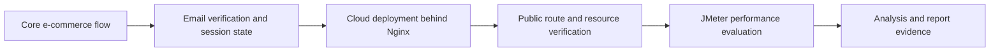
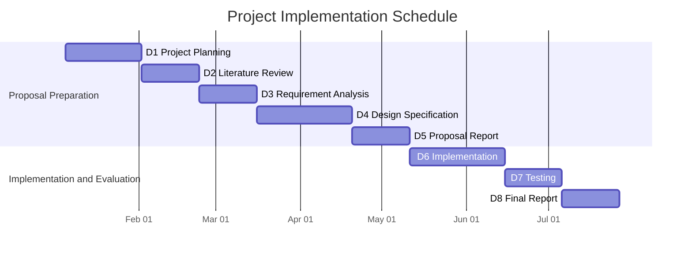
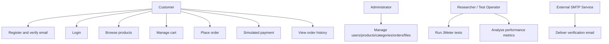
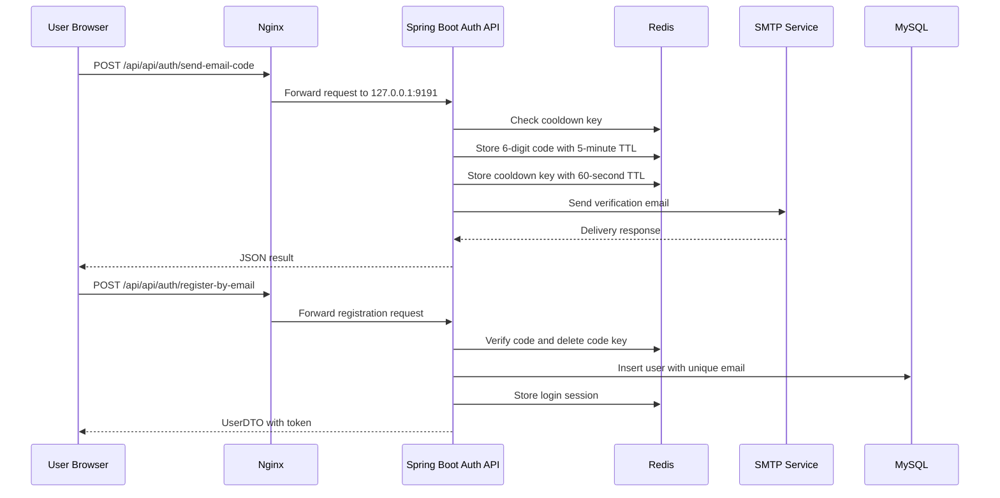
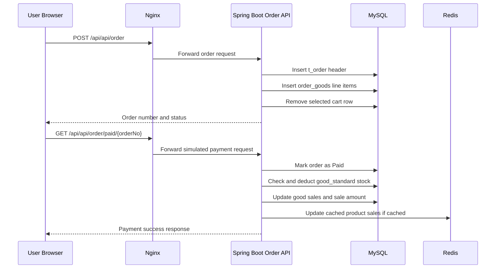
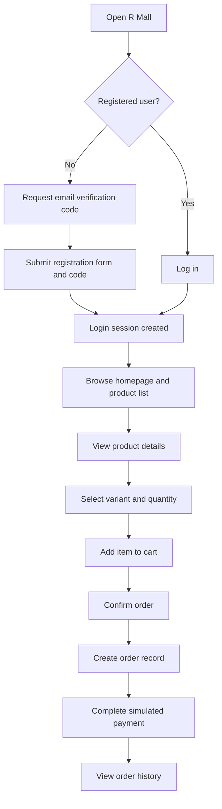
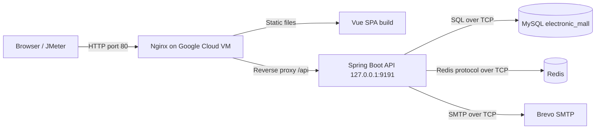
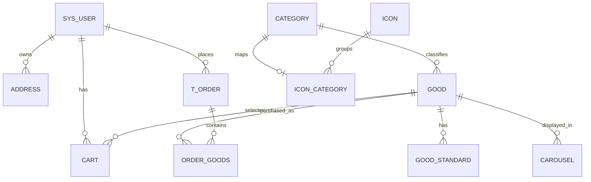
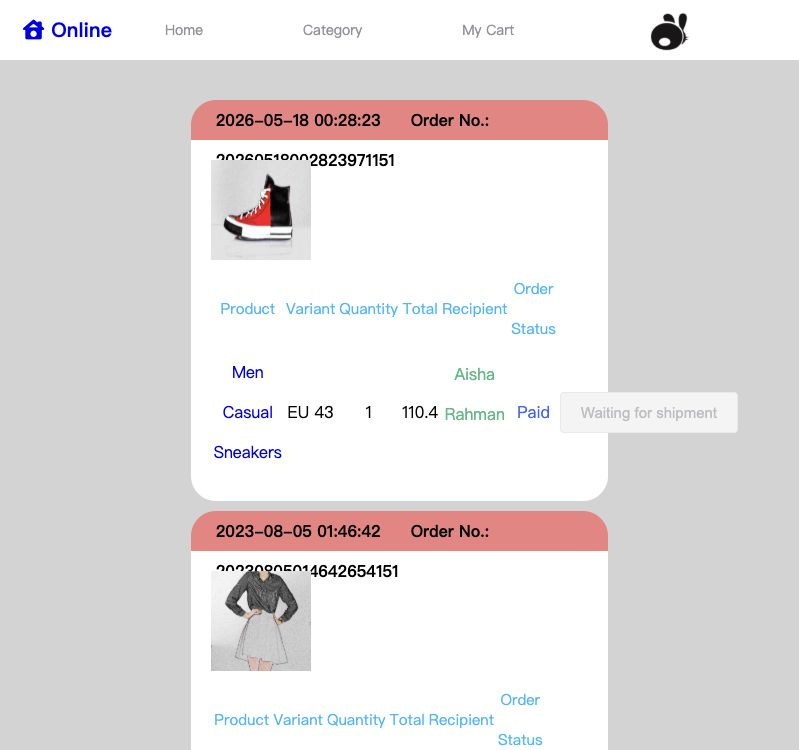
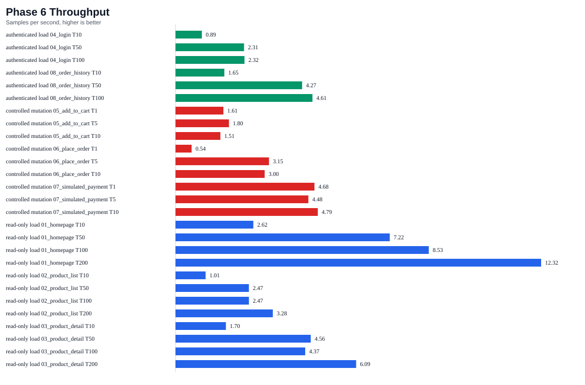

# D5 PROPOSAL REPORT

## Development and Network Performance Evaluation of a Cloud-Based Small E-Commerce Platform

**Student:** Li Rufeng
**Student ID:** A206331
**Programme:** Bachelor of Computer Science with Honours
**Faculty:** Faculty of Information Science and Technology, Universiti Kebangsaan Malaysia
**Project domain:** Network Technology - Cloud Computing and Network Application Performance Evaluation
**System name:** R Mall
**Version:** Rewritten D5 version 3, 28 June 2026

---

## DECLARATION

I hereby declare that, except for the citations and summaries with cited sources in this project, all work in this project has been carried out by myself.

I declare that I used Grammarly and ChatGPT to assist with language checking, idea organisation, and explanation of technical concepts. All AI-assisted outputs were reviewed, corrected, and verified against the implemented source code, deployment configuration, project documentation, and official technology references before being included in this report.

---

## ACKNOWLEDGEMENT

I would like to express my sincere gratitude to my project supervisor, Dr. Nazhatul Hafizah Kamarudin, for her guidance, advice, and support throughout the planning, development, deployment, and evaluation of this project. I also thank the Faculty of Information Science and Technology, Universiti Kebangsaan Malaysia, for providing the academic structure and resources needed to complete this Final Year Project.

Finally, I thank my family for their support and encouragement during the completion of this project.

---

## ABSTRAK

Pertumbuhan aplikasi web berasaskan awan menyebabkan sistem e-dagang kecil perlu menyediakan bukan sahaja fungsi membeli-belah yang lengkap, tetapi juga komunikasi rangkaian yang stabil apabila menerima akses pengguna secara serentak. Projek ini membangunkan dan menilai R Mall, sebuah platform e-dagang kecil berasaskan awan untuk Projek Tahun Akhir bidang Teknologi Rangkaian. Sistem ini menyokong pendaftaran dan log masuk pengguna, pengesahan e-mel, paparan produk, pengurusan troli, penempatan pesanan, pembayaran simulasi, sejarah pesanan dan pengurusan pentadbir asas. Platform ini dilaksanakan menggunakan Vue 2, Spring Boot, MySQL, Redis dan Nginx, serta dikerahkan pada mesin maya Google Cloud. Dari perspektif Teknologi Rangkaian, projek ini menganalisis aliran permintaan HTTP antara pelayar, proksi songsang Nginx, pelayan aplikasi Spring Boot, pangkalan data MySQL dan perkhidmatan keadaan sementara Redis. Apache JMeter digunakan untuk menilai masa tindak balas, daya pemprosesan dan kadar ralat di bawah beban pengguna serentak yang terkawal. Bukti ujian semasa menunjukkan bahawa prototaip yang dikerahkan dapat menyokong beban demonstrasi Projek Tahun Akhir yang dipilih dengan kadar ralat JMeter 0.00%, namun masa tindak balas beberapa senario bacaan menjadi beberapa saat pada beban yang lebih tinggi. Projek ini menghasilkan testbed e-dagang berasaskan awan yang praktikal dan menunjukkan bagaimana penilaian prestasi rangkaian boleh digabungkan dengan pembangunan aplikasi web peringkat prasiswazah.

**Kata kunci:** Aplikasi berasaskan awan, platform e-dagang kecil, penilaian prestasi rangkaian, HTTP, proksi songsang, Nginx, Apache JMeter, Spring Boot, Vue, Redis.

---

## ABSTRACT

As cloud-hosted web applications become common, small e-commerce platforms must provide not only functional shopping features but also stable network communication under concurrent access. This project develops and evaluates R Mall, a cloud-based small e-commerce platform for a Network Technology Final Year Project. The system supports user registration and login, email verification, product browsing, cart management, order placement, simulated payment, order history, and basic administrator management. It is implemented using Vue 2, Spring Boot, MySQL, Redis, and Nginx, and is deployed on a Google Cloud VM. From the Network Technology perspective, the project analyses the HTTP request path between the browser, Nginx reverse proxy, Spring Boot application server, MySQL database, and Redis temporary-state service. Apache JMeter is used to evaluate response time, throughput, and error rate under controlled concurrent user loads. The current testing evidence shows that the deployed prototype supports the selected FYP demonstration workloads with 0.00% recorded JMeter error rate, while also revealing multi-second response times under higher browsing loads. The project provides a practical cloud-based e-commerce testbed and demonstrates how network performance evaluation can be integrated into undergraduate web application development.

**Keywords:** Cloud-based application, small e-commerce platform, network performance evaluation, HTTP, reverse proxy, Nginx, Apache JMeter, Spring Boot, Vue, Redis.

---

## TABLE OF CONTENTS

- [CHAPTER 1: PROJECT PLANNING](#chapter-1-project-planning)
- [CHAPTER 2: LITERATURE REVIEW](#chapter-2-literature-review)
- [CHAPTER 3: METHODOLOGY](#chapter-3-methodology)
- [REFERENCES](#references)
- [APPENDIX](#appendix)

---

## LIST OF TABLES

| Table | Title |
|---|---|
| Table 1.1 | Project Objectives and Measurable Indicators |
| Table 1.2 | Project Scope and Exclusions |
| Table 1.3 | Implementation Schedule |
| Table 2.1 | Comparison of Relevant Technologies and Approaches |
| Table 3.1 | Stakeholders and User Needs |
| Table 3.2 | Functional Requirements |
| Table 3.3 | Non-Functional and Network Requirements |
| Table 3.4 | OSI and Protocol Mapping |
| Table 3.5 | Hardware and Software Requirements |
| Table 3.6 | Component and Interface Summary |
| Table 3.7 | Database Table Summary |
| Table 3.8 | Algorithm Summary |
| Table 3.9 | JMeter Evaluation Matrix |
| Table 3.10 | Highest-Concurrency JMeter Result Summary |

---

## LIST OF FIGURES

| Figure | Title |
|---|---|
| Figure 1.1 | Project Development Workflow |
| Figure 1.2 | Gantt Chart of Project Timeline |
| Figure 3.1 | Use Case Diagram |
| Figure 3.2 | Email Verification Sequence |
| Figure 3.3 | Order and Simulated Payment Sequence |
| Figure 3.4 | Customer Shopping Activity Flow |
| Figure 3.5 | Overall Cloud Deployment Architecture |
| Figure 3.6 | Network Request Flow |
| Figure 3.7 | Database Entity Relationship Diagram |
| Figure 3.8 | Interface Screenshot Set |
| Figure 3.9 | JMeter Performance Charts |

---

## LIST OF ABBREVIATIONS

| Abbreviation | Meaning |
|---|---|
| API | Application Programming Interface |
| FYP | Final Year Project |
| HTTP | Hypertext Transfer Protocol |
| HTTPS | Hypertext Transfer Protocol Secure |
| IP | Internet Protocol |
| JWT | JSON Web Token |
| NFR | Non-Functional Requirement |
| OSI | Open Systems Interconnection |
| REST | Representational State Transfer |
| SMTP | Simple Mail Transfer Protocol |
| SPA | Single Page Application |
| TCP | Transmission Control Protocol |
| TTL | Time To Live |
| VM | Virtual Machine |

---

# CHAPTER 1: PROJECT PLANNING

## 1.1 Introduction

E-commerce systems are now a common part of daily digital activity. Even a small online store requires a stable web interface, correct business workflow, and reliable communication between users and the server. When such a system is deployed in the cloud, its performance depends not only on application logic but also on the network path followed by each request.

This project is titled **Development and Network Performance Evaluation of a Cloud-Based Small E-Commerce Platform**. The implemented system is called **R Mall**. It is a small cloud-hosted e-commerce platform that supports realistic shopping activities such as account access, product browsing, cart management, order placement, simulated payment, and order history. These functions are not intended to create a commercial marketplace. They are included to provide a realistic client-server-database workload for Network Technology analysis.

From the Network Technology perspective, R Mall is studied as a network application. A browser requests the Vue single page application through Nginx. The frontend sends JSON API requests through HTTP. Nginx receives public traffic on the Google Cloud VM, serves static frontend files, and reverse-proxies API requests to the Spring Boot backend running on the internal loopback port. The backend then communicates with MySQL for persistent data and Redis for short-lived session, verification-code, cooldown, and cache state. Apache JMeter simulates traffic through the same public HTTP endpoint to measure response time, throughput, and error rate.

The project therefore satisfies the Network Technology requirement to build a working application, analyse communication tools and protocols, vary testing parameters, and interpret performance results. The project is deliberately bounded to a single-VM academic prototype so that the implementation remains feasible within the FYP timeline while still producing measurable network performance evidence.

## 1.2 Problem Statement

Many student web application projects stop after proving that the main functions work locally. However, for a Network Technology project, functional correctness alone is insufficient. A cloud-hosted application also needs to show how requests move through the deployed network path and how the system behaves under concurrent access.

The problem addressed by this project can be stated as follows:

> A small e-commerce platform needs to be developed and deployed in a cloud environment so that its client-server-database communication can be analysed and its network performance can be measured under controlled concurrent user loads.

The problem has four main aspects.

First, a cloud e-commerce platform involves multiple communicating components. A user request may pass through the browser, public IP address, Nginx reverse proxy, Spring Boot application server, MySQL database, Redis service, and sometimes an external SMTP service. If these communication paths are not documented, the system becomes only a web programming project rather than a Network Technology project.

Second, network performance cannot be assumed from successful manual testing. Login, product browsing, cart updates, order placement, and payment confirmation may work for one user but become slower when many simulated users access the system. Response time, throughput, and error rate must therefore be measured.

Third, a realistic but bounded workload is needed. A full commercial e-commerce platform would require real payment integration, logistics, refunds, security hardening, multiple application servers, and high-availability design. These are outside the undergraduate project scope. At the same time, an overly simple endpoint benchmark would not reflect real shopping behaviour. The project needs a middle ground: a small but complete e-commerce workflow that can be repeatedly tested.

Fourth, current project evidence shows that the public deployment uses HTTP only. No HTTPS certificate, port 443 configuration, or HTTP-versus-HTTPS performance comparison has been implemented. Therefore, the project must present the current HTTP reverse-proxy evaluation honestly and treat HTTPS as future work rather than an achieved result.

## 1.3 Proposed Solution

The proposed solution is to develop and evaluate **R Mall**, a cloud-based small e-commerce platform deployed on a Google Cloud VM. The system combines a Vue frontend, Spring Boot REST backend, MySQL database, Redis temporary-state service, Nginx reverse proxy, Brevo SMTP email delivery, and Apache JMeter performance testing.

The solution has five main parts.

First, the application provides a realistic e-commerce golden path:

```text
Register / Login
-> Browse Products
-> View Product Details
-> Add to Cart
-> Place Order
-> Complete Simulated Payment
-> View Order History
```

This golden path gives the project realistic request types, including public browsing, authenticated API access, database reads, database writes, and state changes.

Second, the backend uses Spring Boot with a controller-service-mapper-entity structure. Controllers expose REST endpoints, services contain business logic and transactions, MyBatis/MyBatis-Plus maps SQL access, and entities/DTOs structure database and response data. MySQL stores durable business data, while Redis stores temporary session and email-verification state.

Third, the authentication flow is strengthened through email verification. The system generates six-digit verification codes, stores them in Redis for five minutes, enforces a 60-second resend cooldown, and sends the code through SMTP. JWT tokens are returned after successful account actions and are backed by Redis session records. This provides a practical FYP-level session model without claiming full production-grade identity security.

Fourth, the system is deployed on a Google Cloud VM. Nginx listens on port 80, serves the Vue production build, supports SPA history routing through `try_files`, and forwards `/api/` requests to the Spring Boot service running on `127.0.0.1:9191`. The backend port is not the public user entry point.

Fifth, Apache JMeter is used to evaluate performance. Eight test plans cover homepage, product list, product detail, login, add to cart, place order, simulated payment, and order history. The evaluation varies thread counts and separates read-only, authenticated, and controlled mutation scenarios.

This solution fits the Network Technology domain because it creates a working network application, documents the protocol and topology, and evaluates network behaviour using measurable performance indicators.

## 1.4 Project Objectives

The three major goals of this project are:

**Objective 1:** To design and develop a cloud-based small e-commerce platform that supports core online shopping functions.

This objective focuses on producing a complete but bounded web application that can support realistic shopping activities within the scope of an undergraduate Network Technology project. The system includes user registration and login, email verification, product browsing, product detail viewing, cart management, order placement, simulated payment, order history, and basic administrator management. The purpose is not to build a commercial marketplace. Instead, the developed application provides a realistic client-server-database workload that can be deployed, demonstrated, and tested under controlled network conditions. This objective is specific, achievable within the project duration, and measurable through the verified completion of the main customer and administrator workflows.

**Objective 2:** To implement and analyse the network communication mechanisms used by the platform in a cloud environment.

This objective establishes the Network Technology focus of the project. It examines how requests are transmitted between the browser, Nginx reverse proxy, Spring Boot REST API, MySQL database, Redis temporary-state service, and SMTP email service. The analysis includes the public HTTP entry point, reverse-proxy forwarding, JSON API exchange, TCP-based database and Redis communication, token-based session handling, and the OSI-layer interpretation of these interactions. By treating deployment and request routing as part of the academic analysis, the project goes beyond ordinary web development and remains aligned with the requirement to analyse communication tools, techniques, protocols, and application construction.

**Objective 3:** To evaluate the network performance of the deployed platform under different test parameters using Apache JMeter.

This objective provides the empirical evaluation component of the project. Apache JMeter is used to execute controlled HTTP test plans for homepage loading, product browsing, product detail retrieval, login, cart update, order placement, simulated payment, and order-history retrieval. The evaluation varies thread counts, ramp-up settings, and loop counts according to the scenario type, and measures average response time, P90 response time, throughput, samples, errors, and error rate. This objective is measurable through retained JMeter result summaries, aggregate CSV files, charts, and execution records. It also defines a clear limitation: the current evaluation is based on HTTP deployment and does not claim HTTPS or HTTP-versus-HTTPS comparison results.

**Table 1.1: Project Objectives and Measurable Indicators**

| Objective | SMART interpretation | Evidence or indicator |
|---|---|---|
| Objective 1 | Specific and achievable: build a bounded small e-commerce platform | Working customer and administrator functions; verified golden path |
| Objective 2 | Relevant to Network Technology: analyse deployed request communication | Nginx reverse proxy configuration, OSI/protocol mapping, cloud topology |
| Objective 3 | Measurable: evaluate response time, throughput, and error rate | JMeter result summaries, aggregate CSV, charts, and Phase 6 report |

## 1.5 Project Scope

The scope is divided into application scope, network/deployment scope, performance evaluation scope, and excluded scope.

**Included application scope**

- User registration and login.
- Email-code registration and password reset.
- Product homepage, categories, search/listing, and product details.
- Product variants with different prices and stock.
- Shopping cart operations.
- Order placement.
- Simulated payment.
- Order history.
- Basic administrator management for users, products, categories, carousel, orders, files, avatars, and income views.

**Included network and deployment scope**

- Vue 2 frontend served as a production SPA.
- Spring Boot REST backend.
- MySQL relational database.
- Redis for temporary session, verification-code, cooldown, and selected cached product state.
- Nginx public web server and reverse proxy.
- Google Cloud VM deployment.
- Public HTTP endpoint.
- Internal Spring Boot service on port 9191.
- Request path analysis across browser, Nginx, backend, database, and Redis.

**Included performance evaluation scope**

- Apache JMeter test plans for key user journeys.
- Smoke testing, read-only load testing, authenticated load testing, and controlled mutation testing.
- Metrics: average response time, P90 response time, throughput per second, samples, errors, and error rate.
- Controlled concurrency parameters using JMeter threads, ramp-up, and loops.

**Excluded scope**

- Real payment gateway integration.
- Alipay, WeChat Pay, Stripe, or bank settlement.
- OAuth or social login.
- Docker, Kubernetes, microservices, container orchestration, and auto-scaling.
- CDN and horizontal load-balancing clusters.
- Real logistics tracking, refunds, invoices, and commercial settlement.
- AI recommendation and multi-vendor seller management.
- Production-grade security certification.
- HTTP-versus-HTTPS performance comparison, because HTTPS has not been implemented or tested.

**Table 1.2: Project Scope and Exclusions**

| Area | Included | Excluded |
|---|---|---|
| Application | Small e-commerce workflow and admin support | Commercial marketplace complexity |
| Network | HTTP request path, Nginx reverse proxy, cloud VM deployment | TLS/HTTPS production deployment and HTTP/HTTPS comparison |
| Data | MySQL relational data and Redis temporary state | Distributed database cluster |
| Payment | Simulated payment state transition | Real payment provider or financial transaction |
| Testing | JMeter controlled load and mutation tests | Commercial-scale capacity certification |

## 1.6 Constraints and Restrictions

The project is subject to the following constraints.

1. **Academic resource constraint.** The deployed system runs on a single Google Cloud VM with an academic budget. The results represent a bounded FYP prototype, not a horizontally scaled production platform.

2. **HTTP-only public deployment.** The current Nginx configuration listens on port 80. There is no domain, TLS certificate, port 443 listener, or HTTP-to-HTTPS redirect in the current deployed configuration.

3. **Controlled mutation testing.** Add-to-cart, order placement, and simulated-payment tests change live cart, order, stock, and sales data. Therefore, mutation tests are intentionally limited to lower thread counts and require database backup discipline.

4. **Shared demo account limitation.** Some JMeter scenarios use a shared demo user and selected product variant. This is suitable for controlled FYP evidence but not for a full production-grade order-concurrency benchmark.

5. **Internet route variability.** The load generator runs from a local workstation against the public VM, so observed response times include internet route variability outside direct project control.

6. **Credential confidentiality.** SMTP and database credentials must be stored in environment variables or protected runtime files. They must not be included in the report or committed to the repository.

7. **Demo-compatible password handling.** Password handling follows existing frontend MD5 compatibility and should be improved with server-side salted password hashing such as bcrypt or Argon2 in future production work.

8. **Administrative tooling limitation.** phpMyAdmin and similar administration tools are used only for convenience during project work and should not be treated as final security design.

## 1.7 Methodology

This project adopts an **Iterative Incremental Development** methodology. This model is suitable because the project combines application development, cloud deployment, authentication improvement, database work, and network performance evaluation. Each increment can be implemented, tested, corrected, and documented before the next increment is added.

The implemented increments are:

1. **Increment 1: Localisation and core flow stabilisation.** The base e-commerce flow was stabilised, visible UI text was localised into English, RM currency was used, and the main customer route flow was verified.

2. **Increment 2: Authentication and email verification.** Registration and password reset were improved through email verification, Redis TTL keys, cooldown handling, and backend tests.

3. **Increment 3: Cloud deployment.** The frontend, backend, MySQL, Redis, Nginx, systemd service, environment files, and persistent upload directory were prepared for the Google Cloud VM.

4. **Increment 4: Cloud runtime debugging.** Resource paths, API routing, history-mode fallback, media upload storage, public image loading, and authenticated read paths were verified.

5. **Increment 5: Performance evaluation.** JMeter plans were prepared, validated, executed, and summarised. Results were interpreted through response time, throughput, and error rate.

This methodology was chosen because network application development is integration-heavy. A small configuration problem in Nginx, environment variables, API paths, Redis, or database state can break the whole system. Iterative development makes each problem easier to isolate.



**Figure 1.1: Project Development Workflow**

## 1.8 Implementation Schedule

The project work is organised as a Work Breakdown Structure (WBS) that follows the required D1 to D8 deliverable sequence. Earlier planning and review tasks define the academic direction, while later implementation and testing tasks depend on the approved scope, requirements, architecture, and deployment decisions.

**Table 1.3: Implementation Schedule**

| WBS ID | Phase | Main activities | Dependency | Estimated duration | Output / milestone |
|---|---|---|---|---|---|
| 1.0 | D1 Project Planning | Define background, problem statement, proposed solution, SMART objectives, scope, restrictions, method, and initial schedule | None | 4 weeks | Approved project planning direction |
| 2.0 | D2 Literature Review | Review cloud deployment, reverse proxy, REST communication, databases, Redis, e-commerce workload, and performance testing | D1 scope | 3 weeks | Literature foundation and research gap |
| 3.0 | D3 Requirement Analysis | Define stakeholders, user needs, functional requirements, non-functional requirements, hardware/software requirements, OSI requirements, and system models | D1 and D2 | 3 weeks | Requirements and methodology baseline |
| 4.0 | D4 Design Specification | Design architecture, network topology, database, algorithms, interface evidence, and performance-evaluation method | D3 requirements | 5 weeks | Design specification and prototype design |
| 5.0 | D5 Proposal Report | Consolidate D1 to D4 into a proposal report aligned with Network Technology criteria | D1-D4 | 3 weeks | Current proposal report |
| 6.0 | D6 Implementation | Implement and explain selected critical frontend, backend, database, authentication, deployment, and verification components | D5 direction | 5 weeks | Implementation document and source evidence |
| 7.0 | D7 Testing | Execute functional, integration, deployment, and JMeter performance testing; collect results and interpret limitations | D6 implementation | 3 weeks | Testing report and performance evidence |
| 8.0 | D8 Final Report | Combine updated chapters, implementation, testing, conclusion, limitations, references, and appendices | D7 evidence | 3 weeks | Final thesis report |

The main dependency relationship is sequential, but the implementation follows iterative refinement within each phase. For example, deployment configuration, email verification, database migration, and JMeter scripts were each tested and corrected before the next phase was finalised. This relationship is important because performance evaluation cannot be executed reliably until the deployed application, database state, Nginx routing, and authentication flows are stable.

The project milestones are:

- Week 4: D1 project planning completed.
- Week 7: D2 literature review completed.
- Week 10: D3 requirements analysis completed.
- Week 15: D4 design specification completed.
- Week 18: D5 proposal report prepared.
- Week 23: D6 implementation evidence prepared.
- Week 26: D7 testing and JMeter evidence prepared.
- Week 29: D8 final report integration prepared.



**Figure 1.2: Gantt Chart of Project Timeline**

> **Manual figure note:** If the final submission template does not support Mermaid rendering, replace Figure 1.2 with a manually inserted Gantt chart image exported from a spreadsheet or project-planning tool.

## 1.9 Conclusion

This chapter has introduced the project, stated the problem, proposed the solution, defined objectives, described scope and restrictions, and explained the development methodology. The project is not positioned as a commercial e-commerce platform. It is a Network Technology FYP that uses a small e-commerce application as a realistic testbed for cloud request flow and performance evaluation.

---

# CHAPTER 2: LITERATURE REVIEW

## 2.1 Introduction

This chapter reviews the technologies and concepts relevant to a cloud-based small e-commerce platform and its network performance evaluation. The review focuses on cloud-hosted web applications, client-server communication, RESTful APIs, reverse proxy deployment, relational and temporary-state data management, e-commerce workloads, and performance testing using Apache JMeter.

The aim is not to argue for a large enterprise architecture. Instead, the review supports the project decision to build a bounded cloud application and evaluate it through measurable network indicators.

## 2.2 Cloud-Based Web Application Deployment

Cloud deployment allows a web application to be accessed through the internet without requiring every user to run the system locally. For a small academic project, a cloud VM is a practical deployment option because it provides one controllable server environment where the frontend, backend, database services, reverse proxy, and test endpoint can be configured and observed (Google Cloud 2026).

In this project, the Google Cloud VM acts as the public host. The VM runs Ubuntu, Nginx, Spring Boot, MySQL, and Redis. This single-host deployment is simpler than a production multi-node cloud platform, but it is sufficient for analysing a complete browser-to-server request path. The single-VM model also makes limitations clearer: CPU, memory, disk I/O, database performance, and internet route variability may all affect response time.

For Network Technology work, the important point is that the cloud VM creates a real public network boundary. JMeter and browsers access the system through the public endpoint rather than through localhost. This allows the project to measure deployed behaviour rather than only local development behaviour.

## 2.3 Client-Server and RESTful Communication

The implemented system follows a client-server model. The Vue frontend runs in the browser after being served by Nginx. The frontend then uses Axios to send HTTP requests to backend REST endpoints. Requests and responses use JSON for structured data exchange (Axios 2026; Vue.js 2026).

RESTful communication is suitable for this project because it creates clear, testable HTTP endpoints. Examples include product listing, product detail, login, cart operations, order creation, simulated payment, and order history. Each endpoint can be manually verified and later tested by JMeter.

From the OSI model perspective, REST and JSON are application-layer concerns, HTTP is the application-layer protocol used for web exchange, TCP provides reliable transport, and IPv4 routes traffic between the client and the cloud VM. MySQL and Redis also use TCP-based communication between the Spring Boot application and local data services (Fielding, Nottingham & Reschke 2022; Mozilla Developer Network 2026).

## 2.4 Reverse Proxy and Nginx in Web Systems

A reverse proxy receives public requests and forwards selected traffic to internal services. Nginx is widely used for this role because it can serve static files, handle routing rules, forward headers, and proxy API traffic to an application server (F5 NGINX 2026).

In R Mall, Nginx has two roles:

1. It serves the Vue production build as static frontend files.
2. It forwards `/api/` requests to the Spring Boot backend on `127.0.0.1:9191`.

This arrangement separates the public entry point from the backend runtime. Users do not access the Spring Boot port directly. Instead, Nginx receives the request, applies SPA fallback rules for frontend routes, and forwards API requests internally. Forwarded headers such as `Host`, `X-Real-IP`, `X-Forwarded-For`, and `X-Forwarded-Proto` help preserve original client and protocol information.

For performance evaluation, the reverse proxy is important because JMeter tests the same public path used by real browsers. The measured response time includes Nginx serving or proxying, backend processing, and data-service communication where applicable.

## 2.5 Database and Temporary State Management

E-commerce applications require persistent data for users, products, carts, orders, and media. MySQL is used in this project as the relational database because the data has clear entities and relationships, while MyBatis maps SQL access between the Java service layer and the relational schema (MyBatis 2026; Oracle 2026). The schema includes user accounts, addresses, product categories, products, variants, cart rows, order headers, order line items, carousel items, file metadata, and avatar metadata.

Redis is used for temporary state rather than durable business records. This separation is important. MySQL stores the long-term state of the e-commerce workflow, while Redis stores data that naturally expires or can be regenerated. Examples include login session records, email verification codes, resend cooldown keys, and selected cached product data (Redis 2026).

Using Redis for verification codes is especially suitable because codes should expire automatically. In this project, a verification code lasts five minutes and a resend cooldown lasts 60 seconds. This behaviour can be implemented cleanly using Redis TTL support.

## 2.6 E-Commerce Workload and User Transaction Flow

The e-commerce domain provides a useful workload for Network Technology evaluation because different actions exercise different communication patterns.

Product browsing is mostly read-only. It tests how the frontend loads the page, how the API returns product data, and how database reads behave under concurrent access. Login and order history are authenticated read flows. Cart, order, and simulated payment are mutation flows because they update database state.

The selected golden path is realistic enough for testing:

```text
Login or register
-> Browse product list
-> View product detail
-> Add item to cart
-> Place order
-> Complete simulated payment
-> View order history
```

At the same time, the workload remains bounded. It excludes real financial settlement, third-party payment callbacks, logistics, refunds, and multi-vendor marketplace operations. This makes the project feasible while still supporting network performance analysis.

## 2.7 Network Performance Testing with Apache JMeter

Apache JMeter is a suitable tool for this project because it can generate HTTP requests, parameterise thread counts, apply assertions, and produce response-time, throughput, and error-rate data (Apache Software Foundation 2026). In R Mall, JMeter plans are created for eight scenarios:

1. Homepage.
2. Product list.
3. Product detail.
4. Login.
5. Add to cart.
6. Place order.
7. Simulated payment.
8. Order history.

The test design separates smoke tests, read-only load tests, authenticated load tests, and controlled mutation tests. This separation is necessary because mutation tests change live data. For example, order and payment tests create orders and reduce stock. Treating all scenarios as identical high-concurrency tests would make the dataset harder to control and could damage demonstration data.

The key metrics are:

- **Average response time:** the mean time taken by requests.
- **P90 response time:** the response time below which 90% of requests complete.
- **Throughput:** number of completed requests per second.
- **Error rate:** percentage of failed requests or failed assertions.

These metrics align with Network Technology expectations because they describe observable communication behaviour rather than only UI correctness.

## 2.8 Comparison and Research Gap

Many web application projects focus on feature completion: user registration, product display, cart logic, and order processing. These features are necessary, but they do not prove that a cloud deployment remains usable under concurrent access. Conversely, some performance tests use simple synthetic endpoints that do not represent a realistic user workflow.

This project addresses the gap by using a complete but bounded e-commerce workflow as the workload for performance evaluation. It tests both read-only and mutation scenarios through the public cloud endpoint. It also documents the network path across browser, Nginx, backend, MySQL, and Redis.

**Table 2.1: Comparison of Relevant Technologies and Approaches**

| Area | Alternative | Selected approach | Justification |
|---|---|---|---|
| Deployment | Localhost only | Google Cloud VM | Enables public endpoint testing and cloud request-path analysis |
| Frontend | Server-rendered pages | Vue SPA | Supports reusable UI components and client-side route flow |
| Backend | Ad hoc servlet endpoints | Spring Boot REST API | Provides structured web, configuration, mail, and test support |
| Reverse proxy | Direct backend exposure | Nginx | Separates public entry from internal backend port |
| Persistence | File storage only | MySQL | Fits relational e-commerce entities and transactions |
| Temporary state | Database polling | Redis | Fits TTL session, verification code, and cooldown state |
| Payment | Real gateway | Simulated payment | Avoids financial risk while preserving order-state transition |
| Testing | Manual clicking only | Apache JMeter | Produces repeatable response-time, throughput, and error-rate evidence |

## 2.9 Conclusion

The literature and technology review supports the selected project direction. A single-VM cloud deployment with Nginx reverse proxy is appropriate for a bounded Network Technology FYP. RESTful HTTP communication, MySQL, Redis, and JMeter provide a practical stack for building, deploying, testing, and analysing a small cloud e-commerce application. The review also shows why the project must avoid unsupported claims such as commercial-scale capacity, real payment integration, or HTTPS comparison when these are not part of the implemented system.

---

# CHAPTER 3: METHODOLOGY

## 3.1 Introduction

This chapter describes the methodology used to specify, model, design, and evaluate R Mall. It combines the D3 requirement-analysis perspective and the D4 design-specification perspective required for the D5 Proposal Report.

The chapter covers user needs, functional requirements, non-functional and network requirements, OSI/protocol specification, system models, architecture design, database design, algorithm design, interface design, and performance evaluation method.

## 3.2 User Needs and Stakeholders

The system has four main stakeholder groups: customers, administrators, researcher/test operator, and external SMTP service.

**Table 3.1: Stakeholders and User Needs**

| Stakeholder | User needs |
|---|---|
| Customer | Register, verify email, log in, browse products, choose variants, manage cart, place order, complete simulated payment, and view order history |
| Administrator | Manage users, products, categories, variants, carousel records, files, avatars, and orders for demonstration data maintenance |
| Researcher/Test operator | Run JMeter tests, control thread parameters, collect response-time/throughput/error-rate results, and analyse request behaviour |
| External SMTP service | Receive outbound email requests from Spring Boot and deliver verification codes to users |

## 3.3 Functional Requirements

**Table 3.2: Functional Requirements**

| ID | Requirement |
|---|---|
| FR-01 | The system shall allow users to register, log in, and reset passwords through email verification. |
| FR-02 | The system shall display product lists, product details, categories, icons, and carousel data. |
| FR-03 | The system shall allow authenticated users to add products to cart, view cart rows, update cart quantities, and remove cart rows. |
| FR-04 | The system shall allow authenticated users to place orders from selected cart items. |
| FR-05 | The system shall support simulated payment and update order state, stock, product sales, and cached product data where applicable. |
| FR-06 | The system shall allow users to view their order history. |
| FR-07 | The system shall provide basic administrator management for users, products, product variants, categories, carousel records, files, avatars, and orders. |
| FR-08 | The system shall deploy to a cloud VM using Nginx as static web server and reverse proxy. |
| FR-09 | The system shall provide Apache JMeter test plans for smoke, read-only load, authenticated load, and controlled mutation scenarios. |

## 3.4 Non-Functional and Network Requirements

**Table 3.3: Non-Functional and Network Requirements**

| ID | Requirement |
|---|---|
| NFR-01 | The public web application shall be accessible through the Google Cloud VM public IP over HTTP. |
| NFR-02 | The backend service shall not be the primary public entry point; API traffic shall pass through Nginx. |
| NFR-03 | The frontend shall call production APIs through the `/api` base path. |
| NFR-04 | Email verification codes shall expire after five minutes. |
| NFR-05 | Email-code resend attempts shall be limited by a 60-second cooldown. |
| NFR-06 | Authenticated requests shall include a token header and shall be validated through JWT plus Redis-backed session state. |
| NFR-07 | JMeter tests shall measure response time, throughput, and error rate under defined thread levels. |
| NFR-08 | Mutation tests shall be controlled and backed up because they modify cart, order, stock, and sales data. |
| NFR-09 | The report shall state that HTTPS and HTTP-versus-HTTPS performance comparison are future work, not current results. |

## 3.5 OSI and Protocol Specification

**Table 3.4: OSI and Protocol Mapping**

| OSI layer | Project usage |
|---|---|
| Layer 7 - Application | HTTP/1.1, RESTful APIs, JSON payloads, Vue SPA assets, SMTP email sending |
| Layer 6 - Presentation | JSON serialization and browser rendering; TLS is not configured for the current public endpoint |
| Layer 5 - Session | JWT token handling with Redis-backed session state and expiry |
| Layer 4 - Transport | TCP for HTTP, MySQL, Redis, and SMTP communication |
| Layer 3 - Network | IPv4 public access to Google Cloud VM; loopback/internal VM communication to backend service |
| Layer 2 and below | Abstracted by local network and Google Cloud infrastructure |

The public deployment is HTTP-only. Therefore, this report does not claim TLS termination, HTTPS performance measurement, or HTTP-versus-HTTPS comparison.

## 3.6 Hardware and Software Requirements

**Table 3.5: Hardware and Software Requirements**

| Category | Requirement |
|---|---|
| Cloud host | Google Cloud VM `fyp-mall-vm`, zone `asia-southeast1-b`, Ubuntu 22.04 LTS |
| Public endpoint | `http://34.143.225.11/` |
| Public web port | Nginx port 80 |
| Backend runtime | Spring Boot service on internal port 9191 |
| Frontend | Vue 2.6.14, Vue Router 3.5.1, Vuex 3.6.2, Element UI, Axios 0.26.1 |
| Backend | Java 8, Spring Boot 2.5.6, Spring Web, MyBatis, MyBatis-Plus |
| Database | MySQL database named `electronic_mall` |
| Temporary state | Redis |
| Email | Spring Boot Mail with Brevo SMTP credentials supplied by environment variables |
| Testing | Maven, npm scripts, Node verification utilities, Apache JMeter 5.6.3 |

## 3.7 System Model

This project uses an object-oriented modelling approach for user interaction and system behaviour. It also includes a network communication model because the project belongs to Network Technology.

### 3.7.1 Use Case Model

Actors:

- Customer.
- Administrator.
- Researcher/Test Operator.
- External SMTP Service.

Main customer use cases:

- Register account.
- Verify email.
- Log in.
- Browse products.
- View product detail.
- Manage cart.
- Place order.
- Complete simulated payment.
- View order history.

Main administrator use cases:

- Manage users.
- Manage products and product variants.
- Manage categories and carousel records.
- Manage orders.
- Manage files and avatars.

Researcher/test operator use cases:

- Run JMeter test plans.
- Configure thread, ramp-up, and loop parameters.
- Collect response time, throughput, and error-rate results.
- Interpret performance limitations.



**Figure 3.1: Use Case Diagram**

### 3.7.2 Sequence Models

**Email verification registration sequence**



**Figure 3.2: Email Verification Sequence**

**Order and simulated payment sequence**



**Figure 3.3: Order and Simulated Payment Sequence**

### 3.7.3 Activity Model

The activity model describes the main customer shopping workflow used for functional verification and JMeter scenario design. It begins with account access, continues through product browsing and cart management, and ends with simulated payment and order-history confirmation. The same workflow provides the basis for selecting representative read-only, authenticated, and mutation test scenarios.



**Figure 3.4: Customer Shopping Activity Flow**

This diagram is part of the object-oriented system model required by the guideline. The relational ERD in Section 3.9 is used only for database design and does not change the selected system-model approach.

### 3.7.4 Network Communication Model



**Figure 3.5: Overall Cloud Deployment Architecture**

The request path for a normal API call is:

```text
Browser or JMeter
-> Public IP on Google Cloud VM
-> Nginx port 80
-> Spring Boot service on 127.0.0.1:9191
-> MySQL and/or Redis
-> Spring Boot
-> Nginx
-> Browser or JMeter
```

**Figure 3.6: Network Request Flow**

## 3.8 Architecture Design

The architecture combines a layered application structure with a client-server cloud deployment.

Application layers:

- **Presentation layer:** Vue SPA, Element UI components, route views, Axios HTTP client.
- **Reverse proxy layer:** Nginx serving frontend files and forwarding API/resource paths.
- **Controller layer:** Spring Boot controllers exposing REST endpoints.
- **Service layer:** business rules, authentication handling, email verification, order transactions, and simulated payment.
- **Mapper/data access layer:** MyBatis mapper interfaces and XML SQL mappings.
- **Data layer:** MySQL for persistent business records and Redis for temporary state.
- **Testing layer:** Apache JMeter as an external load generator.

**Table 3.6: Component and Interface Summary**

| Component | Main responsibility | Network/interface role |
|---|---|---|
| Browser | Runs Vue SPA and sends requests | HTTP client |
| Nginx | Static serving and reverse proxy | Public port 80; forwards `/api/` to backend |
| Spring Boot API | Business processing and REST endpoints | Receives proxied HTTP requests on 9191 |
| MySQL | Durable business data | SQL over TCP from backend |
| Redis | Session, verification code, cooldown, cache state | Redis protocol over TCP from backend |
| SMTP service | Email delivery | Outbound email verification messages |
| JMeter | Load generation | Sends controlled HTTP requests to public endpoint |

The current Nginx deployment pattern is:

```nginx
server {
    listen 80;
    root /var/www/project-fyp-mall;
    index index.html;

    location / {
        try_files $uri $uri/ /index.html;
    }

    location /api/ {
        proxy_pass http://127.0.0.1:9191/;
        proxy_set_header Host $host;
        proxy_set_header X-Real-IP $remote_addr;
        proxy_set_header X-Forwarded-For $proxy_add_x_forwarded_for;
        proxy_set_header X-Forwarded-Proto $scheme;
    }
}
```

Because `proxy_pass` removes the first `/api/` segment in the current template, backend root routes such as `/login` are publicly reached as `/api/login`, while backend routes that already start with `/api/` are reached through paths such as `/api/api/good`. This path mapping is documented so that manual verification and JMeter plans use the correct deployed URLs.

## 3.9 Database Design

The database is named `electronic_mall`. It supports users, addresses, categories, icons, products, variants, carts, orders, order line items, carousel data, product-file metadata, and avatar metadata.

**Table 3.7: Database Table Summary**

| Table | Purpose |
|---|---|
| `sys_user` | Customer and administrator accounts, including unique email |
| `address` | Delivery address records linked to users |
| `category` | Product categories |
| `icon` | Icon codes for category navigation |
| `icon_category` | Mapping between icons and categories |
| `good` | Product master data |
| `good_standard` | Product variants, prices, and stock |
| `cart` | Shopping cart rows |
| `t_order` | Order headers |
| `order_goods` | Order line items |
| `carousel` | Homepage carousel product links |
| `sys_file` | Uploaded product file metadata |
| `avatar` | Avatar file metadata |



**Figure 3.7: Database Entity Relationship Diagram**

The current schema does not contain a `Network_Trace_Log` table. Performance evidence is retained through JMeter result files, aggregate CSV, summary Markdown, charts, execution records, and project reports rather than through a custom telemetry table.

## 3.10 Algorithm Design

The most important algorithms are email verification, JWT/Redis session validation, order creation, and simulated payment.

**Table 3.8: Algorithm Summary**

| Algorithm | Main steps | Network or data relevance |
|---|---|---|
| Email verification | Normalize email, check purpose, check cooldown, generate six-digit code, store code in Redis for five minutes, store cooldown for 60 seconds, send SMTP email, clean keys on failure, delete code after success | Uses Redis TTL and outbound SMTP communication |
| JWT/Redis session validation | Read token header, retrieve Redis session, refresh TTL, verify JWT signature, store current user context, reject missing or invalid token | Connects browser token, backend validation, and temporary server-side state |
| Order creation | Read current user, generate order number, insert order header, insert order line items, remove selected cart row in a transaction | Preserves data consistency during mutation requests |
| Simulated payment | Mark order paid, retrieve product variant and quantity, check stock, deduct stock, update product sales and sale amount, update Redis cached product if present | Provides a safe payment-like state transition without real financial gateway |

### 3.10.1 Email Verification Pseudocode

```text
BEGIN SendEmailCode(email, purpose)
    normalizedEmail = lowerCase(trim(email))
    VALIDATE normalizedEmail and purpose
    IF cooldown key exists in Redis THEN
        RETURN resend-too-soon error
    END IF
    code = generate six-digit code
    STORE code in Redis with 5-minute TTL
    STORE cooldown marker in Redis with 60-second TTL
    TRY send email through SMTP
    IF sending fails THEN
        DELETE code key and cooldown key
        RETURN send-failed error
    END IF
    RETURN success
END
```

### 3.10.2 Simulated Payment Pseudocode

```text
BEGIN PayOrder(orderNo)
    START TRANSACTION
    FIND order by orderNo and current user
    UPDATE order state to Paid
    FIND selected product variant
    IF stock is insufficient THEN
        ROLLBACK and return error
    END IF
    DEDUCT variant stock
    UPDATE product sales and sale amount
    UPDATE Redis cached product if cached
    COMMIT
    RETURN success
END
```

## 3.11 Interface Design

The implemented UI is a functional web interface for demonstration and testing. It includes customer-facing pages and administrator pages.

The customer interface supports the main shopping path from homepage browsing to order-history confirmation. The administrator interface supports data maintenance for users, products, categories, carousel records, files, avatars, and orders. These interfaces are included to demonstrate the working application and to provide stable test scenarios for the network performance evaluation.




**Figure 3.8: Interface Screenshot Set**

> **Manual figure note:** The screenshots above are inserted from the current project evidence. Before final submission in Word/PDF format, check whether each image is sharp and correctly scaled. If the Markdown renderer does not preserve spacing or image size, manually insert the same images from the listed file paths.

The interface design should not be described as a real-time network telemetry dashboard. The current implemented UI focuses on e-commerce demonstration and testable workflows. Network performance evidence is presented through JMeter reports and charts rather than live UI telemetry.

## 3.12 Performance Evaluation Method

Apache JMeter 5.6.3 is used to execute controlled HTTP tests against the deployed public endpoint. The test plans use:

- `BASE_PROTOCOL=http`
- `BASE_HOST=34.143.225.11`
- `BASE_PORT=80`
- `API_PREFIX=/api`

This confirms that the current executed evaluation is HTTP-only.

**Table 3.9: JMeter Evaluation Matrix**

| Category | Plans | Thread levels |
|---|---|---|
| Smoke | Homepage, product list, product detail, login, add to cart, place order, simulated payment, order history | 1 thread, 1 loop |
| Read-only load | Homepage, product list, product detail | 10, 50, 100, 200 |
| Authenticated load | Login, order history | 10, 50, 100 |
| Controlled mutation | Add to cart, place order, simulated payment | 1, 5, 10 |

Assertions are included to ensure that a successful network response is also a valid business response. For example, the homepage plan checks for the Vue root element and JSON API plans check for the project success code.

The retained official Phase 6 summary contains:

- 35 summarised result rows.
- 3,197 total JMeter sampler executions.
- 0 JMeter errors.
- 0.00% overall observed error rate.
- 3,176 load and mutation sampler executions.
- 0 load and mutation errors.

**Table 3.10: Highest-Concurrency JMeter Result Summary**

| Scenario | Highest threads | Samples | Error rate | Average ms | P90 ms | Throughput/s |
|---|---:|---:|---:|---:|---:|---:|
| Homepage | 200 | 800 | 0.00% | 1491.54 | 2457 | 12.32 |
| Product list | 200 | 200 | 0.00% | 1936.82 | 3400 | 3.28 |
| Product detail | 200 | 400 | 0.00% | 2302.22 | 3659 | 6.09 |
| Login | 100 | 100 | 0.00% | 2067.24 | 3116 | 2.32 |
| Order history | 100 | 200 | 0.00% | 1170.88 | 1986 | 4.61 |
| Add to cart | 10 | 20 | 0.00% | 949.70 | 2035 | 1.51 |
| Place order | 10 | 40 | 0.00% | 1320.25 | 1882 | 3.00 |
| Simulated payment | 10 | 50 | 0.00% | 254.82 | 441 | 4.79 |

**Figure 3.9: JMeter Performance Charts**

Recommended chart evidence:

- `docs/testing/jmeter/results/phase6-summary/charts/p90-response-time-ms.svg`
- `docs/testing/jmeter/results/phase6-summary/charts/throughput-per-second.svg`




> **Manual chart note:** If the final report template cannot render SVG files, export these two SVG charts to PNG and insert the exported images manually.

The results support FYP demonstration usability and controlled network performance analysis. They do not support a claim of commercial-scale optimisation because several high-load read-only scenarios have multi-second P90 response times. Future improvement should include HTTPS deployment with a domain and certificate, frontend asset optimisation, SQL tuning, caching improvements, and scalable architecture only if the scope expands.

## 3.13 Conclusion

This chapter has specified the user needs, requirements, network protocols, system models, architecture, database design, algorithms, interface evidence, and performance evaluation method for R Mall. The methodology is aligned with Network Technology because it treats the system as a deployed communication application and evaluates it through measurable HTTP performance indicators.

The current project evidence is intentionally bounded. The platform is deployed over HTTP, uses simulated payment, and evaluates controlled FYP workloads. These limitations are stated clearly so that the report remains technically accurate and academically defensible.

---

# REFERENCES

> The following references follow an author-date web-reference style consistent with UKM/GAYA UKM requirements. Final punctuation, hanging indentation, and ordering should be adjusted to match the latest faculty formatting template before submission.

Apache Software Foundation. 2026. *Apache JMeter User's Manual*. Available at: https://jmeter.apache.org/usermanual/ [Accessed 28 June 2026].

Axios. 2026. *Axios Documentation*. Available at: https://axios-http.com/docs/intro [Accessed 29 June 2026].

Brevo. 2026. *Send a Transactional Email*. Available at: https://developers.brevo.com/docs/send-a-transactional-email [Accessed 29 June 2026].

F5 NGINX. 2026. *NGINX Reverse Proxy*. Available at: https://docs.nginx.com/nginx/admin-guide/web-server/reverse-proxy/ [Accessed 28 June 2026].

Fielding, R., Nottingham, M. & Reschke, J. 2022. *RFC 9110: HTTP Semantics*. Internet Engineering Task Force. Available at: https://www.rfc-editor.org/rfc/rfc9110.html [Accessed 29 June 2026].

Google Cloud. 2026. *Compute Engine Documentation*. Available at: https://cloud.google.com/compute/docs [Accessed 28 June 2026].

MyBatis. 2026. *MyBatis 3 Introduction*. Available at: https://mybatis.org/mybatis-3/ [Accessed 29 June 2026].

Mozilla Developer Network. 2026. *An Overview of HTTP*. Available at: https://developer.mozilla.org/en-US/docs/Web/HTTP/Guides/Overview [Accessed 28 June 2026].

Oracle. 2026. *MySQL 8.0 Reference Manual*. Available at: https://dev.mysql.com/doc/refman/8.0/en/ [Accessed 28 June 2026].

Redis. 2026. *Redis Documentation*. Available at: https://redis.io/docs/ [Accessed 28 June 2026].

Spring. 2026. *Spring Boot Reference Documentation*. Available at: https://docs.spring.io/spring-boot/reference/index.html [Accessed 28 June 2026].

Vue.js. 2026. *Vue.js 2 Guide*. Available at: https://v2.vuejs.org/v2/guide/ [Accessed 28 June 2026].

Project FYP Mall. 2026a. *Project Scope and Objectives*. Internal project documentation. Available at: `docs/project/project-scope-and-objectives.md` [Accessed 28 June 2026].

Project FYP Mall. 2026b. *Database Design*. Internal project documentation. Available at: `docs/database/DATABASE_DESIGN.md` [Accessed 28 June 2026].

Project FYP Mall. 2026c. *Phase 3 Brevo Email Verification Report*. Internal project documentation. Available at: `docs/reports/phase-3-email-verification-report.md` [Accessed 28 June 2026].

Project FYP Mall. 2026d. *Phase 4 Cloud Deployment Report*. Internal project documentation. Available at: `docs/reports/phase-4-cloud-deployment-report.md` [Accessed 28 June 2026].

Project FYP Mall. 2026e. *Phase 6 JMeter Performance Evaluation Report*. Internal project documentation. Available at: `docs/reports/phase-6-jmeter-performance-evaluation-report.md` [Accessed 28 June 2026].

Project FYP Mall. 2026f. *D6 Implementation Document*. Internal project documentation. Available at: `report/D6_Implementation.md` [Accessed 28 June 2026].

---

# APPENDIX

## Appendix A: Source Artefact Locations

| Artefact | Path |
|---|---|
| Frontend source | `ElectronicMallVue/` |
| Backend source | `ElectronicMallApi/` |
| Database SQL | `database/electronic_mall.sql` |
| Nginx configuration | `deploy/nginx/project-fyp-mall.conf` |
| systemd service | `deploy/systemd/project-fyp-mall-api.service` |
| Environment template | `deploy/env/project-fyp-mall.env.example` |
| JMeter plans | `docs/testing/jmeter/01_homepage.jmx` to `docs/testing/jmeter/08_order_history.jmx` |
| JMeter summary | `docs/testing/jmeter/results/phase6-summary/summary-tables.md` |
| Aggregate results | `docs/testing/jmeter/results/phase6-summary/aggregate-results.csv` |
| D6 implementation evidence | `report/D6_Implementation.md` |

## Appendix B: Screenshot and Figure Evidence

| Figure purpose | Suggested source |
|---|---|
| Homepage | `report/screenshot/main page.png` |
| Product list | `report/screenshot/products page.png` |
| Login | `report/screenshot/login page.png` |
| Register | `report/screenshot/righter page.png` |
| Admin page | `report/screenshot/admin page.png` |
| Order history | `docs/assets/phase-2-order-history-verified.png` |
| P90 response chart | `docs/testing/jmeter/results/phase6-summary/charts/p90-response-time-ms.svg` |
| Throughput chart | `docs/testing/jmeter/results/phase6-summary/charts/throughput-per-second.svg` |

## Appendix C: Important Caveats for Final Submission

- The current public deployment uses HTTP, not HTTPS.
- No HTTP-versus-HTTPS performance comparison was executed.
- Nginx currently listens on port 80 only.
- JMeter plans use `BASE_PROTOCOL=http` and `BASE_PORT=80`.
- Real payment is not implemented; payment is simulated.
- OAuth login is not implemented.
- Docker, Kubernetes, microservices, and load-balanced clusters are outside the current implementation scope.
- Mutation tests use controlled data and a shared demo account, so they are not production-grade order-concurrency proof.
- Raw `.jtl` files and generated JMeter HTML reports are not tracked in Git; retained evidence is CSV, Markdown, SVG, execution record, and report documentation.
- Password security is demo-compatible and should be improved before real production use.
