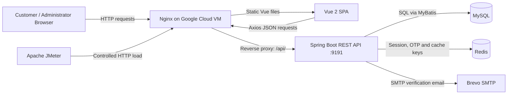
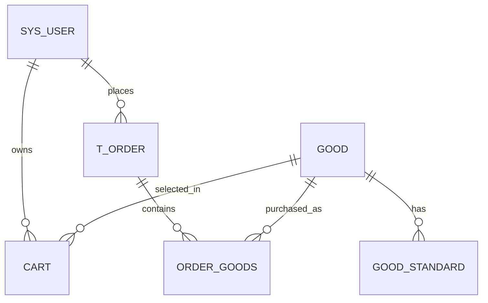

# D6 IMPLEMENTATION DOCUMENT

## Development and Network Performance Evaluation of a Cloud-Based Small E-Commerce Platform

**Project Name:** R Mall  
**Programme:** Network Technology Final Year Project  
**Document Type:** D6 — Implementation  
**Date:** June 2026

---

## 1. INTRODUCTION

### 1.1 Purpose of the Document

This document describes the implementation of R Mall, a cloud-based small e-commerce platform developed as a Network Technology Final Year Project. It records how the functional requirements and design specification were translated into an operational web system. The implementation covers the customer-facing storefront, administrator functions, RESTful backend services, database, authentication and email verification mechanisms, cloud deployment, and performance-testing artefacts.

The purpose of this document is not to reproduce the entire source code. Instead, it explains selected implementation components that are critical to the operation, integrity, security, and network behaviour of the system. The selected extracts demonstrate how the system handles user sessions, email verification, order creation, simulated payment, client-server communication, route protection, and reverse-proxy deployment.

### 1.2 Scope of the Document

The scope of this document includes the following implemented components:

- Vue 2 customer and administrator web interfaces;
- Spring Boot REST API and its controller-service-mapper structure;
- MySQL relational database for users, products, carts, orders, and uploaded-resource metadata;
- Redis for short-lived authentication session and email verification state;
- JWT-based authenticated requests and role-based administrator access;
- Brevo SMTP-based email verification for registration and password reset;
- transactional order placement and simulated payment processing;
- Nginx reverse proxy and Google Cloud VM deployment; and
- Apache JMeter test plans used to evaluate network performance under controlled simulated load.

The project remains intentionally limited to a small academic e-commerce platform. Real payment gateways, logistics integration, microservices, container orchestration, advanced recommendation, and commercial-scale high availability are outside the project scope.

### 1.3 Relationship with Other Project Documents

This document is derived from the project proposal and the D3 and D4 requirements/design specifications. In particular, the project scope defines the goal of developing a realistic cloud-hosted e-commerce workload and evaluating its network performance [7]. The database design, engineering documentation, phase reports, deployment records, and test evidence provide implementation traceability [8]–[11].

The implementation described here produces the following subsequent deliverables:

- user interfaces for customers and administrators;
- complete source code for inclusion in D8;
- database initialisation and migration scripts;
- cloud deployment configuration;
- functional and regression test scripts;
- JMeter performance test plans and result summaries; and
- user and administrator manuals.

### 1.4 Terms, Acronyms and Abbreviations

| Term | Description |
|---|---|
| API | Application Programming Interface. In this project, RESTful HTTP endpoints supplied by Spring Boot. |
| Axios | JavaScript HTTP client used by the Vue application to call backend endpoints. |
| DTO | Data Transfer Object used to return selected user/session fields to the frontend. |
| JWT | JSON Web Token used to verify an authenticated session token. |
| JMeter | Apache tool used to execute functional, load, and performance tests. |
| MyBatis / MyBatis-Plus | Java persistence framework and extension used to map SQL data to Java entities. |
| Nginx | Web server and reverse proxy used to serve the production frontend and forward API requests. |
| Redis | In-memory data store used for temporary session and email-verification information. |
| SPA | Single-Page Application. Vue Router serves client-side views without full-page navigation. |
| TTL | Time To Live; the expiry duration for a stored Redis key. |
| VM | Virtual Machine. The production system runs on a Google Cloud VM. |

---

## 2. DEVELOPMENT PROCESS

### 2.1 Development Approach and Technology Selection

The system was implemented as a modular monorepo so that the frontend, backend, database schema, deployment configuration, verification utilities, and supporting documentation remain in one controlled codebase. The implementation approach followed an incremental sequence: localise and stabilise the core shopping journey, strengthen account authentication, prepare cloud deployment, and perform controlled performance evaluation.

The selected technology stack is shown in Table 2.1. Spring Boot was selected for the backend because it supports web, data access, mail, configuration, testing, and executable application packaging within one Java framework [1]. Vue 2 was used to build a component-based SPA, while Axios provides the client HTTP interface [2]. MySQL provides the relational persistent store, Redis manages short-lived state, Nginx exposes the public application and reverse-proxies requests, and Apache JMeter executes parameterised HTTP load tests [3]–[6].

**Table 2.1: Main Implementation Technologies**

| Layer | Technology | Main Responsibility |
|---|---|---|
| Presentation | Vue 2, Vue Router, Vuex, Element UI | Storefront/admin pages, reusable UI components, navigation, client state |
| Client communication | Axios | JSON HTTP requests, session-token injection, response handling |
| Application | Java, Spring Boot | REST controllers, business services, validation, configuration, exception handling |
| Persistence | MyBatis, MyBatis-Plus, MySQL | SQL mapping and durable transactional data |
| Temporary state | Redis | Session records, email verification codes, resend cooldown keys, product cache data |
| Deployment | Nginx, systemd, Google Cloud VM | Static-file serving, reverse proxy, process management, public access |
| Validation | Maven, npm scripts, Node.js utilities, JMeter | Unit tests, builds, regression checks, golden-path checks, performance evaluation |

### 2.2 Overall System Architecture

Figure 2.1 illustrates the implemented deployment and request architecture. A browser loads the Vue SPA from Nginx. Requests for APIs and uploaded resources are forwarded through Nginx to the Spring Boot service. The application service accesses MySQL for persistent data and Redis for temporary session, verification-code, and cached-product information. The SMTP service is used only when a registration or password-reset verification email is requested.



**Figure 2.1: Implemented Cloud-Based System Architecture**

> **Manual figure option:** Replace the Mermaid diagram with a redrawn architecture diagram when preparing the final thesis layout. Include the browser, Nginx, Vue frontend, Spring Boot API, MySQL, Redis, SMTP service, and JMeter load generator.

The deployment deliberately uses a single VM architecture because the FYP evaluates client-server-database communication under controlled load rather than a commercial distributed platform. Nginx is configured to serve the SPA and to forward `/api/` traffic to the backend service on `127.0.0.1:9191`, consistent with its reverse-proxy model [5]. This separation allows the public web server to be exposed on port 80 while the Spring Boot process remains behind the reverse proxy.

### 2.3 Source Repository and Module Structure

The root repository is divided according to responsibility, as shown in Table 2.2. This separation enabled code, database, deployment, and test changes to remain traceable throughout implementation.

**Table 2.2: Repository Modules**

| Directory / Module | Implemented Content |
|---|---|
| `ElectronicMallVue/` | Vue 2 frontend pages, components, routing, Vuex store, Axios client, local checks, production build configuration |
| `ElectronicMallApi/` | Spring Boot source, controllers, services, entities, MyBatis mappers, configuration, tests, and media handling |
| `database/` | Canonical `electronic_mall.sql` initialisation script and documented migrations |
| `deploy/` | Nginx virtual-host configuration, systemd service unit, and environment-file template |
| `tools/` | API golden-path, schema, and JMeter-result processing utilities |
| `docs/` | Requirements, data design, engineering records, deployment reports, and test evidence |

### 2.4 Frontend Implementation

#### 2.4.1 Customer and Administrator Interfaces

The frontend was developed as a Vue SPA. Customer pages include registration, login, homepage, product list, product details, cart, order confirmation, simulated payment, order history, and profile management. Administrator pages include the dashboard, user management, product management, category management, carousel management, order management, file management, and income views.

Vue Router uses history mode for readable URLs. The route configuration marks customer operations such as cart, checkout, payment, order history, and profile as login-required. Administrator views use a separate authority requirement. This is complemented by client-side navigation checks and backend enforcement; the frontend alone is not treated as a security boundary.

The customer interface was localised for the Malaysia context during implementation. Visible labels are in English, prices use RM, addresses and phone numbers follow the intended Malaysia demonstration context, and payment is explicitly described as simulated. The verified primary journey is:

```text
Login → Browse Products → View Product Details → Add to Cart → Place Order
      → Complete Simulated Payment → View Order History
```


**Figure 2.2: Verified Customer Order-History Interface**

> **Manual figures to insert:**
>
> 1. Screenshot of the customer homepage showing the carousel, categories, English product names, and RM prices.
> 2. Screenshot of the product-detail page showing a selected product variant and add-to-cart action.
> 3. Screenshot of the administrator product or order-management page.
> 4. Screenshot of the registration page with the email verification-code field and countdown button.

#### 2.4.2 Centralised HTTP Client and Session Failure Handling

All frontend API communication is centralised in `src/utils/request.js`. The Axios instance takes its base URL from the environment so local development and cloud deployment can use different endpoints without changing business-page code. Before each request, the client adds a JSON content type and, if present, the session token stored in browser local storage. When the backend reports an invalid or expired token, the response interceptor removes the local session state and redirects the user to the login page.

**Code Listing 2.1: Selected Axios Request and Response Interceptors**

```javascript
const request = axios.create({
  baseURL: process.env.VUE_APP_API_BASE_URL || '/api',
  timeout: 5000
})

request.interceptors.request.use(config => {
  config.headers['Content-Type'] = 'application/json;charset=utf-8'
  const user = JSON.parse(localStorage.getItem('user'))
  if (user) config.headers['token'] = user.token
  return config
})

request.interceptors.response.use(response => {
  const res = response.data
  if (res.code === '401' || res.code === '402') {
    localStorage.removeItem('user')
    if (router.currentRoute.path !== '/login') router.push('/login')
  }
  return res
})
```

The implementation reduces duplicated HTTP configuration across views and gives a consistent response when a session has expired. The five-second client timeout prevents an indefinitely pending browser request. At deployment time, `.env.development` targets the local API and `.env.production` uses the Nginx `/api` path.

#### 2.4.3 Email-Verified Registration Interface

The registration view validates the email format and required fields before requesting a verification code. The `Send Code` control is disabled while a request is active and during the 60-second countdown. After successful verification, the response DTO is saved to `localStorage` and the user is routed to the storefront, thereby implementing automatic login after registration.

**Code Listing 2.2: Selected Frontend Registration Submission**

```javascript
const form = {
  username: this.user.username,
  email: this.user.email,
  code: this.user.code,
  password: md5(this.user.password)
}

this.request.post('/api/auth/register-by-email', form).then((res) => {
  if (res.code === '200') {
    localStorage.setItem('user', JSON.stringify(res.data))
    this.$router.push('/')
  } else {
    this.$message.error(res.msg)
  }
})
```

The frontend pre-validation improves usability, while the backend remains responsible for authoritative validation, code verification, username/email uniqueness checks, and user persistence. The MD5 password representation is retained only for compatibility with the existing demonstration system; it is identified as a security limitation in Section 3.2.

### 2.5 Backend Implementation

#### 2.5.1 Layered REST API Structure

The backend follows a controller-service-mapper-entity structure. Controllers expose HTTP endpoints and return a common `Result` envelope. Services contain business logic, transactions, and validation. Mapper interfaces and XML files implement SQL access through MyBatis and MyBatis-Plus. Entities represent persistent data, while DTOs prevent unnecessary internal fields from being returned to the browser.

The principal modules are summarised in Table 2.3.

**Table 2.3: Principal Backend Modules**

| Module | Main Functions |
|---|---|
| User and authentication | Login by username/email, JWT session creation, account registration, profile update, password reset |
| Email verification | Six-digit code generation, Redis storage, resend cooldown, SMTP delivery, verification and code removal |
| Product and category | Product listing, search/filtering, product detail, variants, categories, carousel, file resources |
| Cart and address | Cart add/update/remove, user delivery addresses, checkout support |
| Order | Order creation, line-item persistence, payment-state transition, stock deduction, sales updates, order history |
| Administration | Role checks, product/category/carousel management, user/order/file management, income data |
| Shared configuration | CORS, Redis, MyBatis-Plus, interceptors, upload-storage properties, exception handling |

#### 2.5.2 Authentication, JWT, and Redis Session State

After successful login, registration, or password reset, the backend creates a JWT token and stores the corresponding `User` object under a Redis key. Subsequent client requests carry the token in the HTTP `token` header. The `JwtInterceptor` rejects missing tokens, retrieves the associated user from Redis, refreshes the Redis TTL, verifies the signed JWT using the user's username, and stores the current user in a request-local holder for downstream use.

This dual mechanism was selected for the FYP system because JWT verifies token integrity while Redis enables server-side session expiry and immediate invalidation through key removal [4]. Public resources and pre-login authentication endpoints are excluded from the interceptor; protected business endpoints require a valid session. A second authority interceptor protects administrator operations.

**Code Listing 2.3: Selected JWT/Redis Validation Logic**

```java
String token = request.getHeader("token");
if (!StringUtils.hasLength(token)) {
    throw new ServiceException(Constants.TOKEN_ERROR,
        "Session expired. Please log in again");
}

User user = redisTemplate.opsForValue()
    .get(RedisConstants.USER_TOKEN_KEY + token);
if (user == null) {
    throw new ServiceException(Constants.TOKEN_ERROR,
        "Session expired. Please log in again");
}

UserHolder.saveUser(user);
redisTemplate.expire(RedisConstants.USER_TOKEN_KEY + token,
    RedisConstants.USER_TOKEN_TTL, TimeUnit.MINUTES);

JWT.require(Algorithm.HMAC256(user.getUsername())).build().verify(token);
```

The selected extract is critical because it connects browser authentication, temporary server-side state, token validation, and current-user identity. It also illustrates why Redis is required even though a signed token is used.

#### 2.5.3 Secure Email Verification Lifecycle

The email-verification module was introduced to prevent direct unauthenticated registration and to support a usable forgotten-password flow. It generates a cryptographically strong six-digit code, stores the code under a purpose-specific Redis key for five minutes, and writes a second cooldown key for 60 seconds. The purpose is either `register` or `reset`, so a code issued for one process cannot be used in the other.

The service normalises email addresses to lowercase, validates their format, checks whether the sender configuration is available, and removes both Redis keys if SMTP delivery fails. When the user submits a code successfully, the code key is deleted. This prevents reuse within its original TTL.

**Code Listing 2.4: Selected Verification-Code Storage and Failure Cleanup**

```java
String code = String.format("%06d", RANDOM.nextInt(1_000_000));
redisTemplate.opsForValue().set(
    buildCodeKey(normalizedEmail, normalizedPurpose),
    code, RedisConstants.EMAIL_CODE_TTL, TimeUnit.MINUTES);
redisTemplate.opsForValue().set(
    cooldownKey, "1", RedisConstants.EMAIL_COOLDOWN_TTL, TimeUnit.SECONDS);

try {
    mailSender.send(message);
} catch (RuntimeException e) {
    redisTemplate.delete(buildCodeKey(normalizedEmail, normalizedPurpose));
    redisTemplate.delete(cooldownKey);
    throw new ServiceException(Constants.CODE_500,
        "Failed to send verification email");
}
```

The cleanup path is important because the system must not leave a valid code or cooldown state after an email-delivery failure. SMTP credentials are supplied through environment variables (`BREVO_SMTP_USERNAME`, `BREVO_SMTP_KEY`, and `BREVO_SENDER_EMAIL`) rather than source code or version-controlled configuration.

#### 2.5.4 Transactional Order Creation and Simulated Payment

Order processing is the most critical business process in the system. The user first selects cart items and delivery details. The order service persists an order header in `t_order`, parses the selected item data, inserts one or more `order_goods` line items, removes the selected cart entry, and returns a generated order number. The `@Transactional` annotation ensures that a failure in any database operation causes the entire order-creation unit to roll back.

Simulated payment changes the order state, retrieves the selected product variant, validates stock availability, deducts the variant stock, updates sales count and sales amount, and synchronises an existing cached product object when present. The payment route is deliberately labelled **simulated**; no real card, online-bank, or third-party payment provider is integrated.

**Code Listing 2.5: Selected Transactional Order and Payment Logic**

```java
@Transactional
public String saveOrder(Order order) {
    order.setUserId(TokenUtils.getCurrentUser().getId());
    order.setOrderNo(DateUtil.format(new Date(), "yyyyMMddHHmmss")
        + RandomUtil.randomNumbers(6));
    orderMapper.insert(order);

    OrderGoods orderGoods = new OrderGoods();
    orderGoods.setOrderId(order.getId());
    for (OrderItem item : JSON.parseArray(order.getGoods(), OrderItem.class)) {
        orderGoods.setGoodId(item.getId());
        orderGoods.setCount(item.getNum());
        orderGoods.setStandard(item.getStandard());
        orderGoodsMapper.insert(orderGoods);
    }
    cartService.removeById(order.getCartId());
    return order.getOrderNo();
}

@Transactional
public void payOrder(String orderNo) {
    orderMapper.payOrder(orderNo);
    int store = standardMapper.getStore(goodId, standard);
    if (store < count) throw new ServiceException("Insufficient stock");
    standardMapper.deductStore(goodId, standard, store - count);
    goodMapper.saleGood(goodId, count, totalPrice);
}
```

The listing has been shortened for explanation. The actual implementation performs type conversion and validation before stock deduction and also updates the Redis product cache when a cached item exists. The database model supports this process through the relationships between `t_order`, `order_goods`, `good`, `good_standard`, `cart`, and `sys_user`.

#### 2.5.5 API Interfaces

The backend exposes REST interfaces for each business module. Table 2.4 lists representative endpoints used by the critical user flows. All responses are returned in a common envelope containing at least a result code, message, and data payload where relevant.

**Table 2.4: Representative REST Interfaces**

| Endpoint | Method | Authentication | Purpose |
|---|---|---:|---|
| `/login` | POST | No | Log in using username or email and return a session DTO |
| `/api/auth/send-email-code` | POST | No | Send registration or reset verification code |
| `/api/auth/register-by-email` | POST | No | Register account after successful email-code verification |
| `/api/auth/reset-password-by-email` | POST | No | Reset password after successful email-code verification |
| `/api/good` | GET | No | Obtain product data for the storefront |
| `/api/cart` | POST / PUT / DELETE | Yes | Add, update, or remove cart items |
| `/api/order` | POST | Yes | Create an order from checkout data |
| `/api/order/paid/{orderNo}` | GET | Yes | Complete the simulated-payment state transition |
| `/api/order/userid/{userId}` | GET | Yes | Retrieve customer order history |
| `/api/order/delivery/{orderNo}` | GET | Admin | Mark an order as shipped |

### 2.6 Database Implementation

MySQL database `electronic_mall` provides durable storage for shopping and administrative data [3]. The schema is initialised through `database/electronic_mall.sql`. The central entities are user, address, category, product, product variant, cart, order header, and order line item. The database is deliberately compact to support the required FYP workflows without introducing unnecessary commercial features.

`good_standard` stores the price and available stock for each product variant. The `cart` table records the user, product, selected variant, quantity, and creation time. `t_order` stores the order number, customer/delivery snapshot, total price, state, and creation time, while `order_goods` stores the purchased items. The unique email index on `sys_user.email` complements service-level duplicate-email checks.



**Figure 2.3: Core Order-Related Entity Relationships**

> **Manual figure option:** Insert the complete ERD from `docs/database/DATABASE_DESIGN.md` into the final thesis. The complete ERD also includes addresses, categories, icons, carousel records, file metadata, and avatars.

### 2.7 Cloud Deployment and Network Implementation

The production implementation runs on an Ubuntu 22.04 Google Cloud VM. The application service is started by systemd under the `www-data` user. The service unit loads a protected environment file, starts the executable Spring Boot JAR, and restarts after failure. MySQL and Redis run as data services on the VM. Persistent media storage is configured through `MALL_UPLOAD_DIR` so uploaded resources are not tied to the lifecycle of the packaged JAR.

Nginx serves the Vue build directory and implements history-mode SPA fallback through `try_files`. It proxies `/api/` requests to the Spring Boot service, while forwarding host, client IP, and forwarding-protocol headers. The selected deployment configuration is shown below.

**Code Listing 2.6: Selected Nginx SPA and Reverse-Proxy Configuration**

```nginx
server {
    listen 80;
    root /var/www/project-fyp-mall;
    index index.html;

    location / {
        try_files $uri $uri/ /index.html;
    }

    location /api/ {
        proxy_pass http://127.0.0.1:9191/;
        proxy_set_header Host $host;
        proxy_set_header X-Real-IP $remote_addr;
        proxy_set_header X-Forwarded-For $proxy_add_x_forwarded_for;
        proxy_set_header X-Forwarded-Proto $scheme;
    }
}
```

This configuration is significant to the Network Technology focus because it separates public HTTP access from the internal application port and makes the request path observable as browser → Nginx → Spring Boot → MySQL/Redis. The trailing slash semantics of `proxy_pass` require a documented public-path mapping: backend root paths are exposed through `/api/<path>`, whereas backend controller paths that already begin with `/api/` are externally reached using `/api/api/<path>` in the current deployment template. This known mapping is documented and must be preserved during manual verification unless the API base-path design is refactored.

### 2.8 Performance-Test Implementation

Apache JMeter 5.6.3 was used to implement reproducible HTTP test plans [6]. Eight `.jmx` plans cover the homepage, product list, product detail, login, add-to-cart, place-order, simulated-payment, and order-history flows. Every plan is parameterised through `THREADS`, `RAMP_UP`, and `LOOPS`, enabling the same test design to be used for smoke and load execution.

Assertions were added to distinguish a valid response from a merely successful network connection. The homepage plan checks for the Vue application root element, while JSON API plans check for the project response success code. The JMX files were validated as XML before execution. A database backup was created before mutation tests because cart, order, and stock records are intentionally changed by the add-to-cart, order, and simulated-payment scenarios.

**Table 2.5: Implemented JMeter Test Matrix**

| Test Category | Test Plans | Simulated Threads |
|---|---|---:|
| Smoke | Homepage, product list, product detail, login, cart, order, payment, order history | 1 |
| Read-only load | Homepage, product list, product detail | 10, 50, 100, 200 |
| Authenticated load | Login, order history | 10, 50, 100 |
| Controlled mutation | Add cart, place order, simulated payment | 1, 5, 10 |

The retained evaluation summary contains 3,197 sampler executions and 0 recorded errors. At the highest tested concurrency, homepage, product-list, and product-detail scenarios each completed with 0.00% error rate at 200 threads. Login and order history each completed with 0.00% error rate at 100 threads. Controlled mutation scenarios reached 10 threads with 0.00% error rate. The observed high-load P90 response times, however, reached 2,457 ms for the homepage, 3,400 ms for product listing, and 3,659 ms for product detail. Therefore, the results support FYP demo usability and performance analysis, not a claim of commercial-scale optimisation.

> **Manual figures to insert:**
>
> 1. `docs/testing/jmeter/results/phase6-summary/charts/p90-response-time-ms.svg` as a P90 response-time chart.
> 2. `docs/testing/jmeter/results/phase6-summary/charts/throughput-per-second.svg` as a throughput chart.
> 3. A screenshot of a JMeter test plan showing the Thread Group, HTTP sampler, and response assertion.

### 2.9 Implementation Verification

Verification was integrated throughout development rather than deferred until the end. Backend tests check the email-code lifecycle, duplicate-email protection, account login, registration auto-login, and password reset. Frontend checks validate the authentication wiring and history-mode routes. The production build verifies that Vue pages compile successfully. A Node.js golden-path utility validates product data, category data, images, registration, login, cart creation, order creation, simulated payment, order history, and localised business payloads.

**Table 2.6: Implemented Verification Evidence**

| Verification Activity | Evidence / Expected Result |
|---|---|
| Backend unit tests | `mvn -q test` passed; targeted email/authentication tests validate TTL, cooldown, wrong-code rejection, code deletion, duplicate checks, and login behaviours |
| Backend packaging | `mvn -q package` passed, producing a deployable JAR |
| Frontend authentication check | `npm run check:auth` passed with authentication-flow wiring verification |
| Frontend route check | `npm run check:routes` passed for 12 history-mode routes |
| Frontend build | `npm run build` passed; only pre-existing Browserslist and asset-size warnings remained |
| Database schema check | `node tools/check-database-schema.js` passed |
| Core API golden path | Verified product browsing, registration, login, cart, order, simulated payment, order history, and Malaysia-context data |
| Public deployment | Homepage and authenticated read flows were verified through the Google Cloud VM deployment |
| JMeter evaluation | Smoke, read-only, authenticated, and controlled mutation plans completed with 0.00% recorded error rate |

---

## 3. SUMMARY

### 3.1 Implementation Summary

R Mall was implemented as a complete but deliberately bounded cloud-based e-commerce platform. The Vue frontend provides separate customer and administrator interfaces. The Spring Boot backend implements REST APIs, business rules, transactional order handling, email verification, session control, and access-control enforcement. MySQL stores durable business data, while Redis manages temporary session, verification-code, and cache state. Nginx provides the public web entry point and reverse-proxies requests to the internal backend service. Apache JMeter provides an executable, parameterised method for evaluating the deployed system under controlled network load.

The implementation satisfies the main FYP need for a realistic client-server-database workload. It enables the complete shopper flow from account access through simulated payment and allows the resulting network communication to be measured through response time, throughput, and error rate.

### 3.2 Unexpected Problems and Their Resolution

Several implementation issues arose during development. Each issue was analysed, corrected within the project boundary, and verified through appropriate regression or deployment evidence.

**Table 3.1: Unexpected Problems and Resolutions**

| Problem | Impact | Resolution and Evidence |
|---|---|---|
| Vue history-mode direct links returned 404 for generic GET requests | Users and automated route checks could not reliably access deep links | Added explicit `historyApiFallback` configuration and `npm run check:routes`; 12 main routes passed. |
| Product images and avatars referenced local addresses after cloud deployment | Public users could not load media resources | Introduced environment-based API/resource URLs, routed resources through Nginx, and moved uploads to persistent `MALL_UPLOAD_DIR`; public image display was verified. |
| Existing registration did not verify email and password reset depended on an admin-style operation | Registration integrity and self-service recovery were inadequate | Added SMTP email verification, Redis TTL/cooldown keys, new public authentication endpoints, DTOs, UI controls, database email uniqueness, and focused tests. |
| Legacy order states were stored in Chinese | Localised interface could display inconsistent order labels | Standardised active status values and retained SQL compatibility mapping for legacy records. |
| Public reverse-proxy path rewriting produced different external paths for root and `/api/*` backend routes | Manual deployment checks could call an incorrect endpoint | Documented the public path mapping and used it in deployment verification and JMeter plans. |
| Mutation performance tests changed live cart, order, and stock data | Test execution could affect the demonstration database | Created a VM-side MySQL backup before mutation tests, limited concurrency, and recorded the resulting data changes. |
| High-load P90 response times were multi-second for some browsing scenarios | The platform is not suitable for unqualified commercial-scale performance claims | Interpreted results within the academic FYP scope; identified caching, asset optimisation, SQL tuning, and scale-out as future improvements. |

### 3.3 Limitations and Future Improvement

The implementation is appropriate for the current FYP scope, but several limitations should be stated clearly:

- The production test deployment used HTTP; HTTPS should be introduced with a domain and certificate before real-world use.
- Passwords retain the existing frontend MD5 compatibility flow. A production system should use server-side salted adaptive password hashing such as bcrypt or Argon2.
- The simulated payment process is not integrated with a real payment gateway and does not represent financial settlement.
- The deployment is a single VM and does not implement load balancing, horizontal scaling, multi-region redundancy, or container orchestration.
- The controlled mutation tests use a shared demonstration account and product variant; they are suitable for FYP evidence but not for a production-grade concurrent-order benchmark.
- Database migrations are documented SQL scripts rather than an automated migration framework. Flyway or Liquibase may be adopted in future work.
- The current public API path arrangement includes a legacy double-`/api` mapping for controller paths already prefixed with `/api`; simplifying this contract would improve deployment maintainability.

### 3.4 Concluding Statement

In conclusion, the implementation phase transformed the proposed architecture into an operational cloud-hosted system with a real customer transaction flow and measurable network behaviour. The selected code demonstrates the core mechanisms that make the system functional: client request interception, email verification, session validation, transactional order processing, database persistence, reverse proxy routing, and controlled performance testing. The complete source code, configuration files, database scripts, and test plans will be provided in D8 as the final technical artefact.

---

## REFERENCES

> The following entries use an author–date web-reference form consistent with UKM-style bibliography requirements. Confirm minor punctuation and indentation against the latest faculty template before final submission.

[1] Spring. 2026. *Spring Boot Reference Documentation*. Available at: https://docs.spring.io/spring-boot/reference/index.html [Accessed 23 June 2026].

[2] Vue.js. 2026. *Vue.js 2 Guide*. Available at: https://v2.vuejs.org/v2/guide/ [Accessed 23 June 2026].

[3] Oracle. 2026. *MySQL 8.0 Reference Manual*. Available at: https://dev.mysql.com/doc/refman/8.0/en/ [Accessed 23 June 2026].

[4] Redis. 2026. *Redis Documentation*. Available at: https://redis.io/docs/ [Accessed 23 June 2026].

[5] F5 NGINX. 2026. *NGINX Reverse Proxy*. Available at: https://docs.nginx.com/nginx/admin-guide/web-server/reverse-proxy/ [Accessed 23 June 2026].

[6] Apache Software Foundation. 2026. *Apache JMeter User's Manual*. Available at: https://jmeter.apache.org/usermanual/ [Accessed 23 June 2026].

[7] Project FYP Mall. 2026a. *Project Scope and Objectives*. Internal project documentation. Available at: `docs/project/project-scope-and-objectives.md` [Accessed 23 June 2026].

[8] Project FYP Mall. 2026b. *Database Design*. Internal project documentation. Available at: `docs/database/DATABASE_DESIGN.md` [Accessed 23 June 2026].

[9] Project FYP Mall. 2026c. *Phase 3 Brevo Email Verification Report*. Internal project documentation. Available at: `docs/reports/phase-3-email-verification-report.md` [Accessed 23 June 2026].

[10] Project FYP Mall. 2026d. *Phase 4 Cloud Deployment Report*. Internal project documentation. Available at: `docs/reports/phase-4-cloud-deployment-report.md` [Accessed 23 June 2026].

[11] Project FYP Mall. 2026e. *Phase 6 JMeter Performance Evaluation Report*. Internal project documentation. Available at: `docs/reports/phase-6-jmeter-performance-evaluation-report.md` [Accessed 23 June 2026].

---

## APPENDIX A: SOURCE ARTEFACT LOCATIONS

This appendix is included for traceability only. Complete source code is intentionally excluded from the main D6 discussion and should be included in D8.

| Artefact | Source Location |
|---|---|
| Vue routes | `ElectronicMallVue/src/router/index.js` |
| Axios client | `ElectronicMallVue/src/utils/request.js` |
| Registration interface | `ElectronicMallVue/src/views/Register.vue` |
| Simulated payment interface | `ElectronicMallVue/src/views/front/order/Pay.vue` |
| Email verification service | `ElectronicMallApi/src/main/java/com/rufeng/em/service/EmailVerificationService.java` |
| User/session service | `ElectronicMallApi/src/main/java/com/rufeng/em/service/UserService.java` |
| JWT interceptor | `ElectronicMallApi/src/main/java/com/rufeng/em/interceptor/JwtInterceptor.java` |
| Order service | `ElectronicMallApi/src/main/java/com/rufeng/em/service/OrderService.java` |
| Order controller | `ElectronicMallApi/src/main/java/com/rufeng/em/controller/OrderController.java` |
| Application configuration | `ElectronicMallApi/src/main/resources/application.yml` |
| Database schema | `database/electronic_mall.sql` |
| Nginx configuration | `deploy/nginx/project-fyp-mall.conf` |
| Systemd service unit | `deploy/systemd/project-fyp-mall-api.service` |
| JMeter plans | `docs/testing/jmeter/01_homepage.jmx` to `08_order_history.jmx` |
