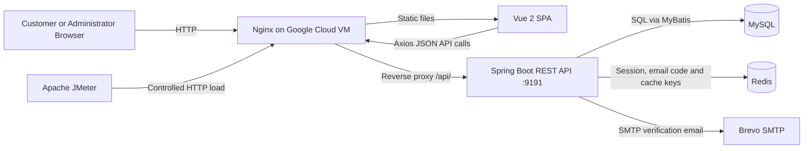
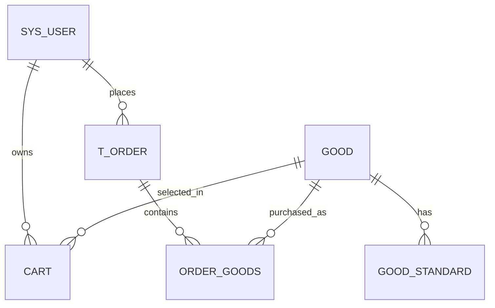

# D6 IMPLEMENTATION DOCUMENT

## Development and Network Performance Evaluation of a Cloud-Based Small E-Commerce Platform

**Project Name:** R Mall  
**Programme:** TK/TM/TU/TH4086 Final Year Project  
**Field:** Network Technology  
**Document Type:** D6 - Implementation  
**Version:** 3  
**Date:** 7 July 2026  

---

## LIST OF TABLES

| Table | Title |
|---|---|
| Table 1.1 | D6 Guideline Coverage |
| Table 1.2 | Implementation Traceability to Earlier and Later Documents |
| Table 1.3 | Terms, Acronyms and Abbreviations |
| Table 2.1 | Implemented Technology Stack |
| Table 2.2 | Repository and Artefact Structure |
| Table 2.3 | Implemented Backend Modules |
| Table 2.4 | Representative REST Interfaces |
| Table 2.5 | Implemented Database Tables |
| Table 2.6 | JMeter Artefact Implementation |
| Table 2.7 | Implementation Verification Evidence |
| Table 3.1 | Unexpected Problems and Resolutions |

## LIST OF FIGURES

| Figure | Title |
|---|---|
| Figure 2.1 | Implemented Cloud Request Architecture |
| Figure 2.2 | Implemented User Interface Evidence |
| Figure 2.3 | Core Order Entity Relationship |
| Figure 2.4 | JMeter Performance Evidence Charts |

## LIST OF CODE LISTINGS

| Listing | Title |
|---|---|
| Code Listing 2.1 | Selected Axios Request and Response Interceptors |
| Code Listing 2.2 | Selected Email-Verified Registration Interface Logic |
| Code Listing 2.3 | Selected Redis-Backed Login Session Creation |
| Code Listing 2.4 | Selected JWT and Redis Session Validation |
| Code Listing 2.5 | Selected Email Verification Code Lifecycle |
| Code Listing 2.6 | Selected Transactional Order and Simulated Payment Logic |
| Code Listing 2.7 | Selected Nginx Reverse-Proxy Configuration |

---

## 1. INTRODUCTION

### 1.1 Purpose of the Document

This document describes the implementation of R Mall, a cloud-based small e-commerce platform developed for the TK/TM/TU/TH4086 Final Year Project in Network Technology. It explains how the requirements and design proposed in the earlier project documents were translated into an operational software system. The report focuses on the implemented frontend, backend, database, cloud deployment, selected source code, and executable performance-test artefacts.

The purpose of D6 is to explain implementation, not to reproduce the complete source code. Therefore, this document selects only code segments that are critical to system operation, technically important to the Network Technology focus, or useful for showing how the proposed design was implemented. Complete source code and full artefact packaging should be provided later in D8.

### 1.2 Scope of the Document

The implementation scope includes the customer storefront, administrator interface, RESTful backend, MySQL database, Redis temporary-state layer, email verification, cart and order processing, simulated payment, Nginx reverse proxy, Google Cloud VM deployment, and Apache JMeter test artefacts. The document also records implementation problems that appeared during development and how they were handled.

The scope remains bounded by the Final Year Project proposal. The system is not presented as a commercial marketplace. Real payment gateways, logistics-provider integration, microservice deployment, container orchestration, horizontal load balancing, multi-region redundancy, and production-grade security certification are outside the implemented scope. These exclusions are stated as project boundaries, not as weaknesses that the report needs to defend repeatedly.

**Table 1.1: D6 Guideline Coverage**

| D6 requirement | Coverage in this document |
|---|---|
| Explain the purpose of the document | Section 1.1 states that D6 explains implementation based on earlier requirements and design. |
| Explain the scope of the document | Section 1.2 defines included modules and excluded commercial features. |
| Relate D6 to other documents | Section 1.3 connects D6 with D5, D3/D4 content, D7, D8, user interface artefacts, source code, test plans, and manuals. |
| Define important terms and abbreviations | Section 1.4 defines the main technical terms used in the report. |
| Explain the development process using selected technologies | Section 2 explains the implementation process, architecture, modules, database, deployment, and test artefacts. |
| Extract and explain critical code segments | Sections 2.4 to 2.8 include selected frontend, backend, database-related, and deployment code listings. |
| Include important modules, components, libraries and database | Sections 2.2, 2.3, 2.5, 2.6 and 2.7 describe the main system modules and data layer. |
| Include frontend and backend interfaces | Sections 2.4 and 2.5 describe the Vue interfaces and Spring Boot REST interfaces. |
| State unexpected problems and resolutions | Section 3.2 records implementation problems, impact, and resolution evidence. |
| Summarise implementation | Section 3.1 and Section 3.4 summarise what was implemented and where the boundaries remain. |

### 1.3 Relationship with Other Project Documents

D6 is based on the project planning, requirements and design decisions consolidated in D5. In practical terms, D6 is the implementation continuation of the requirement specification and design specification work: D5 defines the problem, proposed system, objectives, scope, architecture, database design, interface plan, and performance-evaluation method; D6 explains how these designs were built in code, configuration, database scripts, deployment files, and test artefacts.

This document also prepares the next deliverables. D7 uses the implemented system and JMeter artefacts described here as the basis for formal testing. D8 should include the complete source code, final database script, configuration artefacts, user manual, and final integrated report material. The relationship is summarised in Table 1.2.

**Table 1.2: Implementation Traceability to Earlier and Later Documents**

| Document / artefact | Relationship to D6 |
|---|---|
| D5 Proposal Report | Provides project background, objectives, scope, architecture, database design, interface design, and methodology. |
| D3 Requirement Specification | Provides functional, non-functional, domain and technical requirements implemented in the system. |
| D4 Design Specification | Provides interface, data, algorithm and architecture designs implemented in code and deployment configuration. |
| User interface artefacts | Produced from D6 implementation through Vue pages and administrator/customer views. |
| Source code | Produced and explained selectively in D6; complete code belongs to D8. |
| Database scripts | Implement the persistent schema required by the system. |
| D7 Testing Document | Uses the implemented system, verification scripts and JMeter artefacts as the test basis. |
| D8 Final Document | Should contain the complete source code, final artefacts, manual and final report integration. |

### 1.4 Terms, Acronyms and Abbreviations

**Table 1.3: Terms, Acronyms and Abbreviations**

| Term | Definition |
|---|---|
| API | Application Programming Interface. In this project, REST endpoints exposed by Spring Boot and called by Vue and JMeter. |
| Axios | JavaScript HTTP client used by the Vue frontend. |
| DTO | Data Transfer Object used to return controlled session or business fields to the frontend. |
| HTTP | Hypertext Transfer Protocol used by the current public deployment. |
| JMeter | Apache tool used to create and execute HTTP performance-test plans. |
| JWT | JSON Web Token used with Redis to verify authenticated sessions. |
| MyBatis | Java persistence framework used to map SQL operations to Java mapper interfaces. |
| Nginx | Public web server and reverse proxy used to serve the Vue build and forward API requests. |
| Redis | In-memory data store used for temporary session, verification-code, cooldown and cache state. |
| REST | Representational State Transfer style used by the backend API. |
| SPA | Single-Page Application. The Vue frontend uses client-side routing. |
| SMTP | Simple Mail Transfer Protocol used through Brevo for verification-code email delivery. |
| TTL | Time To Live, used to expire Redis keys. |
| VM | Virtual Machine. The deployed system runs on a Google Cloud VM. |

---

## 2. DEVELOPMENT PROCESS

### 2.1 Development Approach and Technology Selection

The system was implemented as a modular monorepo so that the frontend application, backend service, database schema, deployment configuration, verification scripts, JMeter plans and documentation remain traceable in one project workspace. Development followed an incremental sequence: stabilise the core shopping workflow, localise the system for the demonstration context, strengthen authentication through email verification, prepare cloud deployment, verify public routing, and implement JMeter plans for controlled network-performance evaluation.

The selected technology stack reflects the project objective of building a measurable client-server-database web application. Vue 2 implements the browser-facing SPA. Spring Boot implements the REST API and business logic. MySQL stores durable data. Redis stores temporary session, verification-code, cooldown and cache state. Nginx exposes the public HTTP entry point and reverse-proxies API calls to the internal Spring Boot service. Apache JMeter implements repeatable HTTP test plans against the deployed system.

**Table 2.1: Implemented Technology Stack**

| Layer | Implemented technology | Version / evidence | Main implementation role |
|---|---|---|---|
| Frontend framework | Vue | Vue 2.6.14 in `ElectronicMallVue/package.json` | Customer and administrator SPA views. |
| Frontend routing and state | Vue Router, Vuex | Vue Router 3.5.1, Vuex 3.6.2 | History-mode navigation and shared frontend state. |
| HTTP client | Axios | Axios 0.26.1 | Centralised browser-to-API communication. |
| UI library | Element UI | Element UI 2.15.6 | Forms, tables, buttons and management interface widgets. |
| Backend framework | Spring Boot | Spring Boot 2.5.6 in `ElectronicMallApi/pom.xml` | REST controllers, services, configuration and executable packaging. |
| Persistence | MyBatis, MyBatis-Plus, MySQL | MyBatis starter 2.2.2, MyBatis-Plus 3.5.1 | SQL mapping and durable relational data. |
| Temporary state | Redis | Spring Data Redis | Login session, email code, cooldown and product cache state. |
| Email delivery | Spring Mail, Brevo SMTP | Runtime variables in deployment documentation | Registration and password-reset verification codes. |
| Deployment | Nginx, systemd, Google Cloud VM | `deploy/` configuration and cloud records | Static frontend serving, reverse proxy and service management. |
| Performance testing | Apache JMeter | JMeter 5.6.3 in Phase 6 records | Parameterised smoke, load and mutation test plans. |

The selected code listings were chosen because each one explains a critical operation. Client interceptors show how requests and expired sessions are handled. Registration code shows how the user interface triggers email verification. Login and JWT code show how session state is created and checked. Email-service code shows how Redis TTL and SMTP failure cleanup are implemented. Order-service code shows transactional business behaviour. Nginx code shows how the public network path is implemented.

### 2.2 Implemented System Architecture

The implemented system uses a single-VM cloud architecture. A browser requests the Vue frontend from Nginx. The Vue SPA sends JSON HTTP requests through Axios. Nginx forwards `/api/` traffic to the Spring Boot service running on the internal loopback port `9191`. Spring Boot reads and writes durable business data through MyBatis and MySQL, and uses Redis for temporary state. For email verification, Spring Boot sends SMTP mail through Brevo. JMeter sends test traffic to the same public Nginx endpoint so that the measured path includes the deployed network route.



**Figure 2.1: Implemented Cloud Request Architecture**

This architecture implements the Network Technology focus through an observable request path: browser or JMeter client, public HTTP endpoint, Nginx reverse proxy, Spring Boot application service, MySQL persistence and Redis temporary state. The implementation does not claim HTTPS comparison or load-balanced deployment because the current deployment evidence supports HTTP on a single Google Cloud VM.

### 2.3 Repository and Artefact Structure

The repository was organised by implementation responsibility. This helped maintain traceability between design, code, database, deployment and testing evidence.

**Table 2.2: Repository and Artefact Structure**

| Directory / file group | Implemented artefacts |
|---|---|
| `ElectronicMallVue/` | Vue pages, components, router, Vuex store, Axios request utility, UI checks and production build configuration. |
| `ElectronicMallApi/` | Spring Boot application, controllers, services, entities, DTOs, interceptors, configuration, mapper interfaces, mapper XML and tests. |
| `database/` | Canonical MySQL schema and migration scripts. |
| `deploy/nginx/` | Nginx site configuration for SPA fallback and API reverse proxy. |
| `deploy/systemd/` | systemd unit for running the Spring Boot service on the VM. |
| `deploy/env/` | Example runtime environment variables without secrets. |
| `docs/` | Project scope, engineering reports, database design, deployment records, verification workflow and JMeter evidence. |
| `docs/testing/jmeter/` | Eight JMeter `.jmx` plans and retained Phase 6 result summaries. |
| `report/` | D5, D6, D7 and thesis-writing materials. |

### 2.4 Frontend Implementation

#### 2.4.1 Customer and Administrator Interfaces

The frontend was implemented as a Vue 2 SPA with separate customer and administrator workflows. Customer pages include registration, login, homepage, product browsing, product detail, cart, checkout, simulated payment, order history and profile management. Administrator pages include dashboard, user management, product management, category management, carousel management, order management, file management and income views.

The customer workflow implemented for the final demonstration is:

```text
Register or login -> Browse products -> View product details -> Add to cart
-> Place order -> Complete simulated payment -> View order history
```

The interface was also localised for the project context. Display text is in English, prices use RM, sample addresses and phone numbers use Malaysia-style data, and the payment page labels the transaction as simulated. These decisions keep the implementation consistent with the bounded FYP scope.


**Figure 2.2: Implemented User Interface Evidence**

If the final Word version cannot size these images cleanly, insert the same screenshots manually from `report/screenshot/` and `docs/assets/`. The screenshots should support the interface implementation discussion rather than replace the text.

#### 2.4.2 Centralised HTTP Communication

All frontend API calls pass through `ElectronicMallVue/src/utils/request.js`. The Axios instance uses an environment-controlled base URL, which allows local development and cloud deployment to use different API roots. The request interceptor adds JSON headers and the stored session token. The response interceptor handles expired or invalid sessions in one place by clearing the local user object and redirecting to the login page.

**Code Listing 2.1: Selected Axios Request and Response Interceptors**

```javascript
const request = axios.create({
    baseURL: process.env.VUE_APP_API_BASE_URL || '/api',
    timeout: 5000
})

request.interceptors.request.use(config => {
    config.headers['Content-Type'] = 'application/json;charset=utf-8';
    let user = JSON.parse(localStorage.getItem("user"))
    if (user) {
         config.headers['token'] = user.token;
    }
    return config
})

request.interceptors.response.use(response => {
    let res = response.data;
    if (res.code === '401' || res.code === '402') {
        localStorage.removeItem("user");
        ElementUI.MessageBox({
            title: 'Error',
            message: res.msg
        }).then(() => {
            if (router.currentRoute.path !== '/login') {
                router.push('/login')
            }
        })
    }
    return res;
})
```

This code is critical because it makes browser communication consistent across the system. Without this central module, every page would need to implement token injection, response parsing and session-failure behaviour separately. The implementation also supports the public deployment arrangement because production requests can use `/api` rather than a hard-coded backend port.

#### 2.4.3 Email-Verified Registration Interface

The registration page implements a two-step user-facing process: first request an email code, then submit username, email, code and password. The page validates required fields, checks the email format, prevents repeated code requests through a countdown, and stores the returned session DTO after successful registration.

**Code Listing 2.2: Selected Email-Verified Registration Interface Logic**

```javascript
sendCode() {
  if (!this.user.email || !this.isValidEmail(this.user.email)) {
    this.$message.error("Email format is invalid");
    return false;
  }
  this.sendingCode = true;
  this.request.post("/api/auth/send-email-code", {
    email: this.user.email,
    purpose: "register",
  }).then((res) => {
    if (res.code === "200") {
      this.$message.success("Verification code sent");
      this.startCountdown();
    } else {
      this.$message.error(res.msg);
    }
  }).finally(() => {
    this.sendingCode = false;
  });
}

onSubmit() {
  const form = {
    username: this.user.username,
    email: this.user.email,
    code: this.user.code,
    password: md5(this.user.password),
  };
  this.request.post("/api/auth/register-by-email", form).then((res) => {
    if (res.code === "200") {
      localStorage.setItem("user", JSON.stringify(res.data));
      this.$router.push("/");
    } else {
      this.$message.error(res.msg);
    }
  });
}
```

The frontend improves usability but does not replace backend validation. The backend still verifies the code, checks uniqueness, normalises email and creates the login session. The MD5 password representation is retained for compatibility with the original demonstration system and is treated as a limitation in Section 3.3.

### 2.5 Backend Implementation

#### 2.5.1 Layered REST API Structure

The backend follows a controller-service-mapper-entity structure. Controllers expose REST endpoints and return a common `Result` response. Services implement business logic, transactions, validation and integration with Redis or email delivery. Mapper interfaces and XML files implement SQL access through MyBatis and MyBatis-Plus. Entities represent database tables, while DTOs return only selected fields to the browser.

**Table 2.3: Implemented Backend Modules**

| Module | Implemented responsibilities |
|---|---|
| Authentication and users | Username/email login, email-code registration, password reset, session DTO creation, user profile management. |
| Email verification | Code generation, Redis TTL storage, cooldown protection, SMTP delivery, verification and code deletion. |
| Product and category | Product listing, detail retrieval, variants, search/filtering, categories, icons and carousel data. |
| Cart and address | Cart add/update/remove, cart lookup, user address management and checkout support. |
| Order | Order creation, order line-item insertion, simulated payment, stock deduction, sales update and order history. |
| Administration | User, product, category, carousel, file, avatar, order and income management. |
| Shared infrastructure | CORS, Redis configuration, MyBatis-Plus configuration, upload storage, exception handling and interceptors. |

#### 2.5.2 Login Session Creation

When login or email registration succeeds, the backend creates a JWT token and stores the associated user object in Redis. The JWT is returned to the frontend inside a `UserDTO`. Redis controls session expiry through `USER_TOKEN_TTL`, which is currently 180 minutes.

**Code Listing 2.3: Selected Redis-Backed Login Session Creation**

```java
private UserDTO createLoginSession(User user) {
    String token = TokenUtils.genToken(
            user.getId().toString(),
            user.getUsername()
    );
    redisTemplate.opsForValue().set(
            RedisConstants.USER_TOKEN_KEY + token,
            user
    );
    redisTemplate.expire(
            RedisConstants.USER_TOKEN_KEY + token,
            RedisConstants.USER_TOKEN_TTL,
            TimeUnit.MINUTES
    );
    UserDTO userDTO = BeanUtil.copyProperties(user, UserDTO.class);
    userDTO.setToken(token);
    return userDTO;
}
```

This implementation combines a signed token with server-side temporary state. The token identifies and verifies the session, while Redis allows the server to expire or remove the session without waiting for a token-side expiry claim.

#### 2.5.3 Request Authentication and Access Control

Protected requests are handled by `JwtInterceptor`. The interceptor reads the `token` header, rejects missing tokens, loads the user from Redis, refreshes the Redis expiry, verifies the JWT signature and stores the user in `UserHolder` for the current request. Public paths such as login, registration, email-auth routes, file resources and storefront read APIs are excluded in `InterceptorConfig`.

**Code Listing 2.4: Selected JWT and Redis Session Validation**

```java
String token = request.getHeader("token");
if (!StringUtils.hasLength(token)) {
    throw new ServiceException(Constants.TOKEN_ERROR,
        "Session expired. Please log in again");
}

User user = redisTemplate.opsForValue()
    .get(RedisConstants.USER_TOKEN_KEY + token);
if (user == null) {
    throw new ServiceException(Constants.TOKEN_ERROR,
        "Session expired. Please log in again");
}

UserHolder.saveUser(user);
redisTemplate.expire(
    RedisConstants.USER_TOKEN_KEY + token,
    RedisConstants.USER_TOKEN_TTL,
    TimeUnit.MINUTES
);

JWTVerifier jwtVerifier = JWT
    .require(Algorithm.HMAC256(user.getUsername()))
    .build();
jwtVerifier.verify(token);
```

This code is operationally important because it connects the browser token, Redis session state and backend current-user context. It also supports the Network Technology explanation because every protected HTTP request must carry session identity through a request header before the service can access user-specific cart, order or profile data.

#### 2.5.4 Email Verification Lifecycle

The email verification service was implemented to strengthen registration and password reset. The service normalises the email address, checks the purpose, prevents repeated requests through a 60-second cooldown key, generates a six-digit code with `SecureRandom`, stores the code for five minutes in Redis and sends the code through Brevo SMTP. If mail sending fails, the service deletes both the code key and cooldown key so that the system does not retain a valid code that the user never received.

**Code Listing 2.5: Selected Email Verification Code Lifecycle**

```java
String code = generateCode();
redisTemplate.opsForValue().set(
        buildCodeKey(normalizedEmail, normalizedPurpose),
        code,
        RedisConstants.EMAIL_CODE_TTL,
        TimeUnit.MINUTES
);
redisTemplate.opsForValue().set(
        cooldownKey,
        "1",
        RedisConstants.EMAIL_COOLDOWN_TTL,
        TimeUnit.SECONDS
);

try {
    mailSender.send(message);
} catch (RuntimeException e) {
    redisTemplate.delete(buildCodeKey(normalizedEmail, normalizedPurpose));
    redisTemplate.delete(cooldownKey);
    throw new ServiceException(Constants.CODE_500,
        "Failed to send verification email");
}
```

The verification endpoint uses the same Redis key structure to check the submitted code. After successful verification, the code key is deleted. This prevents reuse within the original five-minute TTL and makes the registration and password-reset flows more controlled than the original direct registration flow.

#### 2.5.5 Order Creation and Simulated Payment

Order processing is the most important business implementation because it connects user identity, cart data, order persistence, product variants, stock and simulated payment. The implementation uses Spring transactions to keep the database update sequence consistent. During order creation, the service assigns the current user, generates a unique order number, inserts the order header, inserts order line items and removes the selected cart item. During simulated payment, the service changes the order state, checks stock, deducts stock, updates sales and synchronises Redis product cache if the cached product exists.

**Code Listing 2.6: Selected Transactional Order and Simulated Payment Logic**

```java
@Transactional
public String saveOrder(Order order) {
    order.setUserId(TokenUtils.getCurrentUser().getId());
    String orderNo = DateUtil.format(new Date(), "yyyyMMddHHmmss")
            + RandomUtil.randomNumbers(6);
    order.setOrderNo(orderNo);
    order.setCreateTime(DateUtil.now());
    orderMapper.insert(order);

    OrderGoods orderGoods = new OrderGoods();
    orderGoods.setOrderId(order.getId());
    List<OrderItem> orderItems =
            JSON.parseArray(order.getGoods(), OrderItem.class);
    for (OrderItem orderItem : orderItems) {
        orderGoods.setGoodId(orderItem.getId());
        orderGoods.setCount(orderItem.getNum());
        orderGoods.setStandard(orderItem.getStandard());
        orderGoodsMapper.insert(orderGoods);
    }
    cartService.removeById(order.getCartId());
    return orderNo;
}

@Transactional
public void payOrder(String orderNo) {
    orderMapper.payOrder(orderNo);
    Map<String, Object> orderMap = orderMapper.selectByOrderNo(orderNo);
    int count = (int) orderMap.get("count");
    Long goodId = Long.parseLong(orderMap.get("goodId").toString());
    String standard = (String) orderMap.get("standard");
    int store = standardMapper.getStore(goodId, standard);
    if (store < count) {
        throw new ServiceException(Constants.CODE_500, "Insufficient stock");
    }
    standardMapper.deductStore(goodId, standard, store - count);
    goodMapper.saleGood(goodId, count, totalPrice);
}
```

The listing is shortened to show the critical control flow. The actual source includes type checking around product ID conversion and Redis cache synchronisation. The payment function is deliberately a simulated payment state transition. It does not connect to Alipay, WeChat Pay, card processing or online banking.

#### 2.5.6 Representative REST Interfaces

The main REST interfaces are listed in Table 2.4. Public authentication endpoints are available before login. Cart, order and user-specific data require a valid token. Administrator functions require role-based access.

**Table 2.4: Representative REST Interfaces**

| Endpoint | Method | Access | Purpose |
|---|---|---|---|
| `/login` | POST | Public | Log in by username or email and return a session DTO. |
| `/api/auth/send-email-code` | POST | Public | Send a registration or password-reset verification code. |
| `/api/auth/register-by-email` | POST | Public | Register after successful email-code verification. |
| `/api/auth/reset-password-by-email` | POST | Public | Reset password after successful email-code verification. |
| `/api/good` | GET | Public | Retrieve product data for storefront browsing. |
| `/api/cart` | POST / PUT / DELETE | Authenticated | Add, update or remove cart items. |
| `/api/order` | POST | Authenticated | Create an order from checkout data. |
| `/api/order/paid/{orderNo}` | GET | Authenticated | Complete the simulated-payment state transition. |
| `/api/order/userid/{userId}` | GET | Authenticated | Retrieve order history for the user. |
| `/api/order/delivery/{orderNo}` | GET | Administrator | Mark an order as shipped. |

### 2.6 Database Implementation

The MySQL database is named `electronic_mall` and is initialised by `database/electronic_mall.sql`. The database supports customer accounts, addresses, product categories, products, product variants, cart items, order headers, order line items, carousel records, uploaded product files and avatars.

**Table 2.5: Implemented Database Tables**

| Table | Implementation role |
|---|---|
| `sys_user` | Stores customer and administrator accounts, including email and role. |
| `address` | Stores delivery addresses linked to users. |
| `category` | Stores product categories used by the storefront filter and navigation. |
| `icon` | Stores category icon font values. |
| `icon_category` | Links category records with icon records. |
| `good` | Stores product master data, image path, category, sales and display flags. |
| `good_standard` | Stores product variant price and stock using `(good_id, value)` as the composite key. |
| `cart` | Stores selected user cart items with product, variant and quantity. |
| `t_order` | Stores order headers, total price, user, delivery snapshot, state and time. |
| `order_goods` | Stores order line items linked to orders and products. |
| `carousel` | Stores homepage carousel product links and display order. |
| `sys_file` | Stores uploaded product-file metadata. |
| `avatar` | Stores uploaded avatar metadata. |



**Figure 2.3: Core Order Entity Relationship**

The database design is intentionally direct. It is sufficient for the implemented e-commerce workflow and avoids adding unsupported modules such as logistics settlement, warehouse management or external payment clearing. Current design risks are recorded as limitations: passwords retain frontend MD5 compatibility, migrations are SQL-script based rather than managed by Flyway or Liquibase, and the schema is designed for a small FYP deployment rather than an enterprise marketplace.

### 2.7 Cloud Deployment and Network Implementation

The production implementation runs on a Google Cloud VM named `fyp-mall-vm` in `asia-southeast1-b`. The documented public endpoint is `http://34.143.225.11/`. Nginx listens on port `80`, serves the Vue production build, and forwards API traffic to Spring Boot on `127.0.0.1:9191`. MySQL and Redis run as supporting services on the VM. A systemd service manages the Spring Boot process and reads runtime configuration from an environment file.

**Code Listing 2.7: Selected Nginx Reverse-Proxy Configuration**

```nginx
server {
    listen 80;
    server_name _;

    client_max_body_size 20M;
    root /var/www/project-fyp-mall;
    index index.html;

    location / {
        try_files $uri $uri/ /index.html;
    }

    location /api/ {
        proxy_pass http://127.0.0.1:9191/;
        proxy_set_header Host $host;
        proxy_set_header X-Real-IP $remote_addr;
        proxy_set_header X-Forwarded-For $proxy_add_x_forwarded_for;
        proxy_set_header X-Forwarded-Proto $scheme;
    }
}
```

This configuration is central to the Network Technology implementation because it defines the public-to-internal request path. The browser sees one public HTTP endpoint. Internally, Nginx separates static frontend delivery from API forwarding. The `try_files` rule supports Vue history-mode routes, while the `/api/` location keeps the backend port private.

The current public path mapping is a known deployment characteristic. Backend root routes such as `/login` are exposed as `/api/login`, while backend controller routes that already begin with `/api/` are externally reached as `/api/api/...` because the production Axios base URL is `/api` and Nginx strips the first `/api/` segment before forwarding. This mapping is documented in `docs/README.md` and `docs/verification/verification-workflow.md`.

### 2.8 Performance-Test Artefact Implementation

Apache JMeter 5.6.3 was used to implement repeatable HTTP test artefacts for the deployed system. D6 records these artefacts as part of implementation because they are executable components developed for the Network Technology evaluation. Full test design, test execution and test-result interpretation belong to D7.

**Table 2.6: JMeter Artefact Implementation**

| JMeter plan | Implemented flow |
|---|---|
| `01_homepage.jmx` | Load homepage and homepage-related APIs. |
| `02_product_list.jmx` | Request product list API with pagination. |
| `03_product_detail.jmx` | Request product detail and product variant APIs. |
| `04_login.jmx` | Log in as the demo user and extract the token. |
| `05_add_to_cart.jmx` | Log in and add one product variant to cart. |
| `06_place_order.jmx` | Log in, add item, read cart and place order. |
| `07_simulated_payment.jmx` | Log in, add item, place order and complete simulated payment. |
| `08_order_history.jmx` | Log in and retrieve user order history. |

The plans use shared variables such as `BASE_PROTOCOL=http`, `BASE_HOST=34.143.225.11`, `BASE_PORT=80`, `API_PREFIX=/api`, `THREADS`, `RAMP_UP` and `LOOPS`. This parameterisation allows the same test plan to run as smoke, read-only load, authenticated load or controlled mutation load. Mutation plans are deliberately limited because they create cart/order data and consume product stock.


**Figure 2.4: JMeter Performance Evidence Charts**

The retained Phase 6 summary records 3,197 sampler executions and 0 JMeter errors. These results are cited here only as implementation verification evidence that the JMeter artefacts executed successfully. Detailed discussion of response time, P90, throughput, error rate and data mutation belongs to D7.

### 2.9 Implementation Verification

Implementation verification was performed through backend tests, frontend checks, build checks, database checks, deployment checks and JMeter execution. This section records verification evidence only to show that the implemented system and artefacts were operational at handoff.

**Table 2.7: Implementation Verification Evidence**

| Verification activity | Evidence / result |
|---|---|
| Backend unit tests | `mvn -q test` passed in the documented verification snapshot. |
| Backend package build | `mvn -q package` passed and produced a deployable Spring Boot JAR. |
| Email-auth tests | Verified email code TTL, cooldown, wrong-code rejection, code deletion, duplicate email protection, registration and password reset. |
| Frontend authentication check | `npm run check:auth` passed. |
| Frontend deployment check | `npm run check:deployment` passed and confirmed production paths do not depend on browser-side `localhost:9191`. |
| Frontend route check | `npm run check:routes` passed for the main history-mode routes. |
| Frontend build | `npm run build` passed with only existing Browserslist and asset-size warnings. |
| Database schema check | `node tools/check-database-schema.js` passed in the verification workflow. |
| Public deployment check | Public homepage loaded through `http://34.143.225.11/`, and Nginx routed requests according to the documented path mapping. |
| JMeter execution | Smoke, read-only, authenticated and controlled mutation plans executed with 0 recorded JMeter errors in the retained Phase 6 summary. |

---

## 3. SUMMARY

### 3.1 Implementation Summary

The D6 implementation phase transformed the proposed R Mall design into an operational cloud-hosted web system. The frontend implements customer and administrator workflows through Vue 2. The backend implements REST APIs, authentication, email verification, session handling, cart and order functions, simulated payment and administrative modules through Spring Boot. MySQL stores durable business data, while Redis manages temporary session, verification-code, cooldown and cache state. Nginx exposes the public web entry point and forwards API traffic to the internal Spring Boot service. JMeter test artefacts were implemented to support later Network Technology testing in D7.

The implementation demonstrates a complete academic e-commerce workload from account access to simulated payment and order history. It also creates an observable network path suitable for measuring response time, throughput and error rate under controlled load. The implemented system is therefore suitable for the project aim: developing and evaluating a bounded cloud-based e-commerce platform for Network Technology study.

### 3.2 Unexpected Problems and Their Resolution

Several implementation problems appeared during development. Each problem was handled within the project scope and recorded through source changes, documentation or verification evidence.

**Table 3.1: Unexpected Problems and Resolutions**

| Problem | Impact | Resolution |
|---|---|---|
| Vue history-mode routes could fail on direct refresh or manual URL entry. | Users and route checks could reach a server-side 404 instead of the SPA. | Nginx and local development routing were configured with SPA fallback; route checks were added. |
| Public image and avatar paths initially depended on local backend addresses. | Product images and avatars could fail after cloud deployment. | Resource URLs were moved behind the production `/api` path and persistent upload storage was configured through `MALL_UPLOAD_DIR`. |
| Direct registration did not provide email ownership verification. | Demo accounts were easier to create without a controlled verification step. | Brevo SMTP email verification, Redis code TTL, cooldown keys and email registration endpoints were implemented. |
| SMTP delivery failure could leave misleading temporary state if not handled. | A user might be blocked by cooldown or have a code stored without receiving the email. | The email service deletes both code and cooldown keys when `mailSender.send` fails. |
| Public Nginx path rewriting created different public paths for backend root routes and `/api/*` controller routes. | Manual checks and JMeter plans could call the wrong public endpoint. | The `/api` mapping was documented, and JMeter plans use `API_PREFIX=/api` with the correct public routes. |
| Mutation performance tests create orders, carts and stock changes. | Test execution could pollute demo data. | A backup-first rule was applied, and mutation scenarios were limited to low thread levels. |
| High-load P90 response times reached multiple seconds for some browse scenarios. | The system should not be described as commercial-scale. | The report frames the implementation as an academic prototype and reserves optimisation, caching, scaling and HTTPS hardening for future work. |

### 3.3 Remaining Limitations

The implemented system is complete for the current FYP scope, but several boundaries must remain explicit. The public deployment uses HTTP on port `80`; HTTPS should be added with a domain and certificate before real-world use. Passwords still follow the original frontend MD5 compatibility flow; a production system should move hashing to the server using a salted adaptive password-hashing method such as bcrypt or Argon2. Payment is simulated and does not represent real financial settlement. The deployment uses a single Google Cloud VM and does not implement horizontal scaling, load balancing, container orchestration or multi-region redundancy. Database migrations are documented SQL scripts rather than a managed migration framework.

These limitations mark the boundary of D6 implementation. They should not be rewritten as broad failure statements. Within the stated FYP scope, the implemented system supports the required user workflow, cloud deployment and Network Technology measurement path.

### 3.4 Concluding Statement

In conclusion, D6 shows that the proposed R Mall system was implemented as a functional cloud-based e-commerce platform with selected code-level evidence. The most important implementation mechanisms are centralised HTTP communication, email-verified registration, Redis-backed session management, JWT request validation, transactional order processing, simulated payment, MySQL persistence, Nginx reverse proxying and executable JMeter performance-test artefacts. The detailed testing evidence should be continued in D7, while the full source code and final artefact package should be included in D8.

---

## REFERENCES

Apache Software Foundation. 2026. *Apache JMeter User Manual*. Available at: https://jmeter.apache.org/usermanual/ [Accessed 7 July 2026].

Axios. 2026. *Axios Documentation*. Available at: https://axios-http.com/docs/intro [Accessed 7 July 2026].

Brevo. 2026. *Send a Transactional Email*. Available at: https://developers.brevo.com/docs/send-a-transactional-email [Accessed 7 July 2026].

F5 NGINX. 2026. *NGINX Reverse Proxy*. Available at: https://docs.nginx.com/nginx/admin-guide/web-server/reverse-proxy/ [Accessed 7 July 2026].

Google Cloud. 2026. *Compute Engine Documentation*. Available at: https://cloud.google.com/compute/docs [Accessed 7 July 2026].

MyBatis. 2026. *MyBatis 3 Introduction*. Available at: https://mybatis.org/mybatis-3/ [Accessed 7 July 2026].

Oracle. 2026. *MySQL 8.0 Reference Manual*. Available at: https://dev.mysql.com/doc/refman/8.0/en/ [Accessed 7 July 2026].

Redis. 2026. *Redis Documentation*. Available at: https://redis.io/docs/ [Accessed 7 July 2026].

Spring. 2026. *Spring Boot Reference Documentation*. Available at: https://docs.spring.io/spring-boot/reference/index.html [Accessed 7 July 2026].

Vue.js. 2026. *Vue.js 2 Guide*. Available at: https://v2.vuejs.org/v2/guide/ [Accessed 7 July 2026].

Project FYP Mall. 2026a. *D5 Proposal Report*. Internal project documentation. `report/D5_update_20260707_v4.md` [Accessed 7 July 2026].

Project FYP Mall. 2026b. *Database Design*. Internal project documentation. `docs/database/DATABASE_DESIGN.md` [Accessed 7 July 2026].

Project FYP Mall. 2026c. *Phase 3 Email Verification Report*. Internal project documentation. `docs/reports/phase-3-email-verification-report.md` [Accessed 7 July 2026].

Project FYP Mall. 2026d. *Phase 4 Cloud Deployment Report*. Internal project documentation. `docs/reports/phase-4-cloud-deployment-report.md` [Accessed 7 July 2026].

Project FYP Mall. 2026e. *Phase 6 JMeter Performance Evaluation Report*. Internal project documentation. `docs/reports/phase-6-jmeter-performance-evaluation-report.md` [Accessed 7 July 2026].

Project FYP Mall. 2026f. *D7 Testing Draft*. Internal project documentation. `report/D7_Testing_20260701_v1.md` [Accessed 7 July 2026].

---

## APPENDIX A: SOURCE ARTEFACT LOCATIONS

This appendix provides traceability only. It supplements the D6 explanation and does not replace D8's complete source-code submission.

| Artefact | Source location |
|---|---|
| Vue route configuration | `ElectronicMallVue/src/router/index.js` |
| Central Axios client | `ElectronicMallVue/src/utils/request.js` |
| Registration page | `ElectronicMallVue/src/views/Register.vue` |
| Simulated payment page | `ElectronicMallVue/src/views/front/order/Pay.vue` |
| Authentication controller | `ElectronicMallApi/src/main/java/com/rufeng/em/controller/AuthController.java` |
| User/session service | `ElectronicMallApi/src/main/java/com/rufeng/em/service/UserService.java` |
| Email verification service | `ElectronicMallApi/src/main/java/com/rufeng/em/service/EmailVerificationService.java` |
| JWT interceptor | `ElectronicMallApi/src/main/java/com/rufeng/em/interceptor/JwtInterceptor.java` |
| Interceptor configuration | `ElectronicMallApi/src/main/java/com/rufeng/em/config/InterceptorConfig.java` |
| Order service | `ElectronicMallApi/src/main/java/com/rufeng/em/service/OrderService.java` |
| Order controller | `ElectronicMallApi/src/main/java/com/rufeng/em/controller/OrderController.java` |
| Redis constants | `ElectronicMallApi/src/main/java/com/rufeng/em/constants/RedisConstants.java` |
| Backend application configuration | `ElectronicMallApi/src/main/resources/application.yml` |
| Database schema | `database/electronic_mall.sql` |
| Nginx configuration | `deploy/nginx/project-fyp-mall.conf` |
| systemd service unit | `deploy/systemd/project-fyp-mall-api.service` |
| Environment template | `deploy/env/project-fyp-mall.env.example` |
| JMeter plans | `docs/testing/jmeter/01_homepage.jmx` to `docs/testing/jmeter/08_order_history.jmx` |
| JMeter result summary | `docs/testing/jmeter/results/phase6-summary/summary-tables.md` |
| Verification workflow | `docs/verification/verification-workflow.md` |

## APPENDIX B: SELF-AUDIT AGAINST D6 FORMAT

| Check | Result |
|---|---|
| Chapter 1 introduces purpose, scope, related documents and terminology | Passed. |
| Chapter 2 explains development process, selected technologies, modules, libraries, database, frontend, backend and critical code | Passed. |
| Chapter 2 avoids explaining all code | Passed. Only selected critical excerpts are included. |
| Chapter 3 states unexpected problems, resolutions and implementation summary | Passed. |
| D6 does not duplicate D7's detailed testing analysis | Passed. JMeter results are used only as implementation verification evidence. |
| Appendix supplements the body rather than repeating it | Passed. Appendix A lists source artefact locations and Appendix B records this self-audit. |
| Limitations mark boundaries rather than apologising for the project | Passed. Limitations are stated once in Section 3.3. |
| Claims are tied to project evidence | Passed. Claims are supported by repository source, docs, deployment files, database schema and JMeter records. |

