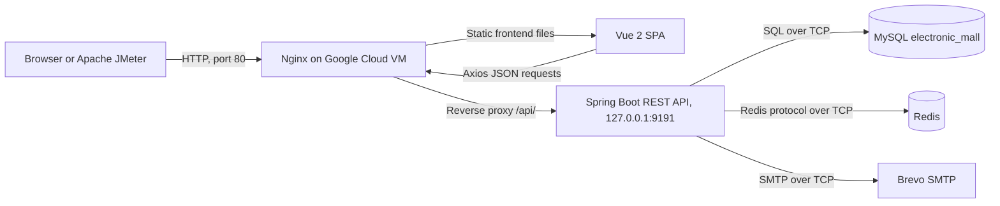
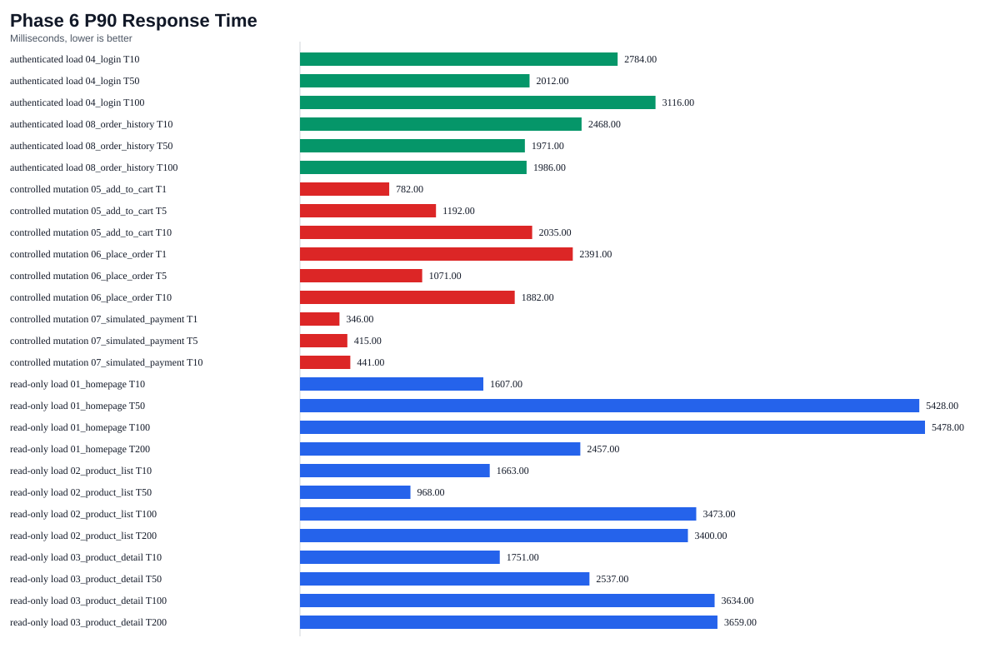

<!--
TECHNICAL REPORT FORMAT SPECIFICATION
- Paper: A4
- Typeface: Times New Roman throughout
- Header: 12 pt, PTA-FTSM-2026-A206331, repeated on every page after conversion
- Title: 14 pt, uppercase, centred
- Author, supervisor and affiliation: 11 pt, centred
- Malay and English abstracts: 11 pt, justified
- Main text: 12 pt, justified
- Follow the supplied FTSM technical-report sample for margins, paragraph spacing,
  table captions, figure captions and reference indentation during Word/PDF conversion.
-->

PTA-FTSM-2026-A206331

 

# DEVELOPMENT AND NETWORK PERFORMANCE EVALUATION OF A CLOUD-BASED SMALL E-COMMERCE PLATFORM

1Li Rufeng, 1Dr. Nazhatul Hafizah Kamarudin

1Faculty of Information Science and Technology  
Universiti Kebangsaan Malaysia  
43600 Bangi, Selangor

## Abstract

Pertumbuhan aplikasi web berasaskan awan menyebabkan platform e-dagang kecil perlu menyediakan bukan sahaja fungsi membeli-belah, tetapi juga komunikasi rangkaian yang stabil apabila menerima akses pengguna secara serentak. Projek ini membangunkan dan menilai R Mall, sebuah platform e-dagang kecil berasaskan awan untuk Projek Tahun Akhir bidang Teknologi Rangkaian. Masalah yang ditangani ialah kebanyakan aplikasi web pelajar hanya menunjukkan fungsi tempatan tanpa menerangkan aliran permintaan pengguna dalam persekitaran awan atau mengukur tingkah laku sistem di bawah beban terkawal. Sistem ini dibangunkan menggunakan Vue 2, Spring Boot, MySQL, Redis, Nginx dan Google Cloud VM. Fungsi utama merangkumi pendaftaran dan log masuk pengguna, pengesahan e-mel, paparan produk, pengurusan troli, penempatan pesanan, pembayaran simulasi, sejarah pesanan dan pengurusan pentadbir asas. Pembangunan projek menggunakan kaedah iteratif berperingkat, manakala penilaian prestasi rangkaian dilaksanakan menggunakan Apache JMeter dengan parameter pengguna serentak yang berbeza. Lapan pelan ujian meliputi halaman utama, senarai produk, butiran produk, log masuk, penambahan ke troli, penempatan pesanan, pembayaran simulasi dan sejarah pesanan. Ringkasan keputusan merekodkan 3,197 pelaksanaan pensampel tanpa ralat JMeter yang diperhatikan. Walau bagaimanapun, masa respons persentil ke-90 bagi beberapa senario bacaan meningkat kepada beberapa saat pada beban tertinggi. Oleh itu, R Mall berjaya berfungsi sebagai prototaip akademik dan testbed rangkaian yang boleh diukur, tetapi hasilnya tidak mewakili kapasiti komersial, prestasi HTTPS atau kebolehskalaan mendatar.

**Kata Kunci:** Aplikasi berasaskan awan, platform e-dagang kecil, penilaian prestasi rangkaian, HTTP, Nginx, Apache JMeter, Spring Boot, Vue, Redis.

## Abstract

As cloud-hosted web applications become increasingly common, small e-commerce platforms must provide not only shopping functions but also stable network communication under concurrent user access. This project developed and evaluated R Mall, a cloud-based small e-commerce platform for a Network Technology Final Year Project. The problem addressed is that many student web applications demonstrate only local functionality without explaining how user requests travel through a cloud environment or measuring system behaviour under controlled load. The system was developed using Vue 2, Spring Boot, MySQL, Redis, Nginx and a Google Cloud virtual machine (VM). Its main functions include user registration and login, email verification, product browsing, cart management, order placement, simulated payment, order history and basic administrator management. The project followed an iterative incremental development method, while network performance was evaluated using Apache JMeter with different concurrent-user parameters. Eight test plans covered the homepage, product list, product details, login, add-to-cart, order placement, simulated payment and order history. The retained results recorded 3,197 sampler executions with no observed JMeter errors. However, the 90th-percentile response time of several read scenarios increased to multiple seconds at the highest tested loads. R Mall therefore operates successfully as an academic prototype and measurable network testbed, but the results do not represent commercial capacity, HTTPS performance or horizontal scalability.

**Keywords:** Apache JMeter, cloud-based application, HTTP, network performance evaluation, Nginx, Redis, small e-commerce platform, Spring Boot, Vue.

# 1.0 INTRODUCTION

E-commerce applications are a familiar part of daily digital activity, but even a small online store depends on several interacting technical layers. A user first obtains frontend resources through a web server, the browser then sends application programming interface requests, the application service processes business logic, and database or temporary-state services complete the operation. When the system is deployed in the cloud, the quality of the user experience depends on both application correctness and the communication path followed by each request. A feature that succeeds for one local user may respond differently when many clients access the public endpoint at the same time.

Cloud virtual machines provide a practical environment for studying this request path because the web server, application service and supporting data services can be configured in an observable deployment (Google Cloud 2026). HTTP provides the application-layer request and response mechanism, while a reverse proxy can separate the public entry point from the internal application runtime (Fielding & Reschke 2014; F5 NGINX 2026). Relational and in-memory databases then serve different data requirements: MySQL retains durable business records, whereas Redis supports time-limited session, verification and cache state (Oracle 2026; Redis 2026). These elements make a cloud-hosted e-commerce platform suitable as a realistic Network Technology testbed.

Many student web projects stop after demonstrating that their main functions work on a local computer. This is insufficient for a Network Technology project because functional correctness alone does not explain the network path or show how the deployed system behaves under controlled concurrent access. A small cloud e-commerce system involves the browser, public IPv4 endpoint, Nginx reverse proxy, Spring Boot service, MySQL database, Redis service and, for email verification, an external Simple Mail Transfer Protocol (SMTP) service. If these communication relationships are not documented and tested, the work remains primarily a software-development exercise.

R Mall was developed to address this problem. It is a bounded cloud-based small e-commerce platform that supports a realistic customer path: registration or login, product browsing, product-detail viewing, cart management, order placement, simulated payment and order-history review. It also supports basic administrator functions for users, products, categories, product variants, carousel records, files, avatars and orders. These functions are not intended to create a commercial marketplace. Instead, they provide public browsing, authenticated access, database reads, database writes and state transitions that can be measured as network workloads.

The implemented network path begins when a browser or Apache JMeter client sends an HTTP request to the public endpoint of a Google Cloud VM. Nginx listens on port 80, serves the Vue 2 single-page application (SPA), and reverse-proxies requests under the public `/api/` path to Spring Boot on the VM loopback address and internal port 9191. Spring Boot communicates with MySQL for persistent records and with Redis for login sessions, email verification codes, resend cooldowns and selected cached product state. It also sends verification messages through Brevo SMTP. This deployment creates one observable path from client request to data processing and back to the client.

The project has three objectives. First, it designs and develops a functional but bounded cloud-based small e-commerce platform. Second, it implements and analyses the communication mechanisms between the browser, reverse proxy, application service, data services and external email service. Third, it evaluates the deployed platform with Apache JMeter under varied thread parameters and reports average response time, 90th-percentile (P90) response time, throughput, sample count, error count and error rate.

The project scope includes the Vue 2 frontend, Spring Boot REST API, MySQL database, Redis temporary-state service, Nginx reverse proxy, Google Cloud VM, Brevo SMTP email verification and eight JMeter plans. The evaluation covers smoke testing, read-only load testing, authenticated load testing and controlled mutation testing. The scope excludes real payment settlement, logistics, refunds, microservices, container orchestration, load-balanced clusters, commercial security certification and multi-region availability. The current public endpoint uses HTTP only; HTTPS deployment and an HTTP-versus-HTTPS comparison are not claimed as completed work.

Development followed an iterative incremental method because application logic, authentication, deployment and performance testing have sequential technical dependencies. The core shopping path was stabilised first, followed by localisation, email verification, cloud deployment, public-route correction and JMeter evaluation. This method allowed configuration or integration problems to be isolated before the next increment was introduced. The final outcome is a working academic prototype whose network behaviour can be described and measured within a clearly stated boundary.

# 2.0 LITERATURE REVIEW

## Cloud-Based E-Commerce and Network Performance Evaluation

Cloud computing provides public access to configurable computing resources and is frequently used to host web applications. For small academic systems, a cloud VM is useful because the researcher can configure the web server, application runtime, database and monitoring or test tools in one environment. Studies of cloud-based e-commerce and web systems emphasise that deployment architecture and server configuration affect observed performance, particularly when client requests increase (Chen & Wang 2023; Kondoj et al. 2022). R Mall adopts a single-VM design because it exposes a genuine public request path while remaining feasible within an undergraduate project.

Modern browser applications commonly separate the client interface from the backend service. Vue 2 provides the SPA interface and client-side routing, while Axios sends JSON requests to REST endpoints (Vue.js 2026; Axios 2026). REST communication is appropriate for R Mall because each customer activity can be represented as a distinct HTTP transaction. Homepage access, product retrieval, login, cart updates, order creation and payment-state updates consequently become testable request types instead of being hidden inside a monolithic page flow.

HTTP/1.1 defines the message syntax and routing foundation for these client-server exchanges (Fielding & Reschke 2014). In the implemented deployment, Nginx acts as the public web server and reverse proxy. It serves the compiled Vue application and forwards API traffic to the Spring Boot service without exposing the backend port as the primary user entry point. Reverse proxying provides a clear public-to-internal boundary and makes the manual user path identical to the path used by JMeter (F5 NGINX 2026). Research comparing web servers also shows that the selected server and request conditions can materially affect performance, which supports explicit server and workload documentation rather than assuming that all deployments behave alike (Amin 2025; Januhandini & Oktiawati 2025).

The backend uses Spring Boot because it provides structured REST controllers, service classes, configuration, data integration and test support (Spring 2021). This layered implementation improves traceability between public endpoints and business operations. MySQL stores durable relational data such as users, products, product variants, carts, orders and order line items. A relational model is suitable because these records have persistent identities and relationships, and order processing requires consistent multi-table updates. MySQL performance can be affected by index design, query structure and runtime tuning; these considerations are particularly relevant to product-list and product-detail operations under concurrent access (Kumar et al. 2024; Oracle 2026).

Redis complements MySQL by storing temporary state. Its expiry mechanism is suitable for email verification codes, resend cooldown markers and login-session records that should be removed automatically after a defined period (Redis 2026). Caching studies indicate that Redis can reduce repeated data-access work when applied appropriately, although cache design must be measured rather than assumed to be beneficial (Kaptosv 2025; Privalov & Stupina 2024). In R Mall, Redis is not a replacement for the relational database. It is used for short-lived state and selected cached product information, while MySQL remains the source for durable business data.

Authentication combines a token sent by the browser with server-side Redis session state. The token allows each protected HTTP request to carry the user's session identity, while Redis allows the backend to expire or remove a session. Email verification further adds temporary code and cooldown lifecycles. Research on email verification and JSON Web Token (JWT) authentication supports the use of these mechanisms as practical controls for web application access, although they do not by themselves establish complete production security (Keri & Niklekaj 2025; Rana et al. 2023). R Mall therefore treats email verification, JWT validation and Redis session checks as bounded FYP-level controls rather than a full identity-management solution.

Performance evaluation requires repeatable workloads and measurable indicators. Manual testing can confirm that a selected page or workflow functions, but it does not reliably compare behaviour at different concurrency levels. Apache JMeter can generate HTTP traffic, parameterise thread count, ramp-up and loop count, apply response assertions and aggregate timing results (Apache Software Foundation 2026a; Apache Software Foundation 2026b). Prior performance-testing research uses load and stress scenarios to expose behaviour that may not appear under a single request, and commonly reports response time, throughput and error measures (Hendayun et al. 2023; Indrianto 2023; Tiwari et al. 2023).

An important methodological issue is workload realism. A single synthetic endpoint is easy to benchmark, but it does not represent the mix of read, authentication and mutation activities found in an e-commerce workflow. Conversely, uncontrolled order and payment testing can corrupt demonstration data. R Mall addresses this issue by separating its scenarios into four groups. Smoke tests verify that every plan executes. Read-only tests cover the homepage, product list and product detail at up to 200 threads. Authenticated tests cover login and order history at up to 100 threads. Controlled mutation tests cover add-to-cart, order placement and simulated payment at up to 10 threads, with database backup and post-test impact recording.

**Table 1: Comparison of Relevant Technologies and Approaches**

| Area | Alternative | Selected approach | Project justification |
|---|---|---|---|
| Deployment | Localhost-only demonstration | Google Cloud VM | Provides public network access and an observable deployed request path. |
| Frontend | Server-rendered pages | Vue 2 SPA | Represents client-side routing and JSON API communication. |
| Backend | Ad hoc endpoints | Spring Boot REST API | Provides layered controllers, services, configuration and test support. |
| Public access | Direct backend exposure | Nginx reverse proxy | Separates the public port from the internal Spring Boot runtime. |
| Durable data | File-based storage | MySQL | Supports relational users, products, variants, carts and orders. |
| Temporary state | Store all state in MySQL | Redis with expiry | Supports sessions, email codes, cooldowns and selected cache entries. |
| Payment | External financial gateway | Simulated payment | Preserves the order-state workload without financial or legal complexity. |
| Evaluation | Manual testing only | Apache JMeter | Produces repeatable metrics under controlled concurrent access. |

The identified gap is not the absence of e-commerce software. Many platforms already provide broader commercial functions. The relevant gap for this project is the absence of a small, complete and measurable academic testbed that links ordinary shopping actions to an explicitly documented cloud request path. R Mall fills this gap by combining a bounded customer workflow with reverse-proxy routing, relational and temporary-state services, and controlled performance testing. The project contribution is therefore the development and evaluation of an observable network application, not a claim that e-commerce itself is novel.

# 3.0 METHODOLOGY

This study includes needs analysis, conceptual model and architecture design, application development, functional verification and network performance evaluation. The method explains how the identified problem was converted into a bounded system, how the main communication components interact, and how the completed deployment was evaluated. The project adopted iterative incremental development so that the core workflow, authentication, cloud deployment and performance-test artefacts could each be implemented and verified before the following increment.

## 3.1 Needs Analysis

User and system needs were derived from the objectives of a Network Technology Final Year Project, the functional requirements of a small e-commerce workflow, inspection of the original project implementation and verification of the final deployed architecture. Four stakeholder groups were identified: customers, administrators, the researcher or test operator, and the external SMTP service.

Customers need to register, verify an email address, log in, browse products, select variants, manage a cart, place an order, complete simulated payment and review order history. Administrators need to maintain the demonstration data through user, product, category, variant, carousel, order, file and avatar functions. The researcher needs repeatable test plans, configurable concurrency parameters and retained response-time, throughput and error evidence. The SMTP service receives outbound verification requests and delivers registration or password-reset codes.

**Table 2: Stakeholders and User Needs**

| Stakeholder | Main needs |
|---|---|
| Customer | Account access, email verification, product browsing, cart, order, simulated payment and order history. |
| Administrator | Basic maintenance of users, products, categories, variants, content files and orders. |
| Researcher/Test Operator | Parameterised JMeter plans, controlled execution and measurable network-performance results. |
| External SMTP Service | Receive outbound email requests and deliver verification codes. |

The functional requirements were bounded to a complete academic golden path. The system must permit registration and login; show categories, product lists, product details and product variants; manage authenticated cart operations; create orders; perform a simulated payment state transition; display order history; and support basic administrator maintenance. It must also provide executable JMeter plans for the main public, authenticated and mutation workflows.

The non-functional requirements focus on deployment and communication. The public application must be accessible through the Google Cloud VM over HTTP. API traffic must pass through Nginx rather than exposing port 9191 as the main public interface. Production frontend requests must use the `/api` base path. Email verification codes must expire after five minutes and resend requests must observe a 60-second cooldown. Protected requests must include the token header and pass JWT and Redis-backed session validation. Performance tests must record timing, throughput and error measurements at defined thread levels.

The requirements also establish explicit restrictions. The platform runs on one Google Cloud VM and is evaluated as an academic prototype. The public endpoint uses HTTP only. Mutation tests are controlled because they change cart rows, order rows, stock and product sales. Several authenticated tests use a shared demonstration account and selected product variant. Payment is simulated and does not communicate with a financial provider. Credentials are supplied through environment configuration and are excluded from the report and repository.

Development was divided into five practical increments. The first stabilised the core e-commerce flow and localised visible content for the Malaysian demonstration context. The second implemented email verification and Redis-backed temporary state. The third prepared the Vue build, Spring Boot service, MySQL, Redis, Nginx, systemd and environment configuration for the VM. The fourth corrected public resource paths, SPA fallback and API routing. The fifth prepared, validated, executed and summarised the JMeter plans.

## 3.2 Conceptual Model Design

The conceptual design connects the customer-facing application with its public and internal communication components. At the presentation layer, the browser runs a Vue 2 SPA and sends JSON requests through a central Axios module. Nginx forms the public reverse-proxy layer. Spring Boot provides the controller and service layers. MyBatis and MyBatis-Plus connect business operations to MySQL. Redis retains temporary state. Brevo SMTP delivers verification messages. Apache JMeter acts as an external test client that follows the same public HTTP path as a normal user.

**Figure 1: Conceptual Cloud Communication Model**

The request path for a normal API operation is browser or JMeter, public IPv4 address, Nginx port 80, Spring Boot port 9191, MySQL and/or Redis, Spring Boot, Nginx and the requesting client. At the Open Systems Interconnection (OSI) application layer, the project uses HTTP/1.1, REST-style JSON exchange and SMTP. JSON serialization and browser rendering provide presentation functions. JWT and Redis-backed records provide session behaviour. TCP supports HTTP, MySQL, Redis and SMTP communication. IPv4 provides public access to the Google Cloud VM, while the loopback address connects Nginx to Spring Boot internally.

The main registration sequence begins when the user requests a verification code. Spring Boot normalises the email and purpose, checks the Redis cooldown key, creates a six-digit code, stores the code for five minutes and the cooldown marker for 60 seconds, and requests SMTP delivery. If email sending fails, both Redis keys are removed. During registration, the backend verifies and deletes the code, inserts the unique user record in MySQL, creates a JWT, stores the user session in Redis and returns the session data to the frontend.

The customer shopping activity then follows a consistent path. The user browses the homepage or products, selects a product variant and quantity, adds the selection to the cart, creates an order, completes the simulated payment and views the paid order in order history. Order creation inserts the order header and order line items and removes the selected cart row inside a transaction. Simulated payment updates the order state, verifies available variant stock, deducts stock, updates product sales and refreshes selected cached product state when present.

**Table 3: Core Database Tables**

| Table | Purpose |
|---|---|
| `sys_user` | Customer and administrator accounts, including unique email and role. |
| `address` | Delivery addresses linked to users. |
| `category`, `icon`, `icon_category` | Product navigation categories and icon mapping. |
| `good` | Product master data, sales and display information. |
| `good_standard` | Product variant value, price and stock. |
| `cart` | User product selections and quantities. |
| `t_order` | Order header, customer, address snapshot, total, state and time. |
| `order_goods` | Product line items linked to an order. |
| `carousel` | Homepage carousel product links. |
| `sys_file`, `avatar` | Product-file and avatar metadata. |

The performance model uses eight JMeter plans. Each plan accepts shared parameters such as base protocol, host, port, API prefix, thread count, ramp-up and loop count. Assertions confirm both transport success and expected application content. The homepage assertion checks for the Vue root element, while API assertions check the project success response. Mutation tests are preceded by a database backup and followed by a comparison of cart, order, stock and payment-state records.

**Table 4: JMeter Evaluation Matrix**

| Group | Test plans | Thread levels |
|---|---|---:|
| Smoke | Homepage, product list, product detail, login, add to cart, place order, simulated payment and order history | 1 |
| Read-only load | Homepage, product list and product detail | 10, 50, 100, 200 |
| Authenticated load | Login and order history | 10, 50, 100 |
| Controlled mutation | Add to cart, place order and simulated payment | 1, 5, 10 |

# 4.0 RESULTS

## 4.1 Application Development

R Mall was implemented as a modular repository containing the browser application, backend service, database scripts, deployment configuration, verification utilities, JMeter plans and project documentation. This organisation preserves traceability between the conceptual design, actual source code, deployment settings and retained evaluation evidence.

The frontend uses Vue 2.6.14, Vue Router 3.5.1, Vuex 3.6.2, Axios 0.26.1 and Element UI 2.15.6. Customer pages include registration, login, homepage, product browsing, product detail, cart, checkout, simulated payment, order history and personal profile. Administrator pages provide a dashboard and management interfaces for users, products, categories, carousel entries, orders, files and income views. The production interface uses English labels, Malaysian ringgit (RM), Malaysia-style example data and an explicit simulated-payment label.

**Figure 2: R Mall Homepage Interface**

**Figure 3: Product Browsing Interface**

**Figure 4: Email-Verified Registration Interface**

**Figure 5: Administrator Interface**

The central Axios module gives all browser requests a consistent base URL, JSON header and token header. In production, the base URL is `/api`, so the frontend does not depend on a browser-visible `localhost:9191` address. The response interceptor detects session-related response codes, removes the stored user object and redirects the browser to the login route. This centralisation reduces duplicated request logic and ensures that protected pages use the same session-failure behaviour.

The Spring Boot 2.5.6 backend follows a controller-service-mapper-entity structure. Controllers expose REST endpoints, services implement business rules and transactions, MyBatis and MyBatis-Plus map database operations, entities represent database records and data-transfer objects limit the fields returned to the browser. The main modules cover authentication, email verification, products, categories, cart, addresses, orders, simulated payment, users, files, avatars, carousel records and administrator operations.

On successful login or email registration, the backend generates a JWT and stores the associated user object in Redis for 180 minutes. Each protected request supplies the token in an HTTP header. The JWT interceptor retrieves the Redis session, refreshes its expiry, verifies the token signature and places the current user into request context. This design combines a signed client token with removable server-side session state.

Email verification was implemented for registration and password reset. The service generates a six-digit code using a secure random generator, stores the code in Redis for five minutes, creates a 60-second resend cooldown key and sends the code through Brevo SMTP. A failed mail operation removes both temporary keys so that users are not left with a code they did not receive or a misleading cooldown. Successful verification deletes the code to prevent reuse.

Order processing connects authentication, cart data, relational persistence, product variants, stock and simulated payment. Order creation assigns the authenticated user, generates an order number, inserts the order header and line items and removes the selected cart item within a transaction. The simulated-payment operation marks the order as paid, checks variant stock, deducts the purchased quantity, updates sales information and synchronises selected cached data. No external bank, card or wallet transaction is performed.

The MySQL database `electronic_mall` implements the relational structure described in Table 3. Product variants use a composite identity based on product and variant value. The order header and line-item separation preserves the purchased-product relationship. Redis is used only for temporary or selected cached state and does not replace the durable order and user records in MySQL.

The production deployment runs on a Google Cloud VM in the `asia-southeast1-b` zone. Nginx listens on public port 80, serves the Vue production build, applies `try_files` fallback for SPA history routes and forwards `/api/` requests to Spring Boot at `127.0.0.1:9191`. A systemd service manages the backend process and reads secrets or environment-specific configuration from a protected runtime file. MySQL and Redis run as supporting services on the VM.

Several implementation problems were identified and corrected. Vue history-mode routes initially risked server-side 404 responses on direct refresh; the Nginx SPA fallback resolved this issue. Image and avatar paths that depended on local backend addresses were moved behind the production `/api` path and persistent upload directory. Direct registration was extended with email ownership verification. Public Nginx path rewriting was documented so that manual checks and JMeter plans call the correct endpoint. Mutation tests were limited and backed up because they intentionally change demonstration data.

## 4.2 Application Evaluation

Evaluation was performed in stages so that higher-load tests were not executed before the application, deployment and test plans were verified. The stages included functional and regression testing, deployment and connectivity checks, bounded security checks, one-user JMeter smoke tests, read-only load tests, authenticated load tests and controlled mutation tests. The official retained performance execution took place on 16 June 2026.

### i. Functional Testing

Functional testing used backend unit tests, frontend verification scripts, production builds, database-schema validation and golden-path checks. Backend tests covered email-code expiry, resend cooldown, wrong-code rejection, code deletion, duplicate email handling, registration, login and password reset. Frontend checks covered authentication wiring, protected-route behaviour, production API configuration, history-mode routes and build readiness. Database validation checked important tables, indexes, unique keys, foreign keys and financial data types.

**Table 5: Functional and Regression Test Results**

| Test or verification | Result |
|---|---|
| Maven backend unit tests | Passed. |
| Maven package build | Passed and produced the deployable Spring Boot application. |
| Frontend authentication check | Passed. |
| Frontend deployment check | Passed; production browser paths use `/api`. |
| Frontend history-route check | Passed for the main routes. |
| Vue production build | Passed with non-failing Browserslist and asset-size warnings. |
| Database schema validation | Passed. |
| JMeter plan XML and summary validation | Passed. |
| Public homepage and reverse-proxy path | Verified through the documented HTTP endpoint during evaluation. |

Deployment checks confirmed that Nginx, the Spring Boot systemd service, MySQL and Redis were active before testing and remained active after the read-only, authenticated and controlled mutation phases. Public-path checks covered the homepage, login, product APIs and media resources. Basic security checks confirmed that protected Vue routes redirect unauthenticated users, expired session responses clear local session data, protected backend requests require JWT and Redis session state, and email verification enforces its cooldown and expiry rules. These checks were not a full penetration test.

The eight JMeter smoke plans were executed at one thread before load testing. They generated 21 samples and recorded no JMeter errors. This confirmed that each test flow could reach the public deployment, satisfy its response assertions and prepare any authentication or mutation data needed for the following request.

**Table 6: JMeter Smoke Test Results**

| Plan | Samples | Errors |
|---|---:|---:|
| Homepage | 4 | 0 |
| Product list | 1 | 0 |
| Product detail | 2 | 0 |
| Login | 1 | 0 |
| Add to cart | 2 | 0 |
| Place order | 4 | 0 |
| Simulated payment | 5 | 0 |
| Order history | 2 | 0 |

### ii. Network Performance Testing

Apache JMeter 5.6.3 sent requests to the same public HTTP endpoint used by browser clients. Consequently, the measurements included the local load-generator route, public Internet path, Google Cloud VM, Nginx reverse proxy, Spring Boot processing and MySQL or Redis operations where required. The plans collected sample count, error count, error rate, average response time, P90 response time and throughput.

The retained summary contains 35 result rows and 3,197 sampler executions. No JMeter errors were observed, producing an overall recorded error rate of 0.00% for the selected execution. Of these samples, 3,176 belonged to load and mutation runs. This result supports stability only for the tested academic workloads and conditions; it does not certify production capacity.

**Table 7: Highest-Concurrency Performance Results**

| Scenario | Highest tested threads | Samples | Error rate | Average (ms) | P90 (ms) | Throughput/s |
|---|---:|---:|---:|---:|---:|---:|
| Homepage | 200 | 800 | 0.00% | 1,491.54 | 2,457 | 12.32 |
| Product list | 200 | 200 | 0.00% | 1,936.82 | 3,400 | 3.28 |
| Product detail | 200 | 400 | 0.00% | 2,302.22 | 3,659 | 6.09 |
| Login | 100 | 100 | 0.00% | 2,067.24 | 3,116 | 2.32 |
| Order history | 100 | 200 | 0.00% | 1,170.88 | 1,986 | 4.61 |
| Add to cart | 10 | 20 | 0.00% | 949.70 | 2,035 | 1.51 |
| Place order | 10 | 40 | 0.00% | 1,320.25 | 1,882 | 3.00 |
| Simulated payment | 10 | 50 | 0.00% | 254.82 | 441 | 4.79 |

**Figure 6: P90 Response Time by Scenario and Thread Level**

**Figure 7: Throughput by Scenario and Thread Level**

The results show that every selected scenario completed without a recorded JMeter error. The read-only homepage, product-list and product-detail scenarios reached 200 threads, while login and order history reached 100. Mutation scenarios were intentionally limited to 10 threads. The absence of JMeter errors demonstrates that the defined request flows remained executable at those selected parameters.

Timing results provide a more cautious interpretation. Product-list and product-detail P90 values reached 3,400 ms and 3,659 ms respectively at 200 threads. Login reached a P90 of 3,116 ms at 100 threads. These values indicate visible slowdown under higher load even though the requests completed successfully. The most defensible result is therefore that the platform remained stable for the selected academic demonstration workload, not that it delivered commercial-scale responsiveness.

Mutation testing also produced observable database changes. Before mutation testing, the retained baseline contained three order rows and three cart rows. After smoke testing, the counts became five orders and four cart rows, and the selected Chair stock decreased from 500 to 499. After controlled mutation load, the database contained 37 order rows, 25 cart rows and Chair stock of 483. The 16-unit stock reduction between post-smoke and post-load states matches the 1-, 5- and 10-thread simulated-payment matrix. The final state included 19 paid orders and 17 pending-payment orders. These changes confirm that the mutation plans exercised business-state transitions rather than only returning static responses.

The evaluation has several limitations. The public endpoint used HTTP rather than HTTPS. The load generator ran from a local workstation, so Internet-route conditions contributed to latency. Mutation tests used a shared demonstration account and selected product variant. The official results represent VM and network conditions on the retained execution date. Raw JTL and generated HTML reports were not retained in Git because of their size; aggregate CSV, summary tables, charts and execution records were retained instead. Security evaluation was limited to baseline access and session checks.

# 5.0 CONCLUSION

R Mall was successfully developed and evaluated as a cloud-based small e-commerce platform for a Network Technology Final Year Project. The platform implements the required customer workflow from account access through product browsing, cart management, order placement, simulated payment and order history. It also provides basic administrator maintenance. These functions form a realistic set of public, authenticated and data-changing requests for network evaluation.

The project also achieved its communication objective. Public clients access one HTTP endpoint on a Google Cloud VM. Nginx serves the Vue 2 SPA and forwards API requests to Spring Boot on an internal loopback port. Spring Boot communicates with MySQL for durable business data, Redis for temporary session and verification state, and Brevo SMTP for verification delivery. This documented path turns the application into an observable network system instead of a localhost-only web demonstration.

Functional, deployment and performance evidence supports the completed implementation. Backend tests, frontend checks, the production build, database validation and JMeter smoke plans passed in the retained verification snapshot. The JMeter summary recorded 35 result rows, 3,197 sampler executions and no observed errors. Read-only scenarios were tested up to 200 threads, authenticated scenarios up to 100 and controlled mutation scenarios up to 10.

The results nevertheless require bounded interpretation. Several high-load read scenarios produced multi-second P90 response times. The deployment uses one VM and HTTP only, and payment is simulated. The test design uses controlled demonstration data rather than many independent real customers. R Mall should therefore be described as a working and measurable academic cloud prototype, not a commercial marketplace, real financial system, high-availability architecture or HTTPS performance study.

Future improvement should begin with a domain, TLS certificate, HTTPS Nginx configuration and HTTP-to-HTTPS redirection, followed by an equivalent JMeter comparison. Further work can optimise product queries, database indexes, Redis caching, frontend assets, Nginx and JVM settings. Longer soak tests, multiple generated users, distributed load generation, host-level CPU and network monitoring, stronger server-side password hashing, rate limiting and deeper OWASP-based security testing would extend the current evidence without changing the project's core architecture.

# 6.0 APPRECIATION

The author would like to express sincere gratitude to the project supervisor, Dr. Nazhatul Hafizah Kamarudin, for her guidance, patience and constructive advice throughout the development, evaluation and documentation of this project. Appreciation is also extended to the Faculty of Information Science and Technology, Universiti Kebangsaan Malaysia, for providing the academic and technical environment required to complete the Final Year Project. The author is grateful to family members for their continuous encouragement and support.

# 7.0 REFERENCES

Amin, M. (2025). Perbandingan kinerja Nginx dan Caddy sebagai web server untuk aplikasi PHP. *Insect (Informatics and Security): Jurnal Teknik Informatika*. https://doi.org/10.33506/insect.v11i1.4223

Apache Software Foundation. (2026a). *Apache JMeter component reference*. Retrieved July 8, 2026, from https://jmeter.apache.org/usermanual/component_reference.html

Apache Software Foundation. (2026b). *Apache JMeter user manual*. Retrieved July 8, 2026, from https://jmeter.apache.org/usermanual/index.html

Axios. (2026). *Axios documentation*. Retrieved July 8, 2026, from https://axios-http.com/

Chen, C., & Wang, F. (2023). Exploring the innovative application of Azure cloud computing platform in cross-border e-commerce operation. *Frontiers in Computing and Intelligent Systems*. https://doi.org/10.54097/fcis.v4i2.9746

F5 NGINX. (2026). *NGINX reverse proxy*. Retrieved July 8, 2026, from https://docs.nginx.com/nginx/admin-guide/web-server/reverse-proxy/

Fielding, R., & Reschke, J. (2014). *Hypertext Transfer Protocol (HTTP/1.1): Message syntax and routing* (RFC 7230). Internet Engineering Task Force. https://doi.org/10.17487/RFC7230

Google Cloud. (2026). *Compute Engine documentation*. Retrieved July 8, 2026, from https://cloud.google.com/compute/docs

Hendayun, M., Ginanjar, A., & Ihsan, Y. (2023). Analysis of application performance testing using load testing and stress testing methods in API service. *Jurnal Sisfotek Global*. https://doi.org/10.38101/sisfotek.v13i1.2656

Indrianto, I. (2023). Performance testing on web information system using Apache JMeter and BlazeMeter. *Jurnal Ilmiah Ilmu Terapan Universitas Jambi*. https://doi.org/10.22437/jiituj.v7i2.28440

Januhandini, R., & Oktiawati, U. Y. (2025). Analisis kinerja web server Apache, Nginx, dan Caddy dengan metode stress testing menggunakan Autocannon. *Journal of Internet and Software Engineering*. https://doi.org/10.22146/jise.v6i2.15011

Kaptosv, L. (2025). Using Redis for caching optimization in high-traffic web applications. *International Journal of Advanced Multidisciplinary Research and Studies*. https://doi.org/10.62225/2583049x.2025.5.4.4839

Keri, M., & Niklekaj, M. (2025). Strengthening web application security through email verification and JWT authentication. *Ingenious*. https://doi.org/10.58944/tjid3591

Kondoj, M., Langi, H., Putung, Y., & Lengkong, V. (2022). Performance analysis of cloud computing based e-commerce server using PROXMOX virtual environment. In *Proceedings of the 5th International Conference on Applied Science and Technology on Engineering Science*. https://doi.org/10.5220/0011876000003575

Kumar, Y. V. R., Samayam, A. K., & Miryala, N. K. (2024). MySQL performance tuning. In *Mastering MySQL administration*. Apress. https://doi.org/10.1007/979-8-8688-0252-2_11

Oracle. (2026). *MySQL 8.0 reference manual*. Retrieved July 8, 2026, from https://dev.mysql.com/doc/refman/8.0/en/

Privalov, M. V., & Stupina, M. V. (2024). Improving web-oriented information systems efficiency using Redis caching mechanisms. *Indonesian Journal of Electrical Engineering and Computer Science*. https://doi.org/10.11591/ijeecs.v33.i3.pp1667-1675

Rana, M., et al. (2023). Enhancing data security: A comprehensive study on the efficacy of JSON Web Token (JWT) and HMAC SHA-256 algorithm for web application security. *International Journal on Recent and Innovation Trends in Computing and Communication*. https://doi.org/10.17762/ijritcc.v11i9.9930

Redis. (2026). *Redis EXPIRE command documentation*. Retrieved July 8, 2026, from https://redis.io/docs/latest/commands/expire/

Spring. (2021). *Spring Boot reference documentation 2.5.0*. VMware Tanzu. https://docs.spring.io/spring-boot/docs/2.5.0/reference/htmlsingle/

Tiwari, V., Upadhyay, S., Goswami, J. K., & Agrawal, S. (2023). Analytical evaluation of web performance testing tools: Apache JMeter and SoapUI. In *2023 IEEE 12th International Conference on Communication Systems and Network Technologies*. https://doi.org/10.1109/csnt57126.2023.10134699

Vue.js. (2026). *Vue 2 guide*. Retrieved July 8, 2026, from https://v2.vuejs.org/v2/guide/

 

Li Rufeng (A206331)  
Dr. Nazhatul Hafizah Kamarudin  
Faculty of Information Science and Technology  
Universiti Kebangsaan Malaysia
